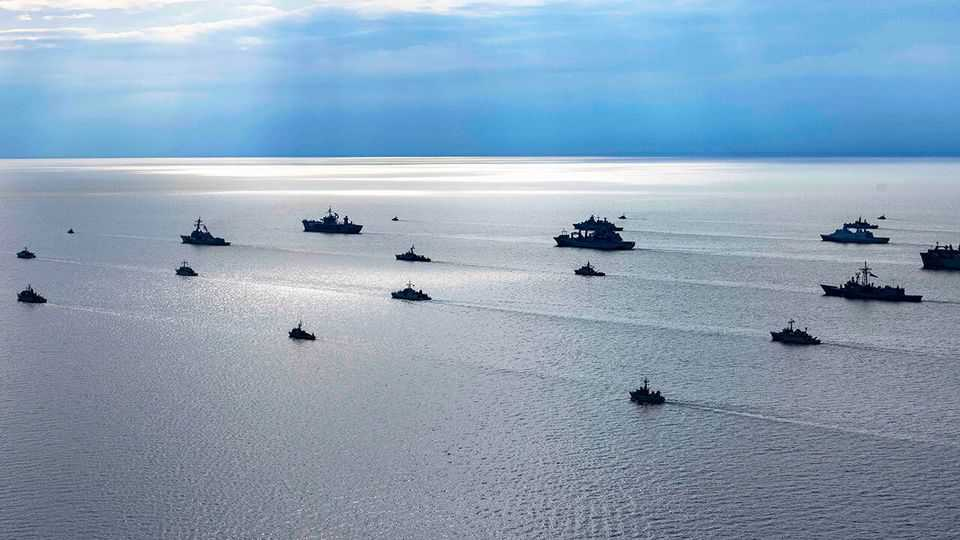

International | Baltic bedlam
The flashing red threat from Russia’s dark fleet
NATO navies struggle to contain a new danger on the seas
October 2nd 2025

THE GREY-ZONE conflict between the West and Russia is escalating at sea as well as in the air. On September 19th, as Russian MiG-31 jets violated Estonian airspace, your correspondent was with Estonia’s navy at its base in Tallinn, the NATO member’s capital. Its naval force is on the front lines of a push to confront the world’s shadow fleet—ships that conceal themselves or their identities. The number of such vessels has soared from 200 in 2022 to about a thousand today. Some are busting sanctions by smuggling Russian oil. Others are suspected of spying and sabotage across northern Europe. The list of worrying maritime incidents is piling up. Police are investigating whether Russia-linked shadowy vessels were connected to drone incursions that have shut down several airports in Denmark since September 22nd. On

September 28th Germany deployed a frigate to Copenhagen as part of the NATO response. Earlier that month Germany detained a Russian-crewed vessel in the Kiel Canal on suspicion of launching drones to spy on critical infrastructure. Undersea infrastructure is being attacked, too. A shadow tanker, the Eagle S, was caught cutting cables in the Gulf of Finland over Christmas last year.

Few people understand Russia’s shadow fleet as well as Ivo Värk, the commander of the Estonian navy. It often tracks dozens of shadow vessels passing through the Gulf of Finland on their way to and from Russia every day. But when it comes to halting illicit tankers that do not pose a direct threat to Estonia, “There’s not much we can do,” commodore Värk admits.

One sailor describes the Estonian navy’s struggle to halt Russian oil tankers using patrol and mine-warfare boats as being “like smaller dogs trying to get to the big dog”. Earlier this year the Estonian navy tried to detain the Jaguar, a tanker subject to sanctions and sailing without a national flag, as it was heading towards Russia. The Estonian navy ordered it to halt, but was then forced to break off its pursuit after Russia launched fighter jets into Estonia’s airspace to protect the ship. Commodore Värk says the Kremlin was sending a message with the jets: Russia’s shadow fleet is a “critical national interest” to be protected at all costs.

Though much of the focus is on Russia’s shadow fleet, North Korea was the “OG of deceptive shipping practices”, says Michelle Bockmann of Windward, a maritime-intelligence firm. It pioneered the tactic of “going dark” by turning off automatic identifier signals that broadcast a ship’s whereabouts, and transferring shipments between vessels at sea rather than at ports. Iran and Venezuela used similar tactics to evade sanctions. The practice “went on steroids” after Russia’s invasion of Ukraine in 2022, says Ms Bockmann. Today shadow vessels make up 19% of the global oil-tanker fleet, according to S&P Global, a data and analysis firm. Much of that growth comes from a pool of nearly 200 “flexible” ships, which service more than one country under sanctions (see chart).

In the Baltic Sea, tankers are the most common shadow ships. In the Taiwan Strait and the South China Sea, China sometimes uses smaller vessels, including fishing boats and tugs. The global shadow fleet is hard to pin down because it is, well, shadowy. Often vessels are not directly controlled by governments, but by networks run by opportunists hoping to exploit weak maritime governance for profit, says Margaux Garcia of C4ADS, a research group in Washington. The networks include owners, usually shell companies in opaque jurisdictions whose beneficiaries are hard to identify, as well as middlemen setting up fake-flag registries and insurance documents. Many are not pro-Russia, pro-China or ideologically tied to any country, says Ms Garcia: “They’re all just people looking for financial gain.”

It has become easier to mask ships’ identities with a proliferation of flags of convenience and registrations in small, poor countries. The Gambia’s fleet has more than doubled since mid-2024, from 43 to 99 ships, and has grown ten times in tonnage terms, according to Windward. More vessels are flag- hopping, or sailing under false flags or no flags at all. Flag-hopping hit a record pace in 2025: vessels placed on a sanctions list are getting new flags in an average of only 45 days, down from 120 days in 2023, according to Lloyd’s List, a shipping journal. “Ships…are moving between five separate registries in a month, and three of those don’t exist,” says Richard Meade, the editor-in-chief. “The speed at which this is changing means nobody has really got a proper source of truth.” Windward reckons that more than half (measured by tonnage) of ships that have been placed under sanctions worldwide are sailing using false or unknown flags. A rock in the Pacific called Matthew Island has a fake registry. “They’re operating completely outside the international rules-based order, just like an F-You” to the world,” says Ms Bockmann.

The legal ambiguity makes enforcement harder. Since the Eagle S cut cables in the Gulf of Finland, Finnish prosecutors have struggled to prove that it was not by accident, or that the ship, which belongs to a company registered in the United Arab Emirates and sails under a Cook Islands flag, has a connection to Russia. Taiwan has similarly struggled: one of the ships

caught cutting its cables in January, for example, had been alternating between two flags and transmitting three different digital identities, none linked to China.

One shadowy tanker, the Kiwala, encapsulates how slippery the identities of ships in the dark fleet are, and how they sometimes blur the lines between carrying illicit oil and taking part in more aggressive grey-zone activities. In April the Estonians detained this ship on suspicion of sailing under a fake Djibouti flag, among other infringements of international maritime rules. They had to release it several weeks later, once it was admitted to Djibouti’s ship registry and had resolved its safety violations.

It was intercepted again on September 28th, this time by France, just days after Danish security services began investigating it in relation to the drone incursions that closed several airports. Since it was previously detained it has changed its name to Boracay, just one of the five names it has used since entering the dark fleet in 2022, during which time it has also flown seven flags and had four registered owners, according to Windward.

In an effort to stop this sort of skulduggery, Western governments are putting pressure on countries with large registries. Panama recently announced it would not allow any vessels over 15 years old to register under its flag. RUSI, a think-tank in London, has suggested that the Financial Action Task Force, a global financial-crime watchdog, should take up inspection of flag registries to prompt better behaviour.

Reflecting the scale and difficulty of the challenge, NATO is stepping up. This year it launched a new mission, Baltic Sentry, to protect cables and pipelines. On a grey September morning in the Öresund Strait between Denmark and Sweden, the Virsaitis, a Latvian naval ship, was called to check on a Russian fishing boat. Officers asked everyone on board to turn off their mobile phones for protection from possible hacking. The vessel had stopped in a busy shipping lane near an undersea gas pipeline, claiming to have suffered a power failure. That made it a “vessel of interest”, explained a NATO official.

Two NATO naval groups, each with 7-8 ships from different countries, take turns tracking such vessels, “like a pickup basketball game”, he said, in co-

ordination with intelligence centres in their countries and at NATO’s maritime headquarters near London. One of the ships keeping an eye below the surface is a Finnish minehunting boat, whose officers show how they use undersea drones, sonar systems and divers to monitor cables and pipelines.

Estonia’s navy pioneered what Marek Kohv of the International Centre for Defence and Security, a think-tank in Estonia, calls “legal harassment”: hailing suspicious vessels by radio and demanding to check their insurance and other paperwork to make sure they are adhering to international safety standards. Britain challenges more than 40 ships a month. One of the aims is to deter potential saboteurs by asking ships to report who they are and what they’re doing. But not all are co-operative, especially those going to and from Russia. “They’ll just say: No,” observes Elgars Romanowski, an officer on board Virsaitis.

There have been no incidents of damage to undersea infrastructure since Baltic Sentry began, suggesting that the new tactics to prevent sabotage are working. Estonia has also passed a law authorising the navy to attack civilian vessels if they are damaging its critical infrastructure. But Western navies, which uphold the international principle of “innocent passage”, have only limited powers to stop shadow-fleet ships in international waters if they do not pose a direct threat.

A long battle lies ahead. Shadow fleets surged after the war in Ukraine began, but they are likely to outlive it, having exposed the weakness of maritime governance. They are a giant floating platform for criminals to make profits—and for hostile regimes to conduct grey-zone espionage and intimidation tactics that constantly test Western capabilities and resolve. As Mr Meade puts it: “I don’t think the genie is going back into the bottle.” ■

This article was downloaded by zlibrary from https://www.economist.com//international/2025/09/30/the-flashing-red-threat-from- russias-dark-fleet