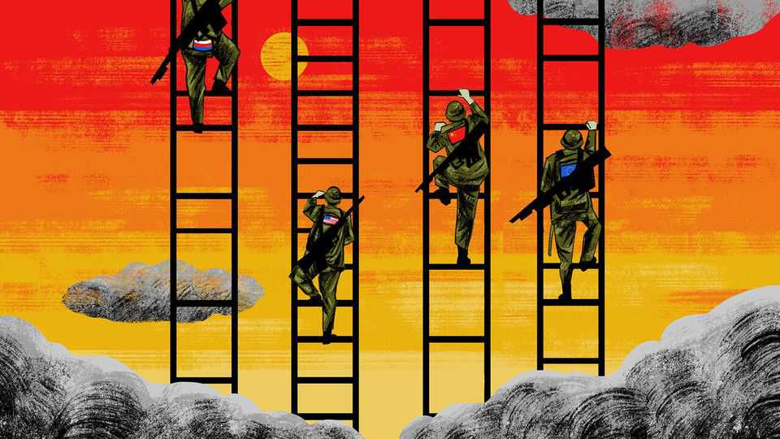

International | The Telegram
Can the West survive an age of brinkmanship?
It is time to relearn the cold-war arts of escalation management
October 2nd 2025

DURING THE cold war, risk management was a life-or-death exercise for political and military leaders. To assist them, front-line troops in Europe and Asia were tasked with monitoring, in real time, how frightened the West should be of its adversaries. American army units in West Germany maintained “normalisation tables” designed to spot the slightest uptick in threat levels. Such tables might record the usual size of Soviet patrols in that sector, or the day of the week on which the enemy tested local air defences. Any change to routine was reported. Cold-war strategists argued that the superpowers stood on “escalation ladders”, each rung of which represented a new level of violence and danger. Every time that one side moved up a rung, or conversely,

refrained from climbing further, it sent a signal to the enemy. Scholars such as Thomas Schelling described how powers might allow a crisis to escalate until fear led one or both to climb down.

The cold war was terrifying. But managing risk today is arguably more complex. In September, when Russian drones flew into Polish and Romanian airspace, and Russian fighter jets trespassed over Estonian territory, the military response from NATO was unified. Warplanes from several countries worked together to shoot drones down and to shoo piloted intruders away. Alas, the political response has proved messier. In Poland, Estonia and some other countries, leaders accuse Russia of deliberate provocations, designed to test both NATO unity and European air defences. In contrast, if public comments are any guide, President Donald Trump seems readier to accept Russian claims that its drones and planes entered NATO skies by mistake.

Asked whether Russia is challenging NATO’s sovereignty, a Western diplomat replies: “It’s murky.” His government ascribes recent border- crossing incursions to a mix of Russian recklessness and “don’t give a fuck” incompetence. One thing is clear, the diplomat suggests: Russia is skilled at giving the West the impression that its “appetite for escalation is higher than ours”.

A lack of clarity about Russia’s intentions has not stopped Western governments from hardening their defences. Some are reviewing rules of engagement for responding to airborne incursions and are debating how to respond to far more ambiguous “grey zone” tactics. These include cyber- intrusions and acts of sabotage—ranging from arson attacks on transport systems, shops and warehouses, to the cutting of submarine cables by Russian ships. In capitals across the West, grizzled senior officials are teaching younger colleagues that when a country needs to deter an adversary, making credible threats may be the prudent course. Put another way, cold-war history teaches that escalation is not always a sign that something is going wrong.

Sir Lawrence Freedman, a historian of war at King’s College, London, warns governments against being unduly intimidated by sabre-rattling, even of the nuclear sort, from President Vladimir Putin and his inner circle.

Because Mr Putin’s invasion of Ukraine in 2022 was a reckless gamble, Western governments tend to assume that the Russian leader has a high tolerance for risk, says Sir Lawrence. But when Mr Putin attacked Ukraine: “He didn’t know he was taking such a big risk,” he notes. Russia’s leader shows no sign of wanting a war with NATO, suggests the professor.

In this era of hybrid warfare, one problem is finding credible ways to deter enemies without matching Russia’s contempt for international law. Cold-war American and Soviet escalation ladders reflected broadly shared codes of warfare. Both sides agreed, for instance, that armed attacks on an adversary’s continental homeland were far more provocative than raids on a far-flung island territory. But when Mr Putin’s Russia acts like a rogue state, the West can hardly respond with tit-for-tat retaliation: NATO members are not about to burn down shopping centres in Moscow.

Yet asymmetry need not be a Russian monopoly. Following the invasion of Ukraine, some allies accused President Joe Biden of pre-emptively climbing down at the first hints of nuclear escalation by Russia. A former Biden administration official insists that his boss did punish and deter Russia with asymmetric acts of escalation. In October 2022 American intelligence reported a “coin flip” chance that Russia might use nuclear arms if its forces faced a major defeat in Ukraine. In response Mr Biden and aides signalled— albeit not explicitly—that if Russia went nuclear, American conventional forces might join the war. In 2024, when Russia used North Korean troops to fight Ukraine’s, America let Ukraine fire long-range ATACMS missiles inside Russia, he adds.

Meanwhile, China is testing American allies in Asia, notably Japan and the Philippines, with displays of military might. Every year the People’s Liberation Army stages larger exercises to practise the encirclement of Taiwan. China’s armed forces are interested in Western approaches to escalation management, says Tong Zhao, an expert on nuclear strategy at the Carnegie Endowment for International Peace, a Washington-based think- tank. In Chinese, leaders talk of mastering zhanzheng kongzhi” or “war control”. Still, Mr Zhao warns against “overblown” fears that China would use Russian aggression in Europe as a cover for opportunistic attacks in Asia. If China makes a move on Taiwan or in the South China Sea, it will do

so on its own initiative, he says, adding that China is not “heavily influenced by what Russia is doing”.

China is not just stronger than Russia, but more patient and disciplined, too. Schelling once defined strategy in an age of brinkmanship as “the art of coercion, of intimidation and deterrence”. Though written decades ago, his words capture perfectly modern China’s approach to economic and national security. Risk management is getting harder. Risk avoidance is not an option. ■

Subscribers to The Economist can sign up to our Opinion newsletter, which brings together the best of our leaders, columns, guest essays and reader correspondence.

This article was downloaded by zlibrary from https://www.economist.com//international/2025/09/30/can-the-west-survive-an-age-of- brinkmanship

Business

Donald Trump is waging war on sky-high drug prices. Can he win? Does big pharma gouge Americans? Armin Papperger’s vaulting ambitions for Rheinmetall With Electronic Arts, Saudi Arabia scores a record buy-out The murky economics of the data-centre investment boom How bosses unwittingly exert power America’s newest media moguls: the Ellisons ByteDance will be better off without TikTok US