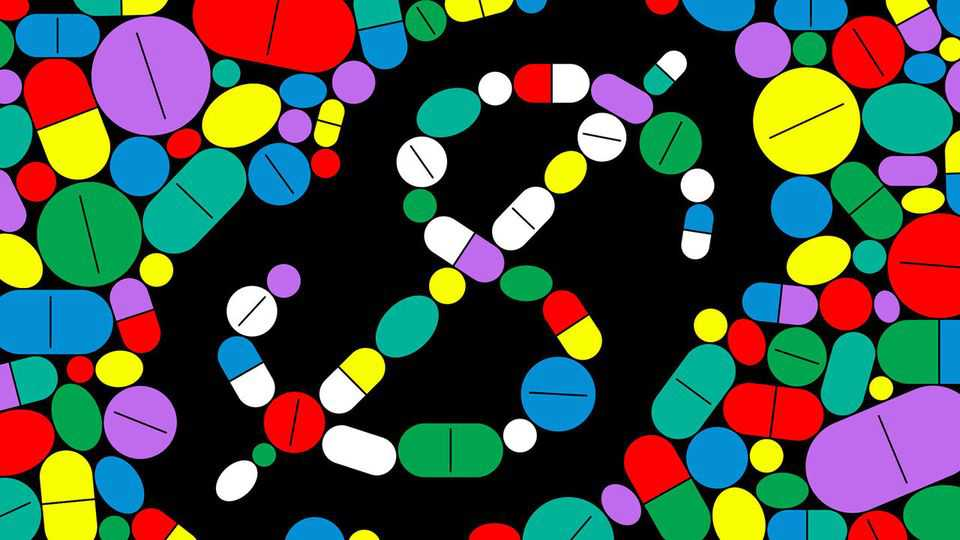
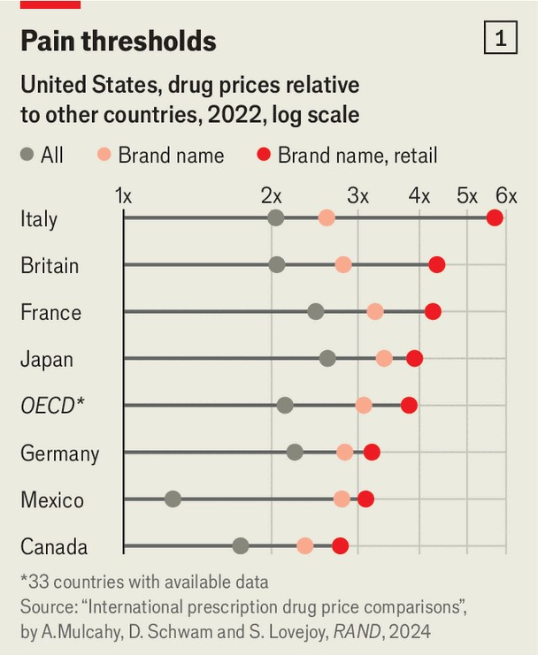
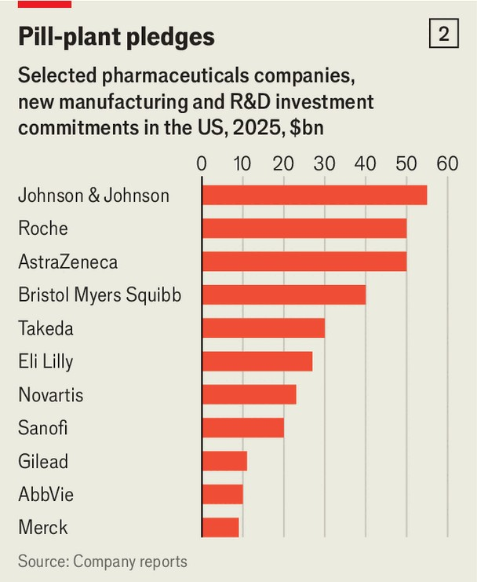

Business | Strong medicine
Donald Trump is waging war on sky-high drug prices. Can he win?
Big pharma faces a reckoning in America
October 2nd 2025

BIG PHARMA has a big headache: Donald Trump. Lately drugmakers have had to put up with presidential pronouncements on everything from vaccines to paracetamol. The pain is not going away. Intent on lowering “abusive” prices, Mr Trump gave leading firms until September 29th to peg their prices to the lowest charged in other rich countries—a rule he calls “most favoured nation” (MFN) pricing—or face “every tool in our arsenal”. On October 1st he unveiled “TrumpRx”, a government website offering patients steeply discounted medicines. Pfizer, a pharmaceuticals giant, has signed up, earning a boost to its share price and pulling other drugmakers’ stocks up with it. Pfizer will also supply its drugs to Medicaid, America’s

health programme for the poor, at MFN prices, though the terms remain confidential and Medicaid accounts for less than 5% of Pfizer’s American sales.

At the same time, the president wants to encourage homegrown manufacturing. From October 1st imported branded drugs face a 100% tariff, unless their makers are building factories in America. His administration is also pondering additional duties under a law allowing imports to be restricted on national-security grounds.

As is often the case, the Trumpian diagnosis contains a kernel of truth. Drug prices are indeed higher in America than elsewhere in the rich world. But the president’s two-point prescription upends a model that has long underpinned the global pharma industry. It could have unintended effects, leaving Americans with fewer medicines but not cheaper ones, while in other countries drugs could be fewer and dearer. David Ricks of Eli Lilly, the world’s most valuable drugmaker, has warned that MFN pricing risks “the worst of two worlds”, importing Europe’s sluggish innovation while keeping American prices high.

Drug prices have long exercised American politicians of both parties. A study by the RAND Corporation, a think-tank, puts them at more than three

times the average in other rich countries (see chart 1). America coughs up around 70% of global pharmaceuticals profits from about half of global sales.

This is partly because of how the market is organised. The supply side is globalised. Most active ingredients are made in low-cost hubs such as India; much of the research and development goes on in America, Europe and increasingly China.

On the demand side, however, prices are set locally. In Europe and many other rich countries, drugmakers must negotiate directly with governments, which have hefty bargaining power and often link payments to cost- effectiveness. In America, prices emerge from a complex web of contracts connecting manufacturers to health insurers, employers and pharmacy- benefit managers (PBMs), which negotiate between insurers, pharmacies and others.

Although public insurance schemes cover about half the population, they negotiate few prices. Joe Biden’s Inflation Reduction Act (IRA) authorised Medicare to haggle directly with manufacturers. But only ten drugs will be covered in 2026 and 20 by 2029. One pharma boss says companies “take what they can get in Europe”, because returns are greater in America.

Patents help keep those American returns high. About 90% of the $490bn spent in America on prescription medicines last year went on branded drugs (mainly patented ones with no cheaper generic equivalents). Yet branded drugs made up only 7% of prescriptions.

The international price gap fuels charges that foreigners are freeloading on American innovation. But whether Americans pay too much or others too little is disputable. A complicating factor is that new drugs tend to be launched first in America. Patients there get them sooner.

Mr Trump, however, is in no doubt: Americans are being ripped off, and he wants it to stop. But his MFN plan is characteristically sketchy. He has told drugmakers it should apply to both government schemes and private insurers, but has not explained how the MFN price will be set.

One possible starting-point is a pilot programme covering only the government schemes. Another option is legislation. Josh Hawley, a Republican senator, and Bernie Sanders, a left-wing Democrat, have both backed codifying MFN pricing. For now, though, passage looks unlikely.

A third possibility is to fold MFN into the IRA negotiations. There are hints, too, that the Food and Drug Administration, the regulator that authorises medicines and which has traditionally stayed out of pricing, could be drawn in. Marty Makary, its commissioner, has suggested the agency might expedite reviews for drugs from firms that pledge to “equalise” prices between America and other countries. Most of these courses would prompt legal scrutiny; when Mr Trump proposed a narrow version of MFN in 2020, he was thwarted by lawsuits from the industry.

The administration’s ambition has rattled drugmakers. Firms that rely most on Medicare and Medicaid—Amgen, Bristol Myers Squibb, Gilead and Johnson & Johnson make more than a third of their sales from the schemes —appear most exposed. Jefferies, an investment bank, estimates that an MFN-pricing rule, combined with tariffs, could cut companies’ earnings by about a sixth.

Executives are warning that lower revenues could mean fewer new drugs. This is more than scaremongering. Darius Lakdawalla of the University of Southern California calculates that a 10% drop in expected revenues could in the long run reduce innovation, measured by drug approvals or clinical- trial starts, by as much as 15%.

Firms will scramble to limit the damage. Coincidentally or not, Bristol Myers Squibb will launch a schizophrenia treatment in Britain at the same price as in America. Sir Pascal Soriot, boss of AstraZeneca, a big British firm, has argued that richer European countries should pay more towards innovation “just like they have to contribute more to their own defence”. Eli Lilly’s Mr Ricks has said that European governments “are not signing up to pay more for drugs”. He favours using trade tools to “rebalance that equation”—something the administration has hinted at. But Peter Kolchinsky of RA Capital, an investment firm, warns that if MFN pushes prices outside America beyond what other countries are willing to pay, it will put the profits they do contribute at risk.

As companies try to shore up revenues in America, unintended consequences are likely. They could raise list prices in foreign markets and thus push up the MFN price. They could then offer bigger (and confidential) discounts to foreign buyers, keeping the net price unchanged. They might also alter formulations to make international comparisons harder. Another tactic is to delay launches in cheaper markets to avoid setting a low benchmark.

Such strategies are not hypothetical. In a 2023 paper, Luca Maini of Harvard Medical School and Fabio Pammolli of the Politecnico di Milano found that MFN-like rules in Europe delayed launches in eight low-income countries by up to a year. They concluded that a similar system in America would probably have limited effects on prices there, while poorer countries would face delayed access to new medicines.

Compared with the disruptions to pricing, the impact of tariffs is likely to be small. The duties spare generics, which make up 90% of prescriptions. And they exempt companies that are investing in American plants, which many have promised to do (see chart 2).

None will make medicines soon; building and certifying factories takes two to four years. Making drugs in America may be costlier, and will also rely

on imports of active ingredients, which could be vulnerable to further protectionism. But the promises may inoculate branded-drug firms against the latest tariffs.

Drugmakers say that they are the wrong target for Mr Trump’s ire. They have a point. Analysis by The Economist finds they pull in two-fifths of net excess profits in America’s health-care sector. The bulk goes to intermediaries, such as insurers and PBMs, and to hospitals. Regulators are probing PBMs’ practices. There have been calls to remove incentives for hospitals to prescribe pricier drugs. But drugmakers still get most of the blame for high prices.

Some manufacturers already have their own versions of TrumpRx, bypassing the middlemen. Makers of obesity treatments, such as Eli Lilly and Novo Nordisk, now offer cheaper versions directly at about half-price. Pfizer and Bristol Myers Squibb plan to sell Eliquis, a blockbuster blood- thinner, at more than 40% off. But such arrangements work mainly for self- administered medicines; for complex treatments, middlemen remain entrenched.

What Mr Trump does next on MFN remains unclear. But the uncertainty it has caused is already weighing on investment. One investor says they are in “wait-and-see” mode on funding young biotech firms. Developing a drug takes a decade and costs more than $2bn; less than a tenth of candidate drugs make it to market. An executive at a big drugmaker warns that “four years of chaos will shred the industry”. One of America’s most inventive sectors now risks spending those years surviving rather than thriving. ■

To stay on top of the biggest stories in business and technology, sign up to the Bottom Line, our weekly subscriber-only newsletter.

This article was downloaded by zlibrary from https://www.economist.com//business/2025/09/28/donald-trump-is-waging-war-on-sky- high-drug-prices-can-he-win