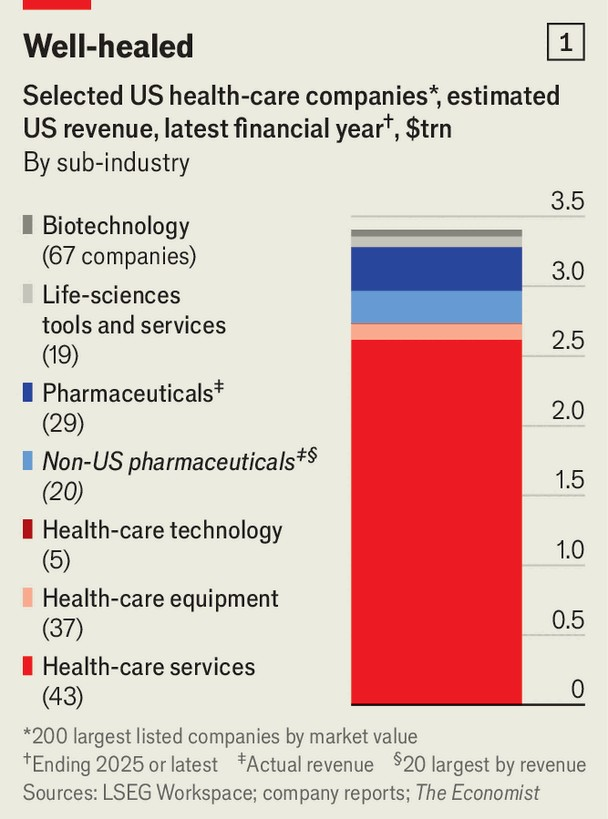
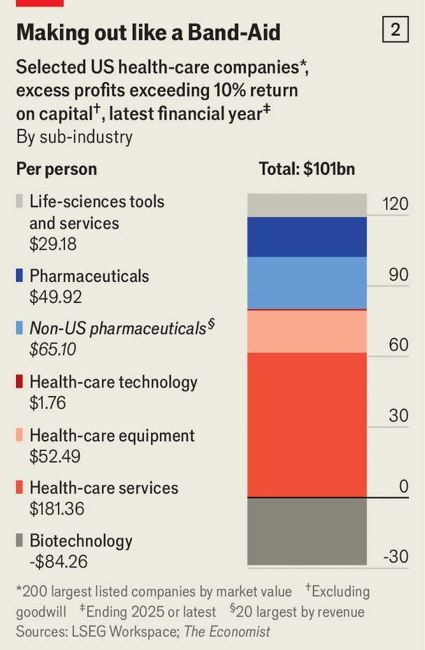
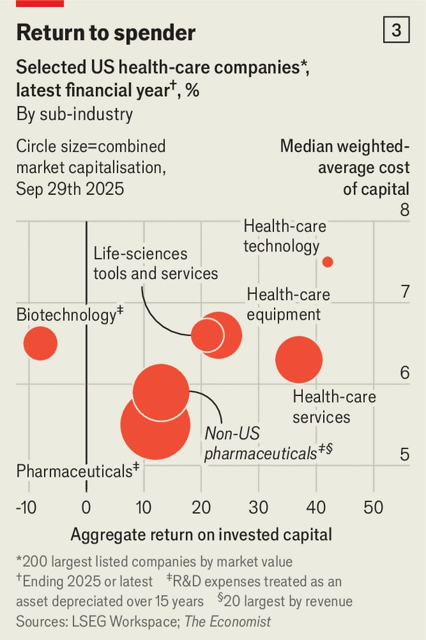

Business | Patient capital
Does big pharma gouge Americans?
In the bloated health-care system, others are the real money-makers
October 2nd 2025

TALK TO AMERICANS about their health-care system and many reach for Xanax. Together they spend around $5trn a year on keeping themselves in good nick, 40% more than in 2010 after adjusting for inflation. That comes to $13,400 per anxiety-ridden head, $6,000 more on average than in other rich countries, without being any healthier for it. Politicians of all stripes have long railed against this injustice—and fingered big pharma as the main culprit. President Donald Trump is now demanding that drugmakers charge no more for medicines in America than they do in comparably well-off places.

America is a lucrative market for the world’s drug giants. Many pharma bosses admit that is where they make most of their profits. But are these profits really responsible for America’s ballooning health-care bill? The short answer is no.

To arrive at it, we used data from LSEG to estimate the economic rents captured by different parts of the health-care-industrial complex. We examined the 200 largest American companies in the sector by market value. Since America tends to be the biggest market for foreign drugmakers, we also looked at the 20 largest non-American pharmaceutical firms by revenue (see chart 1).

Excess profits are calculated as those earned above a 10% return on capital (excluding goodwill). This ought to be the maximum possible in any competitive industry. For drugmakers, we treat research and development as an asset that is depreciated over 15 years, which is more or less the lifetime of their patents. We also assume that all their excess profits are generated in America.

All told, the health-care industry rakes in excess profits of $101bn a year (chart 2). That is more than big airlines and the media-cable-telecoms cabal. Of America’s much maligned oligopolies only big tech is more grasping. Yet in the context of American health-care overspending, it is a drop in a bucket. And American and foreign drugmakers account for a surprisingly small portion of that drop: $39bn between them. Throw in biotech companies, which bleed money while they invest heavily in clever treatments, and drug developers’ overall excess profits amount to a meagre $10bn.

The bulk of the rents is captured instead by providers of health-care services such as hospitals and the system’s true money-makers: insurers, pharmacy- benefit managers and other middlemen taking advantage of its opacity. They have higher costs of capital than drugmakers, but they also clear our 10% hurdle much more comfortably (chart 3). ■

To stay on top of the biggest stories in business and technology, sign up to the Bottom Line, our weekly subscriber-only newsletter.

This article was downloaded by zlibrary from [https://www.economist.com//business/2025/10/02/does-big-pharma-gouge-americans](https://www.economist.com//business/2025/10/02/does-big-pharma-gouge-americans)