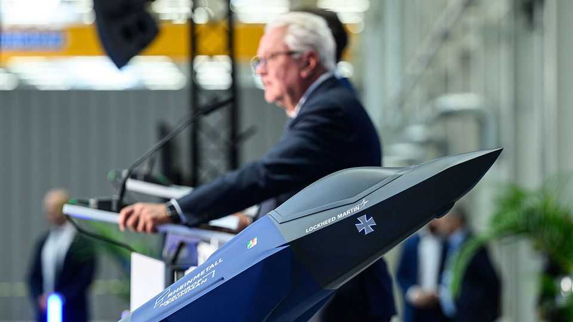

Business | European defence firms
Armin Papperger’s vaulting ambitions for Rheinmetall
He wants his fast-growing German armsmaker to be bigger still
October 2nd 2025

“In future, we will be a relevant player on land, at sea, in the air and in space,” proclaimed Armin Papperger (pictured). Rheinmetall’s chief executive had already led the maker of tanks and ammunition on forays into satellites, drones and parts for fighter jets. Last month Germany’s biggest defence firm said it was adding the four shipyards of Naval Vessels Lürssen (NVL), based in Bremen, for a sum estimated at €1.5bn-2bn ($1.8bn-2.4bn). In a country where corporate chiefs tend to be press-shy and cautious, Mr Papperger is a rare limelight-lover. He is “the face and the main salesman of Rheinmetall”, says Stefan Maichl of Landesbank Baden-Württemberg. He is also the only German CEO with the same high security as the chancellor,

after a Russian plot to kill him was uncovered last year by American and German spooks. But he has not scaled down any public commitments, he tells The Economist. He does his job just as he has since becoming the boss in 2013.

Under Mr Papperger Rheinmetall has come far, thanks both to his stewardship and the booming demand for military equipment, especially ammunition, since Russia invaded Ukraine. The share price, €37 when he took over, is now pushing €2,000. Relative to earnings, its shares are easily the most expensive in the European defence industry.

Rheinmetall has morphed from a mainly German manufacturer of traditional military kit into what it calls an “integrated international technology group”. Its biggest strengths remain tanks (Lynx, Leopard 2, Puma and Panther) and artillery shells. In Lower Saxony in August it finished what will become Europe’s biggest ammunition factory when it reaches full capacity in 2027. The company is also building ammunition plants in Bulgaria, Latvia, Lithuania, Romania and Ukraine.

This year Rheinmetall has formed partnerships to make satellites with ICEYE, a Finnish firm, and drones with America’s Anduril. It is also producing Skyranger, a mobile anti-drone system that can be installed on top of military vehicles—much more cost-efficient than using warplanes to shoot down cheap drones, Mr Papperger says. (Last month Polish jets downed Russian drones that had breached their country’s airspace.) Rheinmetall will supply Ukraine with Skyranger by the end of the year and is keen to sell it to Poland, too.

Mr Papperger is far from done. He is aiming for annual sales of €40bn-50bn and a 20% profit margin by the end of the decade, up from around €10bn and 15% last year. NVL’s sales are to rise from around €1bn to €5bn. This would catapult Rheinmetall into the global league with America’s top defence firms, Lockheed Martin (annual sales last year: $71bn) and Northrop Grumman ($41bn).

Analysts and investors are watching Rheinmetall’s giddying rise with caution as well as awe. On the NVL purchase, Christian Cohrs of Warburg, a bank, wonders why the company is entering a complex line of business

where it has no expertise. Rheinmetall claims that it will find synergies, in particular with its vehicle division in northern Germany, which will share “material and technology expertise” with the shipyards.

Might a ceasefire in Ukraine be bad for business? At every sign of hope, Rheinmetall’s share price takes a knock. But Mr Papperger is certain that “nothing will change”. Europeans have understood that they must be prepared for an aggressor and that America may not come to their rescue, he says. Mr Cohrs thinks much will depend on the nature of a ceasefire. If it is seen as simply a pause in Russian expansionism, European governments will keep rearming at the same speed; if more permanent, they are likely to delay or even cancel orders.

After 12 years in charge, Mr Papperger shows no sign of relinquishing command. He is only 62, and his contract has been extended to the end of 2029. The chief financial, operating and human-resources officers all took up their jobs only this year. It is not clear whether Mr Papperger has a successor in mind yet. But as an eager buyer of Rheinmetall’s shares, he seems content to keep betting on himself. ■

To stay on top of the biggest stories in business and technology, sign up to the Bottom Line, our weekly subscriber-only newsletter.

This article was downloaded by zlibrary from https://www.economist.com//business/2025/10/02/armin-pappergers-vaulting-ambitions- for-rheinmetall