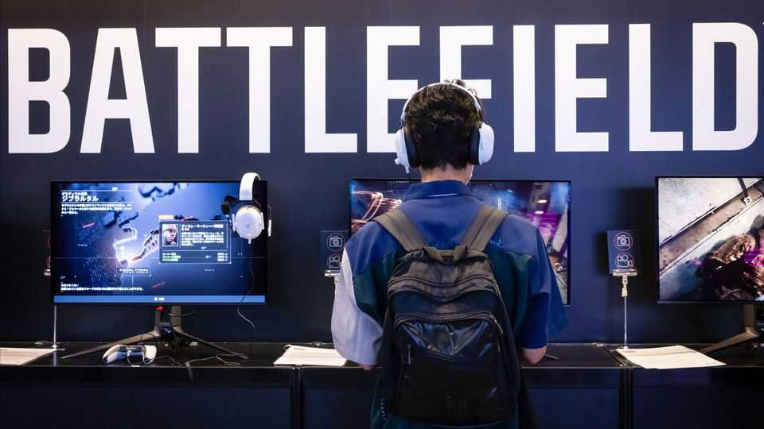

Business | In the game
With Electronic Arts, Saudi Arabia scores a record buy-out
Play private equity on expert mode
October 2nd 2025

Nobody has yet turned “Wall Street”, a 1987 film starring Michael Douglas as a corporate raider, into a video game. If they do, the final boss may look like Electronic Arts (EA). On September 29th a consortium led by Saudi Arabia’s sovereign-wealth fund said it would take the game developer private in the biggest leveraged buy-out ever. In some ways, EA is a predictable target. Its titles, including “Battlefield” and “Madden NFL”, generate heaps of cash. The firm is unloved in public markets. But at $55bn, the deal looks expensive. Using analysts’ forecasts, our beginner-mode five-year buy-out model struggled to eke out a double-digit annualised return.

There are three main characters. Muhammad bin Salman, Saudi Arabia’s crown prince, is mad about sport. His fund’s properties include Newcastle United, Pokémon Go and a minority stake in Take-Two, another developer. The kingdom even has an e-sports industrial policy. Egon Durban raises money from investors rather than pumping it from the ground. Silver Lake, his private-equity firm, is on a tear. In March it bought Endeavor, which owns the Ultimate Fighting Championship. It will be among American TikTok’s new owners. Jared Kushner, who completes the trio, brokered the deal. He is backed by Saudi cash and married to Ivanka Trump.

Some movers and shakers consider bankers non-player characters these days. Not this time. JPMorgan Chase is providing all $20bn of debt for the deal. So voracious is the market’s demand for new debt that the mighty bank must be confident it can offload the pile to investors.

EA’s share price, which is within a hair of the offer, implies few obstacles to the deal despite its size. Few expect a rival bid when potential suitors in Silicon Valley are preoccupied with artificial intelligence. Nor do regulatory hurdles loom, even though the deal means foreign control of an information- intensive business. Authority for blocking deals rests with the president. Mr Kushner’s father-in-law seems unlikely to pull the plug. ■

To stay on top of the biggest stories in business and technology, sign up to the Bottom Line, our weekly subscriber-only newsletter.

This article was downloaded by zlibrary from https://www.economist.com//business/2025/10/02/with-electronic-arts-saudi-arabia- scores-a-record-buy-out