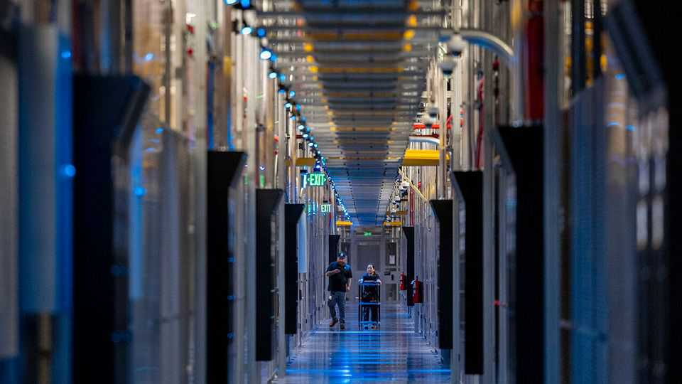
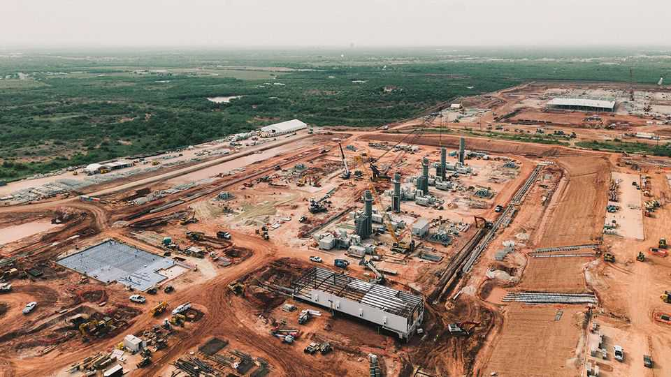

Business | Build it and AI will come
The murky economics of the data-centre investment boom
How similar is it to the 1990s telecoms bubble?
October 2nd 2025

THIS SPRING McKinsey made what seemed to be an extraordinarily bullish forecast of capital spending on the chips, data centres and energy to produce artificial intelligence (AI): $5.2trn worldwide in the next five years. Less than six months on, the consultancy is considering upping that estimate. Announcements in America suggest investing in generative-AI infrastructure is reaching fever pitch. Such expenditure, accentuated by staggering data-centre deals unveiled by firms such as OpenAI, Nvidia and Oracle, is aimed at increasing the computing power its protagonists believe is needed to supply generative AI. But demand—especially the revenue-yielding sort—does not yet match the

hype. Though consumers’ use of chatbots is rising, McKinsey has found that the success rate of AI pilot projects in firms it has canvassed is less than 15%, says Pankaj Sachdeva, a partner at the firm. He predicts an era of “lumpiness” between supply and demand that could last for years.

The strength of demand for generative AI may be the most critical factor determining whether or not this infrastructure boom ends in a bust. But three novel aspects of the data-centre building frenzy add to the uncertainty: the centres’ remote locations, the non-public firms financing them and the weak credit quality of some borrowers. This trifecta reminds some sceptics of the last great infrastructure debacle: the telecoms boom of the late 1990s. Yet plenty of others are holding their noses and diving in.

Geography is the most tangible novelty. The new AI data centres are springing up in the middle of nowhere rather than in established clusters close to big sources of demand and interconnection hubs, such as northern Virginia. OpenAI and its partners, Oracle and SoftBank, have begun the first phase of Stargate (pictured below), a $500bn AI-infrastructure project announced by President Donald Trump in January, in a part of Texas with lots of wind and solar energy—and empty space. North Dakota and New Mexico have similar attractions.

Such fresh locations solve a power problem: many existing clusters lack enough surplus energy for training the latest large language models (LLMs) developed by labs such as OpenAI. But isolation introduces risks for property investors that may not be adequately reflected in the returns, says Gautam Bhandari of I Squared Capital, an infrastructure-focused private- equity firm.

Data centres are usually financed over decades, but those on the cutting edge of AI may become obsolete far quicker, Mr Bhandari says. That is partly due to technology: Nvidia, the dominant maker of AI-related graphics processing units (GPUs), relentlessly improves the efficiency of its chips, which may require regular data-centre upgrades, such as new cooling systems. With land so readily available, a rival data-centre builder with a better, cheaper design can easily set up elsewhere. That raises the likelihood of stranded assets.

The boom’s sources of finance are also relatively new. Until recently, big suppliers of capital for data centres in prime locations were stockmarket investors, via real-estate investment trusts (REITs). They were most comfortable when a data centre’s power consumption was far less than 100 megawatts. But in the AI era, appetites are measured in gigawatts (GW), and the costs can run to $50bn per GW.

As demand for capital has rocketed, REITs have been constrained by their own borrowing capacity, says David Guarino of Green Street, a commercial- property research firm. Their place is being taken by private-credit firms (some of which have acquired ex-REITs) and sovereign-wealth funds, as well as banks. These are sophisticated lenders with deep pools of capital, used to the sort of project finance involved in AI infrastructure lending. But their participation shifts risk from equity to debt markets, putting the banking system more squarely in the line of fire if defaults rise.

And the risk of default is raised by the dubious creditworthiness of some firms at the heart of the building boom. This was not a big concern when cash-rich cloud giants, such as Amazon, Microsoft and Google, were recipients of much of the finance. They are “the best tenants in the world”, says Mr Guarino. But more recently, AI labs like OpenAI and “neocloud” firms that rent out GPUs have entered the fray, increasing the quantity—but

decreasing the credit quality—of those involved. The more of them there are, the more they face competition, pressure on returns and uncertainty about their long-term viability.

It is not just lenders who worry about these neophytes. Utilities, conservative by nature, may also think twice about signing long-term energy contracts with them. “You do not know which of these players will be around in five, ten or 15 years’ time,” says Mr Sachdeva. In response, he says, insurance policies, securitisations and the like are being designed to mitigate the risks. Likewise, tech giants such as Nvidia are pitching in with a web of vendor financings and cross-investments that could also reassure counterparties. But if the worst happens, such incestuousness will increase the vulnerability of the AI ecosystem as a whole.

Such interlinkages are adding to concerns that an infrastructure bubble is forming, similar to the laying of fibre-optics and undersea cables in the early days of the internet. Andrew Odlyzko of the University of Minnesota, a historian of infrastructure manias from 19th-century railways onwards, used to downplay the economic impact of an AI bust. He believed that if a few tech giants were forced to write off their investments in data centres, that would only torch a few years’ worth of profits. Now, he says, he is “much more alarmed” because of the number of firms making big investment pledges.

He sees parallels with the late-1990s investment frenzy that culminated in the dotcom crash. Proposed deals such as Nvidia’s potential investment of $100bn in OpenAI if it buys up to 10GW of GPUs remind him of Nortel’s vendor-financing arrangements with buyers of its equipment during the telecoms bubble. Others, however, play up the differences. Nick Del Deo of MoffettNathanson, an equity-research firm, says that in the telecoms boom cable was laid without customers in place. Today, data centres are built only when counterparties sign contracts for it—though the contracts’ details will be critical in determining whether returns justify the risk.

For now, the potential rewards are so tantalising that money is pouring in, he says. Cheerleaders such as Sam Altman, OpenAI’s boss, argue that the risks of underbuilding are at least as serious as those of overbuilding, because of the long-term economic potential of generative AI. It may be that even if

there is a surplus of capacity in the most advanced data centres, it can be absorbed by running, rather than training, LLMs, Mr Sachdeva says. But that comes back to the question of when demand for generative-AI chatbots and applications catches up with the ambitions of those supplying them. That is the most bewitching uncertainty of all. ■

To stay on top of the biggest stories in business and technology, sign up to the Bottom Line, our weekly subscriber-only newsletter.

This article was downloaded by zlibrary from https://www.economist.com//business/2025/09/30/the-murky-economics-of-the-data- centre-investment-boom