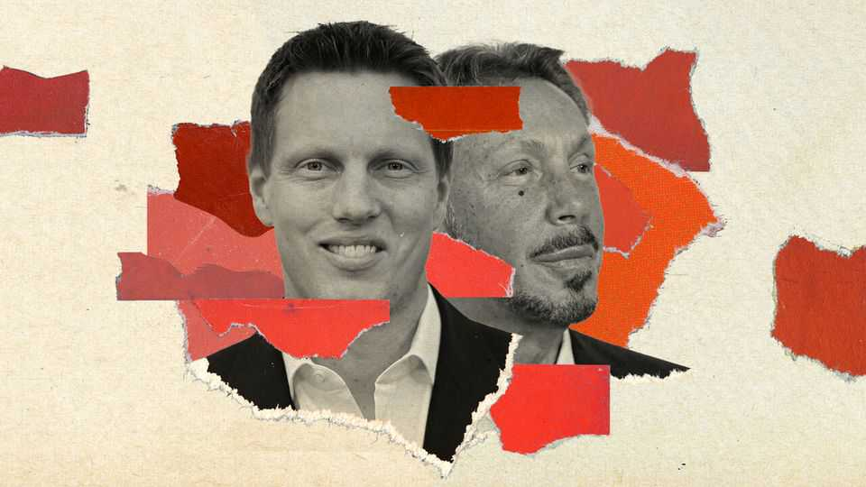
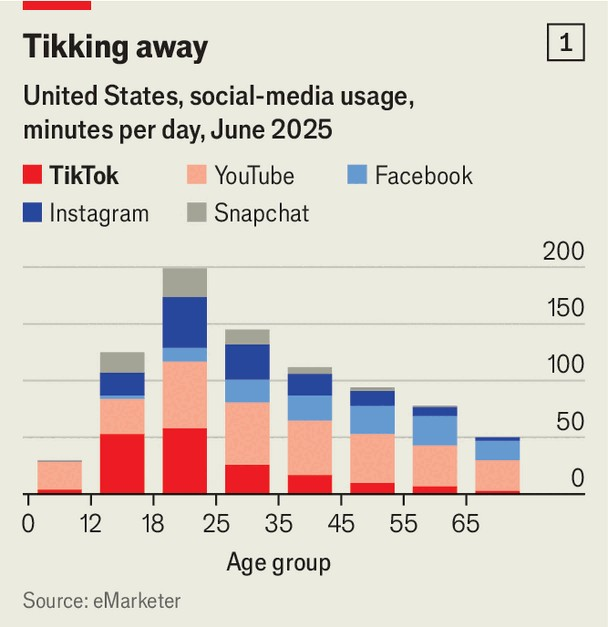
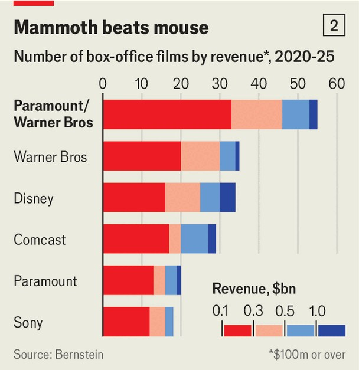

Business | Fathers and sons
America’s newest media moguls: the Ellisons
With Warner Bros and TikTok, the family would be a force in old and new media
October 2nd 2025

Rising high over Burbank’s sprawling film lots, the Warner Bros water tower is an emblem of old Hollywood. Ten miles south, in Culver City, TikTok’s colourful glass-fronted office symbolises the industry that threatens to take its place. Media’s great battle is between professional production studios, such as Warner, and tech platforms like TikTok that serve up algorithmically sorted, user-generated content. Now a pair of deals could bring both companies under the sway of one family. Larry Ellison, the 81-year-old founder of Oracle, a software giant, stumped up most of the cash for his son David to take over Paramount, another grand old Hollywood studio, in August. The family is now said to be bidding for

Warner Bros Discovery, a much larger rival. Meanwhile Oracle is part of a group hoping to buy the American operations of TikTok from ByteDance, its Chinese owner. A sale was approved in principle by President Donald Trump on September 25th.

If the deals go ahead, they will give the Ellisons control of some of America’s biggest news and entertainment brands—from “Game of Thrones” and “Friends” to CBS News and CNN—and influence over the social-media app on which American teenagers spend more time than any other (see chart 1). As competition rages between old and new media, the Ellisons could be uniquely placed to bring them together.

Start with the old media. David Ellison, the 42-year-old boss of Skydance Media, a production company he founded 15 years ago with his father’s help, took control of Paramount this summer. That followed a prolonged wrangle with the Federal Communications Commission (FCC), which withheld its agreement until Paramount settled a highly dubious legal complaint from Mr Trump about a CBS News report. The $8.4bn deal was mainly financed by Larry Ellison, who has become the world’s second- richest man since an artificial-intelligence gold rush doubled Oracle’s share price. He may dip into his fortune again as part of the bid for Warner Bros, whose market value is nearly $50bn.

Combined, Paramount and Warner would be a Hollywood giant. Their recent box-office output exceeds that of any other studio (see chart 2). The pair would have the largest share of the national television-ad market: 35% to Disney’s 27%, calculates Madison & Wall, a consultancy. Their streaming services, Paramount+ and HBO Max, together sell more subscriptions in America than even Netflix.

Warner seems keen to be bought, lacking the scale to threaten the likes of Netflix alone. But putative buyers are scarce. Tech firms like Apple and Amazon are unlikely to want its cable-TV properties. Comcast, a cable giant which owns NBCUniversal, might encounter opposition from Mr Trump, who has a grudge against its MSNBC news service. The Ellisons could face an antitrust probe, as a merger would reduce the number of legacy film studios from five to four. Their friendly relationship with the president may help, as may their appointment of Makan Delrahim, an antitrust enforcer during Mr Trump’s first term, as Paramount’s chief legal officer. The combative FCC will not be involved, since Warner has no broadcast-TV assets.

The TikTok deal seems far from finished. But Mr Trump has named Oracle as playing “a very big part” among the buyers. Oracle is already closely involved with TikTok, storing its American users’ data under a scheme

designed to keep Chinese developers at arm’s length. ByteDance will reportedly lease a copy of its algorithm to TikTok’s new owners, who will retrain it on American users’ data under Oracle’s supervision. The parties have until January to finalise details. The Chinese government has been notably less clear than Mr Trump in saying a deal has been done.

What would the Ellisons do with their new media empire? David Ellison said after sealing the Paramount deal that he wanted to blend “the creative heart of Hollywood with the innovative spirit of Silicon Valley”. Combining one of the world’s most valuable content libraries with one of its sharpest content-recommendation algorithms has obvious potential.

The Ellisons already seem to be examining how they might inject Oracle’s technology into Paramount. Safra Catz, Oracle’s chief executive until last month, sits on Paramount’s board. David Ellison has said he will bring the studio’s operations onto a single tech stack; this year Paramount was said to be negotiating a cloud-computing deal with Oracle. Oracle already uses data from its acquisition of Cerner, a health-tech company, to build various health-care apps, points out Bernstein, a broker. With TikTok, it would have access to the best source of data on what young Americans like to watch.

Control over news brands like CBS and CNN, as well as TikTok, where many Americans get their news, would give the Ellisons considerable political power. Larry Ellison is on good terms with Mr Trump and has donated to Republican candidates. But he has previously described himself as a centrist, having backed Bill Clinton in the 1990s and remaining close to Sir Tony Blair, Britain’s former prime minister. He is also friendly with Binyamin Netanyahu, Israel’s prime minister. Paramount was the only major studio to criticise a recent letter by Hollywood stars calling for a boycott of Israel.

David Ellison has for his part appointed a conservative-leaning “ombudsman” to oversee CBS News’s coverage. Mr Trump has claimed he expects to receive $20m in advertising and public-service announcements from Paramount. Yet the younger Mr Ellison donated nearly $1m to Joe Biden’s presidential campaign in 2024, and recently spent $1.5bn on renewing “South Park”, a Paramount cartoon which relentlessly mocks the size of Mr Trump’s penis. Asked in August about the spat between CBS

News and the president, Paramount’s new owner said that “we don’t intend to politicise the company.” That may be harder than he expects. ■

To stay on top of the biggest stories in business and technology, sign up to the Bottom Line, our weekly subscriber-only newsletter.

This article was downloaded by zlibrary from https://www.economist.com//business/2025/10/01/americas-newest-media-moguls-the- ellisons