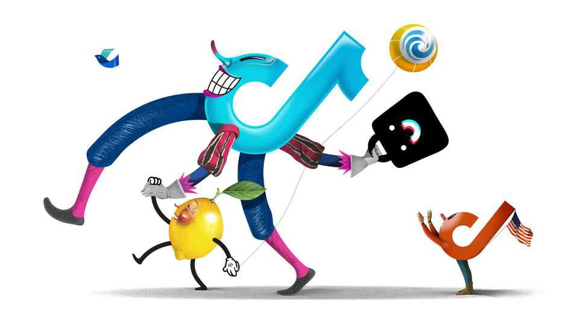

Business | Schumpeter
ByteDance will be better off without TikTok US
There is a lot more to the Chinese tech giant than its American offshoot
October 2nd 2025

ONCE YOU start using TikTok, good luck taking your eyes off it. The same goes for the saga of the Chinese app’s American misadventures. Unlike TikTok’s irresistible short videos, this has dragged on for years. Now, at last, it is nearing a denouement. In late September the contours began emerging of an arrangement reached between Donald Trump and his Chinese counterpart, Xi Jinping, to hand control of TikTok US to a consortium led by American investors. It was either that or, in keeping with a bipartisan law signed in 2024 by Mr Trump’s Democratic predecessor, TikTok would eventually go dark in America. Though the details remain fuzzy, a 30-second TikTok run-down would go something like this. The new owners (flash faces of Larry Ellison and a few

of Mr Trump’s other Silicon Valley chums) got 80% of shares in the American entity. The deal values it at $14bn. Huh? Analysts thought it was worth at least $40bn and perhaps as much as $100bn. Ahhh! Turns out that half the profits would still flow to ByteDance, TikTok’s parent company in Beijing, which would retain a 20% interest. But a licence to use the app’s eye-adhesive recommendation algorithm is now in American hands, ensuring it cannot be manipulated by the Communist Party. Big thumbs up.

TikTok’s American devotees, 117m of whom scroll through it at least once a month, according to eMarketer, a research firm, can relax. The new shareholders can rub their hands at what looks like a bargain even given their diluted economic stake. And Mr Trump can revel in the glory of closer- in-chief.

Yet the biggest winner of all may in fact be ByteDance. That is because letting go of TikTok US removes a distraction from its $330bn parent’s low- key global conquest. One ByteDance investor goes so far as to suggest it could be even more valuable shorn of TikTok US altogether.

Amid all the hoopla it is easy to overlook just how small a part of ByteDance’s e-empire America makes up. By all accounts, it is not a particularly profitable one, either, at least for the time being. TikTok has more than 1bn monthly active users outside the United States—all the more impressive when it is outlawed in populous India. Douyin, its elder Chinese sibling, chips in another 800m or so—and is making real money. It was probably responsible for most of the $33bn in net profit ByteDance reportedly generated last year, on global revenues of $155bn.

Crucially, ByteDance is no longer just about selling ads alongside catchy clips. This contributed $49bn to sales in 2024, reckons eMarketer, less than a third of the total. The privately held firm has displaced Baidu, a diminished tech pioneer, as the B in BAT, a popular shorthand for China’s digital oligopoly. It is going head to head with the acronym’s two listed constituents, Alibaba and Tencent, in everything from entertainment and e- commerce to artificial intelligence (AI) both at home and abroad. In some parts of the world, it is ready to challenge Western big tech, too.

The magic of ByteDance lies in its knack for creating products that successfully cut across existing categories. Are TikTok and Douyin social apps? Sort of, though more in the sense of YouTube than of Facebook or Instagram, which despite TikTok-like tweaks to their algorithms remain partly about forging and nurturing social ties. Are they show business? Sure, but not like Netflix or Disney, with their gargantuan production budgets.

Or maybe e-commerce? That, too, now that you can buy as you binge on the app’s mesmerising content. ByteDance is the third-biggest online-shopping platform in China by value of goods changing hands on it, behind only Alibaba and Pinduoduo. This year TikTok Shop entered countries including Brazil, France and Germany. In Britain, where it has been around since 2021, it is the fourth-largest online pedlar of clothes, sashaying past Marks & Spencer and eBay, according to Morgan Stanley. Thanks to a shotgun merger in 2024 with Tokopedia, an Indonesian online emporium, TikTok now controls over a quarter of e-commerce in the ASEAN club of South- East Asian countries.

TikTok and Douyin are also increasingly being used as a novel kind of online search, offering up tips and information that people would once have googled. This poses a challenge not just to Baidu, once hailed as China’s Google, but also to the American original. And that is before you get to AI.

ByteDance has been a machine-learning company since its inception in 2012. Like Google with its page-rank algorithm, it created its eerily accurate recommendation engine first and built a business around it later. This is now being augmented by generative AI. Last year ByteDance bought over 200,000 high-end AI chips from Nvidia, more than Amazon, Google, Meta or Tencent. Its large language models rank at or near the top of various cleverness league tables. Its Chinese chatbot, Doubao, had 157m monthly users in August, taking market share from DeepSeek, its more globally recognisable rival. It is China’s top AI app; its sister Jimeng, an image- generator, is number four.

ByteDance’s category-busting business model was always going to be harder to deploy in America’s digital market than in less mature ones. TikTok Shop opened there only in 2023, three years after Douyin introduced its version in China. Given geopolitical sensitivities, layering AI on top of

TikTok US would be yet more forbidding. Better to focus attention and resources on less contentious places. With the American hassle behind it, ByteDance may accelerate the roll-out of new features everywhere else.

So why not dump TikTok US once and for all? To Mr Xi that may have been a concession too far to Mr Trump. For ByteDance, it could have been a cleaner—and more lucrative—outcome. ■

Subscribers to The Economist can sign up to our Opinion newsletter, which brings together the best of our leaders, columns, guest essays and reader correspondence.

This article was downloaded by zlibrary from https://www.economist.com//business/2025/10/02/bytedance-will-be-better-off- without-tiktok-us

Finance & economics

How the Trump administration learned to love foreign aid Credit markets look increasingly dangerous The economics of self-driving taxis China’s stockmarket rally may hurt the economy The eccentric investment strategy that beats the rest Don’t tax wealth