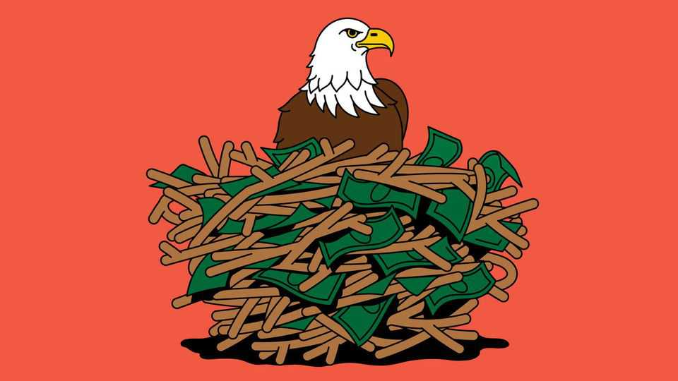

Finance & economics | Financial diplomacy
How the Trump administration learned to love foreign aid
America’s international assistance has not been destroyed—it has been transformed
October 2nd 2025

Nobody expected President Donald Trump to save a country from financial crisis. Yet on October 14th he will meet Javier Milei, Argentina’s president and an ideological ally, to discuss the details of a rescue package. America has already promised Argentina a swap line worth $20bn—an amount representing half the South American country’s foreign reserves—in order to address investors’ fears about the durability of Mr Milei’s currency reforms, which had sent the peso tumbling. Treasury officials are also considering a raid on the Exchange Stabilisation Fund, a stash of dollars that was last used to assist a foreign country in 2002.

Eight months into his second term, Mr Trump has overhauled America’s financial diplomacy. For decades, policymakers had sought to alleviate poverty and win friends doing so. Cash was doled out via aid agencies, as well as the IMF and World Bank, in which America is the biggest shareholder. Now Mr Trump has shut off half the money America sent abroad, panicked multilateral institutions and is extending the most generous American bail-out in 30 years. When Mr Trump began to wield the axe, officials feared America would give up funding developing countries altogether. Instead, a new approach is emerging.

It represents a revolution. American financial diplomacy is now nakedly self-interested. Money is on offer to ideological allies, leaders who control something Mr Trump wants and countries he hopes to lure away from China. In the long run, more could be spent on these goals than was once spent on poverty alleviation. The problem is that they are in tension.

Officials at the IMF and World Bank were reassured when, in April, Scott Bessent, America’s treasury secretary, said that he would not withdraw support so long as both reformed. But they are now worried about what will happen when the White House realises its requests are impractical. Mr Bessent wants the IMF to cut overall lending, which would take decades, and help America reduce the trade surplus of China, another shareholder.

Meanwhile, the Trump administration has rejigged three organisations to pursue its new agenda. In July USAID, America’s main aid agency, handed its last funds to the State Department, where a small team led by aid sceptics has been asked to find new uses for the cash. The Millennium Challenge Corporation, an infrastructure lender frozen in April, has reopened, albeit at a quarter of its earlier size, and been put under Chris Landau, the deputy secretary of state. The State Department will control most of the Trump administration’s international-affairs budget of $31bn in 2026, which is half the size of last year’s pot.

The third institution is the International Development Finance Corporation (DFC), which lends to foreign firms. Mr Trump set it up in his first term; its loan book is capped at $60bn, mostly raised from private investors. The White House wants to lift that to $250bn, which will need congressional approval. Officials at all three say they will scrap most handouts, instead

lending at close to commercial interest rates or making equity investments. Anything that does not turn a profit must serve a narrow set of priorities to avoid being considered a waste of public funds.

On what can money be spent? One use is supporting friendly leaders. America rarely extends bilateral bail-outs, leaving it to the IMF. Now Mr Bessent is not only rescuing Argentina, he has declared unconditional support for Mr Milei. Despite Mr Trump’s isolationist tendencies, the bail- out shows he is willing to be generous to allies. America may struggle to recover funds drawn from the facility, as Argentina is burning through foreign reserves to protect the peso. Even after the bail-out, it still probably lacks the dollars to cover next year’s imports and loan repayments.

Mr Trump is also willing to pay to hurt rivals. China is the world’s biggest bilateral creditor. According to researchers at the College of William and Mary, it has spent $185bn since 2016 on bail-outs alone, second only to the IMF. That has become a problem during tariff negotiations. American officials had hoped to persuade more trade partners to place duties on China, but it is difficult to do so when countries are indebted to Chinese creditors.

An American bilateral bail-out service might solve part of the problem. America has been asking Mr Milei to shut down an $18bn swap line with China since April; now it has leverage. Consequently, it has also asked him to stop selling soyabeans to China. A Treasury official says that Argentina’s may be the first of several bail-outs from America on similar terms, although it is unclear who else might receive them.

Officials could also take on China with the America First Opportunity Fund, a new $3bn pot controlled by Marco Rubio, the secretary of state. State Department officials say that they are considering financing telecoms deals in South-East Asia, where many networks are run in partnership with Chinese providers. Other money could go on tuna fishing in the South Paciffic and, in the form of loans, to Latin American governments that refuse Chinese firms access to critical minerals.

The last diplomatic priority is domestic industrial policy. This may sound odd, but the idea that foreign assistance must solve American problems is now sacrosanct. State Department priorities increasingly resemble a

shopping list: rare resources, sophisticated electronics and defence components. The Trump administration has offered the Zambian government inducements to fast-track mines, has tied military aid to mineral exploitation in Ukraine and is expected to sign a similar deal with the Democratic Republic of Congo next month. The DFC has committed to helping an American firm drilling for copper in the DRC by constructing a railway. And Mr Trump has told the institution to do everything from finding Greenlandic exploration sites to lifting production of brushless motors, a drone component.

This agenda is bold. It is also expensive, and the White House had promised less foreign assistance. Running a lending programme to rival China would alone be ruinous. According to the Council on Foreign Relations, a think- tank, in 2024 the foreign loan books of just two Chinese state banks were worth $506bn. Even with lawmakers onside, the most Mr Trump will be able to offer is $300bn. Chinese officials may even welcome the competition: they have grown tired of rescuing troubled economies.

So far Mr Trump has made choices on the fly, ignoring the price tag. Officials working for Mr Trump hope his ambitions will moderate as he realises the scale of finance involved, in which case bail-outs and anti-China handouts might be dropped in favour of mining projects. If not, and plans to enlarge the DFC are approved, the White House would become a bigger donor than under Joe Biden—not something MAGA types would enjoy. ■

For more expert analysis of the biggest stories in economics, finance and markets, sign up to Money Talks, our weekly subscriber-only newsletter.

This article was downloaded by zlibrary from https://www.economist.com//finance-and-economics/2025/10/02/how-the-trump- administration-learned-to-love-foreign-aid