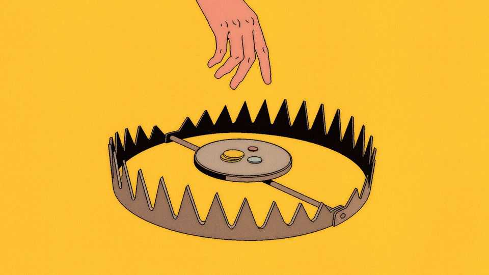
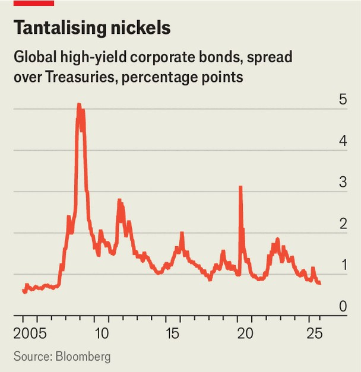

Finance & economics | About to snap?
Credit markets look increasingly dangerous
A pair of bankruptcies highlight the risks
October 2nd 2025

Mention 2007 to a group of professional investors, and watch them bristle. The year was a bad one. It marked the end of the great moderation—a long period of low inflation and steady economic growth that began in the 1980s —and the start of strains in credit markets which became the global financial crisis. You would not be the only one bringing up the year, though. Gloomier investors now sense pre-crisis complacency in credit markets. Over the past month, the spread between yields on corporate bonds and Treasuries has fallen to its lowest since 2007. Junk bonds offer spreads of just 2.8 percentage points, far below the 4.5-point average of the past two decades. A handful of the highest-rated corporate bonds, issued by firms like

Microsoft, offer yields lower than those issued by the American government. The market is priced for perfection; investors think the risk of disorder is just about as low as it has ever been.

They do so even as high-profile bankruptcies and worries about America’s economy cause strains in corners of the credit markets. On September 10th, Tricolor Holdings, a sub-prime automotive lender, filed for bankruptcy. It stands accused of fraud by Fifth Third Bank, one of its creditors. Then on September 28th First Brands, a car-parts-maker, followed suit. The company revealed a web of liabilities worth at least $10bn; an internal probe is now investigating whether the firm used receivables—money that was due from customers—to borrow from lenders several times over. Jefferies, an investment bank, and Millennium Management, a hedge fund, are among those facing losses.

Just how risky is corporate lending? A boom in alternative markets has made it difficult to answer that question. America’s private-credit market, home to roughly $1.6trn of outstanding loans at the end of 2024, is now about the same size as its junk-bond market. Private credit ballooned as banks withdrew from riskier lending following the financial crisis; new institutions sought high returns in opaque markets, and were willing to put up with the risk doing so entailed. This has led to extraordinarily complex financial

arrangements, many beyond the sight of regulators and even the institutions involved.

Private-credit investors must now hope that recent blow-ups are isolated events, not harbingers of worse to come. They have reason to be pessimistic. Lincoln International, an investment bank, suggests that 11% of private- markets firms are receiving “payments-in-kind”, in which borrowers defer interest payments and offer creditors IOUs instead, up from 7% at the end of 2021. Liability-management exercises—creative restructurings of a struggling firm’s debt—have become more common, keeping official bankruptcy rates lower than would have been the case. Meanwhile, business- development companies, financial vehicles that raise capital to invest in private credit, have fallen out of favour. An index of listed BDCs is now down 7% for the year, including dividends.

There are flashes of weakness in America’s economy, too, especially among poorer consumers, suggesting more firms may come under pressure. The share of automotive debt unpaid for 90 days or more rose to 5% in the second quarter of the year, its highest in five years. Sales of lorries, used by investors to track America’s retail and industrial economies, have dropped from an annual rate of 553,000 in May 2023, their post-pandemic peak, to one of 422,000 in August, the lowest in five years. The unemployment rate has crept up. And this is before the impact of America’s new tariff levels, the highest since the 1930s, has fully fed through.

Fitch, a credit-rating firm, notes that the consequences of a potential slump have not just grown—they are also no longer constrained to giant investment outfits. Private-credit firms have marketed themselves to smaller investors, including retirement accounts. At the same time, banks and insurers have lent more to them. Fitch’s analysts caution that private credit’s connections to the banking system are not yet large enough for it to constitute a risk to the entire financial system, as was the case with credit markets in 2007. But even without a financial crisis, blow-ups can have wide-ranging effects. In 2015 and 2016 a slump in the oil price led to panic over bonds issued by energy companies. That sell-off rippled through other parts of the market, too, with the bonds of less creditworthy companies slumping in price. Something similar could be sparked by worries over low-income consumers.

And even if a credit bust does not arrive, there are other dangers for investors. With spreads so close to their historical lows, there is vanishingly little money to be made in exchange for the risk that investors are taking on. “In equities, everyone is obsessed with the upside. But in fixed income, when spreads are at all-time tights, it’s a matter of when, not if,” says Oksana Aronov of JPMorgan Asset Management. “You don’t want to be picking up the nickels in front of that steamroller.” ■

For more expert analysis of the biggest stories in economics, finance and markets, sign up to Money Talks, our weekly subscriber-only newsletter.

This article was downloaded by zlibrary from https://www.economist.com//finance-and-economics/2025/10/02/credit-markets-look- increasingly-dangerous