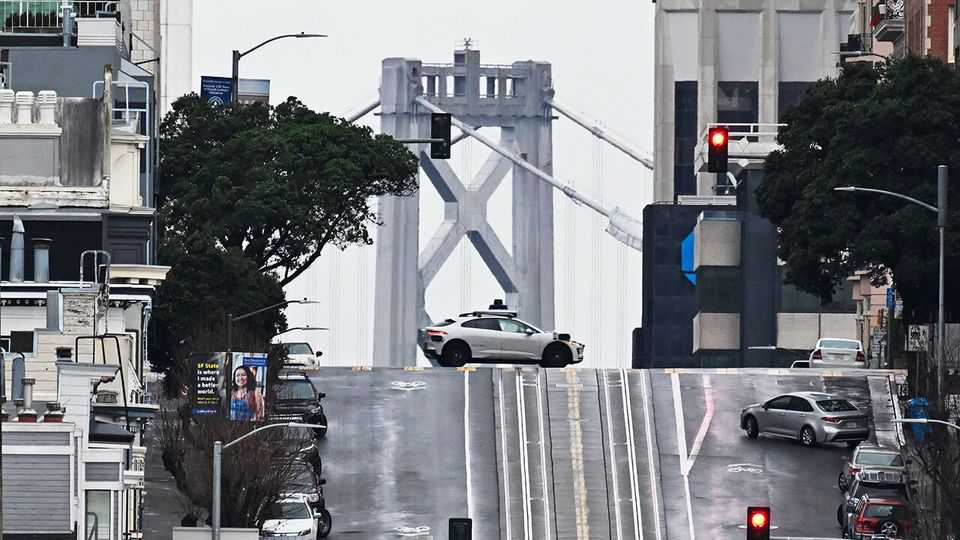

Finance & economics | Way more
The economics of self-driving taxis
Waymo is a case study in automation
October 2nd 2025

AUTONOMOUS TAXIS are taking over San Francisco. Waymo, which launched only in 2023, may now have over a fifth of the city’s ride-share market. Wherever you look, one of the company’s white Jaguars whooshes past. Tesla’s robotaxis have joined them, though with a supervisor in the driver’s seat. Before long Zoox, a firm owned by Amazon, will set its taxis free in the city. The robotaxi boom raises a question: when tech automates a profession, what happens to human workers? You might think that drivers are doomed. In fact, the rise of autonomy has played out in two different ways. First, it has raised overall taxi demand in San Francisco, limiting job losses. Second, it has catered to a lucrative corner of the market.

Take the size of the market first. According to official data, in 2024 the number of people in San Francisco working for “taxi and limousine service” firms grew by 7% against a year earlier. Total pay in the industry rose by 14%. Figures from the city indicate the number of regular taxi trips is about the same as last year. It can still be hard to find a yellow cab at peak times. “As self-driving cars enter the marketplace, they will actually expand the market,” David Risher, chief executive of Lyft, a human-powered ride- hailing firm, has predicted.

The extra riders come from different places. Waymo claims that people visit San Francisco to take its taxis, which would represent pure additional demand. More probably, residents are using private cars less. When the alternative was a Lyft or an Uber, people may have preferred to drive themselves, since the risk of having to engage in awkward conversation was too great. In a driverless taxi you can sit in silence. Now overall spending on taxis appears to be growing especially quickly compared with in other cities. And since Waymo’s launch the number of private cars, adjusted for population, has fallen.

Autonomous taxis are nonetheless a long way from being a mass-market product. Waymos are comfortable and generally clean. But they are perhaps 20-40% more expensive than a Lyft or an Uber. They are also slow. Unlike human-piloted taxis, autonomous ones rarely break traffic rules; you cannot tell a robot to “step on it!” Human drivers in San Francisco now know that if they bully a robotaxi it will give way, meaning Waymos are often slow to move.

Over time, robotaxi companies may iron out some of these flaws by, for instance, cutting prices. But do not expect autonomous taxis to dominate the market soon, in San Francisco or anywhere else. If you have time, by all means sit in a robotaxi. If you need to get somewhere fast, there is nothing better than a yellow cab.■

For more expert analysis of the biggest stories in economics, finance and markets, sign up to Money Talks, our weekly subscriber-only newsletter.

This article was downloaded by zlibrary from https://www.economist.com//finance-and-economics/2025/09/28/the-economics-of-self- driving-taxis