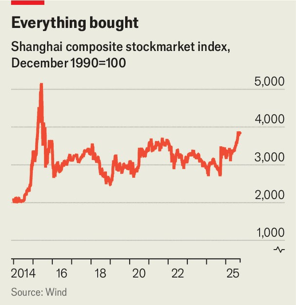

Finance & economics | Purple patch
China’s stockmarket rally may hurt the economy
The “wealth effect” is not the only way it has an impact
October 2nd 2025

SOME CALL it 9/24 for short. On September 24th last year China’s officials decided to engineer a rally in the stockmarket. The central bank cut interest rates and bank reserve requirements. It also enabled companies to buy back their shares and institutional investors to leverage their balance- sheets more easily. The markets took the hint. Buy “everything”, advised an American hedge-fund manager. A year later, the Shanghai composite, an index of pretty much everything that can be bought on the Shanghai Stock Exchange, is up by about 40%. The rally drew strength in its early stages from the promise of fiscal stimulus and enthusiasm for homegrown artificial intelligence. More recently it has gained momentum from the government’s efforts to discourage price wars,

which, though good for consumers, are bad for the profits on which shareholders have the final claim. Last month the index exceeded 3,800 for the first time in ten years. But the government’s ultimate goal was not merely to revive the market. It hoped the market would help revive the economy, too. Unfortunately, the economy has refused to take the hint.

High stock prices can provide a lift to shareholders’ paper wealth and morale, which might encourage them to spend—what economists call the “wealth effect”. Rich valuations can also give firms the means and the motivation to expand their businesses. On top of this, a buoyant, bustling stockmarket improves the fortunes of the brokers, dealers and banks that handle share purchases and finance them.

The stockmarket revival does seem to have increased the risk appetite of households. After years of hoarding cash, especially in the covid-19 pandemic, they are now accumulating bank deposits at a less determined pace. Meanwhile, the number of new share-trading accounts opened since 9/24 in Shanghai may exceed 30m by the end of September. Bulls talk of a “tectonic shift” out of deposits into stocks.

Greater faith in the market has not stirred optimism about the economy, however. Consumer confidence, which collapsed during the pandemic,

remains low. Household spending on goods and services has also been disappointing. Retail sales in August grew by only 3.4% year on year, before adjusting for inflation. “Buy everything” has not extended from the financial bourses to the shop shelves.

What about corporate spending? Hong Kong has enjoyed a listings bonanza this year. But initial public offerings (IPOs) on the mainland have been subdued. In April 2024 regulators raised listings standards after a stockmarket rout earlier in the year, which cost Yi Huiman, head of the securities regulator, his job. Although the tighter standards have helped preserve market momentum by strengthening investors’ rights and limiting the supply of new shares, they have also made the stockmarket harder to tap as a source of capital. Of all the money raised by non-financial companies in the year to August, only 1% was provided by the equity market. China’s regulators are wrapping a safety blanket around retail investors at the cost of putting a wet blanket on business investment. Mr Yi, meanwhile, is now being investigated for “serious violations of discipline”.

China’s stockmarket has rarely been a big source of finance for firms. Yet even if it does not provide the money for investment, the market can provide the motivation. In theory, companies will be keen to expand if markets place a higher value on their assets than the cost of reproducing them. In practice, things are different. Fixed-asset investment fell by over 6% in the year to August. The government’s injunctions against ruinous competition, including reckless expansions of capacity, may have contributed. Although corporate restraint may be good for the profitability and market value of firms, a heedless capex splurge would be better for demand.

The stockmarket is not just a barometer of the economy; it is also part of it. Financial institutions that serve the market, offering margin loans, brokerage accounts and so on, contribute to GDP. Sometimes they make a measurable difference to growth. During the stockmarket bubble of 2015, these activities soared. The turnover of shares rose by more than 900% in the year to the second quarter of 2015. This uptick in financial activity helped the sector grow by 23% in nominal terms in the second quarter of 2015, compared with a year earlier. Ultimately, it accounted for about 16% of the economy’s growth that year.

Recently, however, higher trading volumes have had a more muted impact on GDP: the financial sector has grown by only 4% in nominal terms so far this year, compared with last. One reason is that brokers’ fees have dropped, reducing the recorded value of the services they provide. Average commission has fallen from about 0.08% in 2014 to about 0.02% today, according to Lu Ting of Nomura, a bank. The boom in stock trading has also been overshadowed by the weak profits of China’s banks, which still dominate the sector.

Other parallels with 2015 make the government nervous. The past year’s rally has already lasted longer than the more frenzied bubble of a decade ago. Margin financing—stocks bought with money borrowed from brokers —has exceeded the 2015 record. One broker raised margin requirements last month, limiting the leverage its customers could take on. Regulators have also urged banks to investigate the misuse of other loans for share purchases, according to Bloomberg, a news agency. It reports that social-media platforms have been warned not to give too much publicity to the bull market.

The government is understandably afraid of another bubble. Such fear may delay further cuts in interest rates or reserve requirements by the central bank. But hesitation also poses risks. Deflation remains entrenched: factory- gate prices have been falling year-on-year for 35 months. Consumer-price inflation turned negative in August. The economic slowdown could worsen if exports falter and the property slump persists. The central bank started the stockmarket rebound a year ago in the hope of lifting the economy. It would be ironic if officials’ fear of what they have unleashed hurts the economy more than the rally has helped. ■

For more expert analysis of the biggest stories in economics, finance and markets, sign up to Money Talks, our weekly subscriber-only newsletter.

This article was downloaded by zlibrary from https://www.economist.com//finance-and-economics/2025/09/29/chinas-stockmarket- rally-may-hurt-the-economy