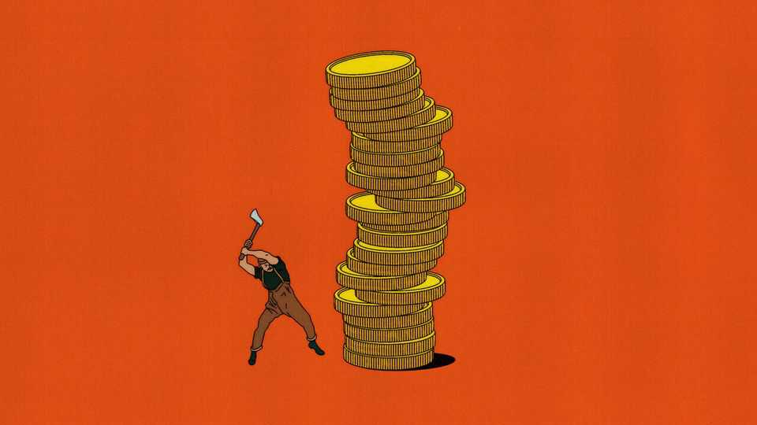

Finance & economics | Free exchange
Don’t tax wealth
Even the most sophisticated arguments in favour of doing so make no sense
October 2nd 2025

France is in a giant fiscal hole. This year the government will run a deficit, where its spending exceeds its revenues, of €160bn ($190bn, or more than 5% of gdp). Investors in its bonds are nervous; politicians need to close the gap. Left-leaning economists, and a growing number of centrist ones, believe that a wealth tax is part of the answer. Gabriel Zucman of the Paris School of Economics, for instance, has proposed an annual levy of at least 2% on fortunes larger than €100m. Although the arguments of economists today are subtler than those normally used to support levies on wealth, they are just as wrongheaded.

A dozen oecd countries had wealth taxes in 1990, but over time the approach has fallen out of favour. Austria abolished its wealth tax in 1994, Germany in 1997 and Sweden in 2007. Even France followed suit in 2018. Only three rich countries—Norway, Spain and Switzerland—still have a tax on net wealth.

Politicians abandoned such taxes because they did not work. The Mirrlees Review, a mammoth repository of good sense about tax policy published by the Institute for Fiscal Studies, a think-tank, and completed in 2011, found that wealth levies “might raise little revenue, and could operate unfairly and inefficiently”. They face numerous problems. Valuing wealth, and therefore the amount of tax to take, is supremely difficult. In response to new levies, the rich have an annoying habit of moving abroad.

Consequently, wealth taxes do not raise much money. Arguments from some on the right that they lead to economic destruction are overdone. But a large- scale review by the oecd found “limited arguments” for net wealth taxes on top of those on capital gains and inheritance. And politicians have found plenty of other ways to ensure that the richest pay lots of tax. In America effective tax rates now rise from 2% for the bottom quintile of income to 45% for the top 0.01%, according to a recent study by David Splinter of America’s Joint Committee on Taxation. Tax systems in most other rich countries are also highly progressive.

Nonetheless, it is not just in France that wealth taxes are back on the agenda. In Britain and Germany their reintroduction is discussed from time to time. Australians are debating whether to place higher taxes on people with large retirement accounts. In America, President Joe Biden floated the idea of a tax on unrealised capital gains, which would have been a wealth tax of sorts.

Economists are aware of the problems such taxes face. A growing number support their reintroduction regardless. “I don’t like wealth taxation, but… there is a good case for an exemption in today’s France,” wrote Erik Fossing Nielsen, formerly of Goldman Sachs, a bank. Olivier Blanchard, formerly the imf’s chief economist, has endorsed a Zucman-style tax, though at a lower rate. Governments will soon have to take painful decisions to close budget deficits, and the necessary measures will probably include cuts to social services and increases in other sorts of taxes. To avoid a new wave of

support for populism, or so the thinking goes, politicians will have to convince the public that the rich are sharing the load. A Zucman-style tax, which 86% of the French public say they support, might be the perfect way to do just this.

It is a seductive argument. It is also misguided. Some economists object to their colleagues’ advocacy of wealth taxes on procedural grounds. “In my view”, wrote John Cochrane of Stanford University, “economists should analyse tax policy based on incentives, not moral sentiments, where we have little comparative advantage.” Leave politics to the politicians, in other words.

There are more substantive objections. Wealth-tax arguments fail on the grounds of durability, utility and naivety. Begin with durability. Zucman- style taxes may be popular for the moment, yet continued support is far from guaranteed, since the public has peculiar views when it comes to taxation. Americans, for instance, say that they want progressive taxes but, when asked about particular levies, also hate progressive taxes the most. A paper by Ursula Dallinger of the University of Trier suggests that support for wealth taxes can ebb, depending on factors including the state of the economy. Thus France could be left with a tax that is both economically damaging and politically counter-productive.

Second, utility. Even if a wealth tax remained popular after its introduction, would it achieve the goals sought by supporters such as Mr Blanchard? The French public would enjoy poking plutocrats in the eye. But the joy would almost certainly be fleeting. The tax would not raise enough money to offset required cuts elsewhere; any momentary jubilation would surely give way to incandescent rage once the government announced, say, reductions in disability benefits or a modest rise in the retirement age.

Third, naivety. Mr Zucman’s newfound supporters underestimate the risks of letting the wealth-tax cat out of the bag. Many wealth-tax advocates almost certainly see a levy of 2% as just the start. While helping Bernie Sanders’s presidential campaign in 2019-20, Mr Zucman seemed to favour a tax of 8% on America’s biggest fortunes. And observe Thomas Piketty, Mr Zucman’s mentor, who has gone in the past decade from advocating mild wealth taxes to ones that would confiscate 90% of the biggest fortunes. Mr Piketty

recently floated the possibility that rich folk who tried to leave France to avoid the tax should be arrested at the airport.

France has other options if it wants to right the fiscal ship, and to do so without savage cuts. Higher rates of vat, as well as taxes on land and other immovable property, would raise plenty of money. A carbon tax would make a difference, too. And at some point the country will have to raise its absurdly low retirement age. None of this would be easy. But implementing a bad policy in order to achieve a good outcome is rarely a wise approach. ■

Subscribers to The Economist can sign up to our Opinion newsletter, which brings together the best of our leaders, columns, guest essays and reader correspondence.

This article was downloaded by zlibrary from [https://www.economist.com//finance-and-economics/2025/10/02/dont-tax-wealth](https://www.economist.com//finance-and-economics/2025/10/02/dont-tax-wealth)

Science & technology

Armed forces are using 18th-century technology to spy on enemies Restocking an African lake may ameliorate a debilitating plague A new technique can turn a woman’s skin cells into eggs A portent of death may have helped create life Are red-light face masks worth the hype?