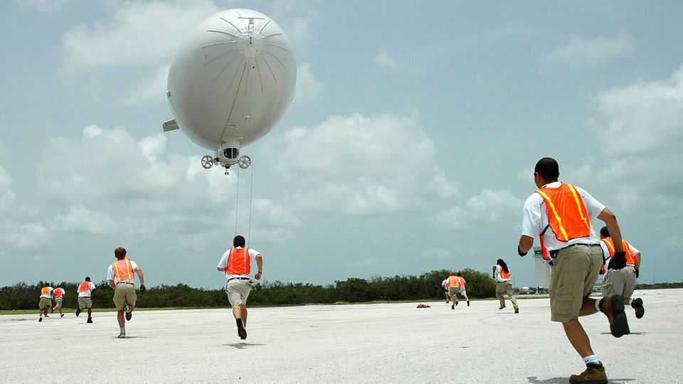
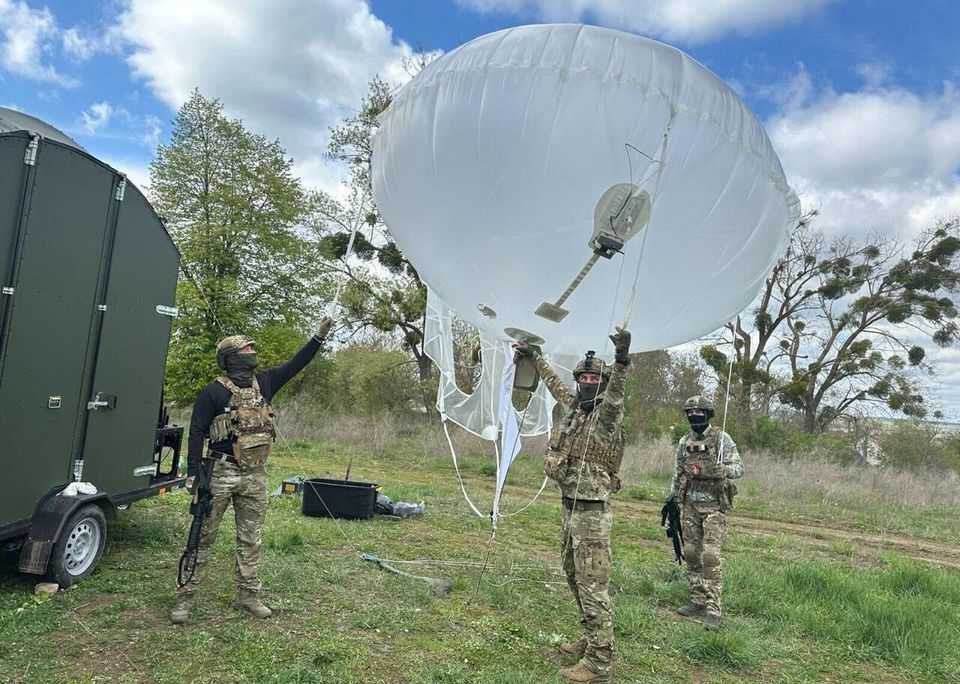

Science & technology | Not hot air
Armed forces are using 18th-century technology to spy on enemies
High-altitude balloons are surprisingly useful in modern conflicts
October 2nd 2025

SOLDIERS ON MANOEUVRES do relish a “sinking exercise”: the blowing up of a clapped-out warship as target practice. And during Valiant Shield 2024, a wargame in the Pacific, many witnessed a first-of-its-kind scuppering. A stratospheric balloon carrying what were described as “electromagnetic spectrum sensors” helped guide the American army’s new Precision Strike Missile into a moving vessel. This year, meanwhile, has seen that army sign a deal worth $4.2bn to upgrade its fleet of tethered “aerostat” balloons, employed for surveillance and communication closer to the ground. And other countries are following suit. Poland is buying four American aerostats for inclusion in an early-

warning radar network it is building to detect Russian missiles and aircraft. Israel has deployed aerostats along its border with Lebanon, to warn of incoming rocket fire. Ukraine is using them as signal relays, to enable its drones to fly longer distances under control. After decades in the wilderness, military balloons are taking off again.

Military ballooning flourished soon after ballooning’s invention in France, in 1783 (Chinese “sky lanterns”, though invented centuries earlier, were never turned into people-carriers). In 1794, for example, the French tethered a hydrogen balloon above a battlefield to spy on Austrian manoeuvres below. Reconnaissance balloons also saw action in the American civil war. In the Franco-Prussian war they carried messages between besieged Paris and the outside world. And they were deployed by both sides in the first world war to snoop on and behind enemy trenches.

By the second world war, however, planes had replaced them and they were relegated, in the form of barrage balloons, to the role of defence against those mechanical interlopers. And in the 1960s satellites rose to prominence for spying and communication. It may thus come as a surprise—in an age where satellite constellations fill the sky and drones are ubiquitous—that armed forces around the world are reviving balloons. But they are.

These devices come in two main forms: aerostats and high-altitude balloons. Aerostats are tethered blimps that operate between three and five kilometres up. Besides acting as signal relays they can lift sensors intended to detect low-flying threats, such as missiles and drones, that can leak through conventional radar coverage. They cost far less than the airborne warning and control aircraft (AWACs) now used for aerial radar surveillance. And they can stand guard for weeks on end.

Deploying them has not been without incident. America’s JLENS programme, designed to detect and track potential cruise-missile threats around Washington, involved two aerostats floating 3km up, each equipped with a radar weighing more than three tonnes that was capable of seeing things as far away as 550km. Thick Kevlar tethers kept the blimps in place. At least, they were supposed to. But in 2015 one escaped its tethers and floated for nearly 150km across Maryland and Pennsylvania, terrorising residents. The programme was cancelled soon thereafter.

That incident, though, is now in the past, as this year’s upgrade deal shows. For one thing, soldiers are learning a great deal about aerostats from other users. America’s Customs and Border Protection agency, for example, has a handful of them festooned along the Mexican border to monitor routes used by drug- and people-traffickers. Another balloon, flying above the coast of Puerto Rico, employs its radar to detect drones and small ships carrying drugs across the Caribbean.

The biggest factor behind the newfound zeal for ballooning, though, is China. In February 2023 an immense Chinese balloon, carrying surveillance equipment in a body the size of a bus, drifted across America for days until it was popped by a fighter jet. China has also floated more than a hundred surveillance balloons over the Taiwan Strait in recent years.

Unlike aerostats, these high-altitude balloons are untethered. They often float in mid-stratosphere, 24-37km up. That is well above the altitude of commercial aircraft, but far closer to the ground than satellites in low-Earth orbit, which are 160-2,000km up. Because short-range communication signals are susceptible to atmospheric absorption, they are more easily monitored from a balloon than from space. The balloons’ lower altitude also means they can take higher-quality pictures of the ground than most satellites manage. And rather than whisking past as satellites do, balloons can loiter over an area of interest. Some modern balloons use artificial intelligence to assist this by predicting and riding on appropriate wind currents.

For these reasons, some experts say high-altitude balloons collect higher- quality intelligence than satellites. And they do so at lower cost, being cheap to launch and easy to retrieve. Unlike large, robust aerostats, they are hampered by small payloads (these rarely exceed 30 or 40kg). But advances in miniaturisation have revitalised their usefulness, says Bryan Clark of the Hudson Institute, a think-tank. Small electronic-warfare payloads slung under such a balloon can suck up data originating hundreds of kilometres away. Balloons also emit little heat or sound and use passive sensing equipment, making them fiendishly hard to detect. Unless you are looking for it in the first place, notes Mr Clark, a balloon is likely to sail by unnoticed.

America’s armed forces are increasingly testing high-altitude balloons. One idea is to launch swarms of them over battlefields as part of networks that identify targets and guide munitions to them. Some Pentagon officials believe that the hulking AWACs now employed to do that job would be vulnerable in a high-intensity scrap with China. The army is also mulling the use of balloons to ferry and drop armed drones deep behind enemy lines. The money is beginning to flow, too. Tucked away in the One Big Beautiful Bill, a tax and spending measure passed by Congress in July, is $50m earmarked for experimental “stratospheric balloons”.

Limitations remain. Steering balloons at high altitude, where wind speeds tend to be high as well, remains tricky. Power is another constraint. A balloon’s electronics usually rely on small solar panels, which limits their level of sophistication. Electronic warfare could also make communication

links susceptible to jamming. And spy balloons shot down over foreign countries tend to spark diplomatic kerfuffles, as America and China can attest. But not as much as shooting down enemy spy planes. The balloon, as it were, is up. ■

Curious about the world? To enjoy our mind-expanding science coverage, sign up to Simply Science, our weekly subscriber-only newsletter.

This article was downloaded by zlibrary from https://www.economist.com//science-and-technology/2025/09/29/armed-forces-are- using-18th-century-technology-to-spy-on-enemies