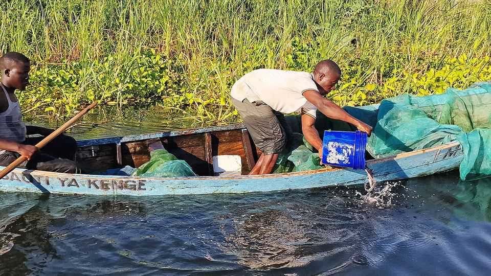

Science & technology | Catfish v bilharzia
Restocking an African lake may ameliorate a debilitating plague
Catfish eat the snails in which the parasite lives
October 2nd 2025

LAKE VICTORIA looks an inviting place for a quick dip. Don’t. Its waters are replete with tiny parasitic worms, called schistosomes, that drill through human skin and damage organs ranging from the liver to the brain. The result is bilharzia, an illness that affects about 200m people, particularly in Africa. It kills more than 10,000 of them a year, but that is not its only serious consequence. Many victims are children, and the parasites stunt both their physical growth and their cognitive abilities, damaging their personal prospects and dragging down the economies of what are already poor countries.

Bilharzia is treatable, but treatment does not stop recurrence and is not always easily available. Reducing exposure to the parasites would be ideal. In the case of Lake Victoria, a study in plos Neglected Tropical Diseases by Roland Proud of St Andrews University and his colleagues suggests boosting the lake’s badly degraded catfish population might help.

Schistosomes’ life-cycle involves two, alternating hosts—mammals (humans included) and aquatic snails. Take out the snails and you break the cycle. But attempts to do this with molluscicides have had limited success. Hence the interest of Dr Proud’s colleague, Andrew Brierley, in boosting catfish populations.

The late Dr Brierley (he died in 2024) had noticed that bilharzia goes up when certain pesticides are deployed adjacent to African lakes, and that these pesticides are killing predators, such as catfish, which eat snails. Boosting the predators might thus ameliorate the problem.

Unfortunately, catfish numbers in Lake Victoria have crashed in recent decades. Overfishing and the introduction of Nile perch, a predatory creature that wreaks havoc on native species, are to blame. A lot of boosting would thus be needed.

To this end Dr Brierley and Dr Proud bred 50,000 catfish fingerlings and released them at three sites on the lake’s Tanzanian shore, with four, similar sites as controls. Locals were enjoined not to fish for them for three months, after which the researchers surveyed snail populations and collected stool samples from children at local schools to monitor infection rates.

The upshot was that, on average, snail populations declined by 57% in places that had been stocked with catfish, and the number of parasite eggs in the children’s faeces dropped by 55%. The control areas, by contrast, showed no decline.

Short-term restocking with catfish thus does seem to work. Whether it would work in the long-term is a different question. But the benefits of reducing bilharzia are such that it might be worth trying. ■

Curious about the world? To enjoy our mind-expanding science coverage, sign up to Simply Science, our weekly subscriber-only newsletter.

This article was downloaded by zlibrary from https://www.economist.com//science-and-technology/2025/10/01/restocking-an-african- lake-may-ameliorate-a-debilitating-plague