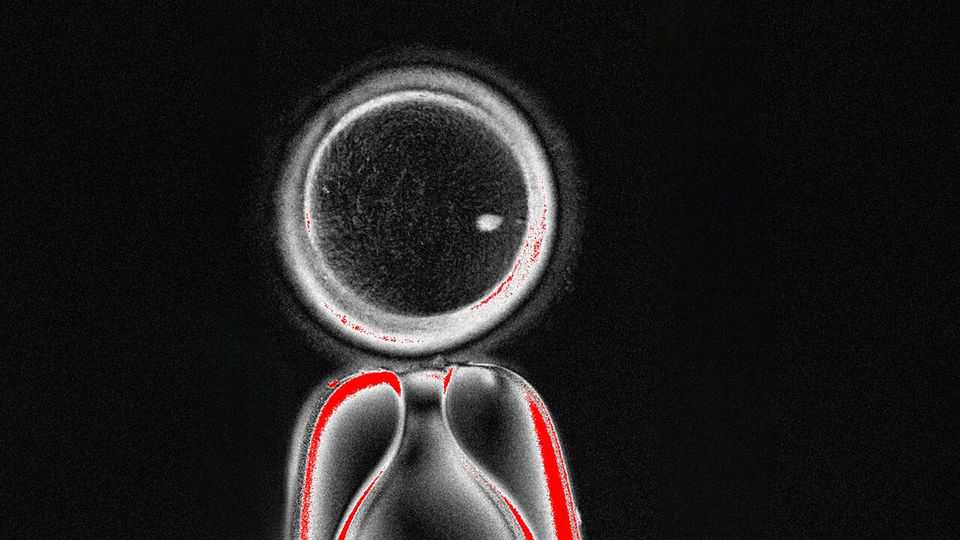

Science & technology | Reproductive technology
A new technique can turn a woman’s skin cells into eggs
But improved fertility treatment is still far away
October 2nd 2025

MANY COUPLES struggle to conceive. Some are helped by IVF (in-vitro fertilisation). But if the woman has no usable eggs to fertilise, they must either give up or use a donor. Researchers have thus worked for years to create eggs for women who lack them. So far they have succeeded only in mice, but that could be about to change. In a paper just published in Nature Communications, a group of scientists report they have—albeit imperfectly —made fertilisable human eggs from skin cells. Previous efforts focused on in-vitro gametogenesis (IVG). This transforms skin cells into stem cells, which can then turn into other sorts of cells. But transforming stem cells into egg cells is particularly complicated. A team led

by Shoukhrat Mitalipov from the Oregon Health & Science University have therefore revived another approach: the somatic-cell nuclear transfer (SCNT) method used to create Dolly the sheep. But they have added a twist.

First, they obtained egg cells from volunteers and removed those cells’ nuclei. They then harvested skin cells from other volunteers, cultured these and let individual cells from the culture fuse with the enucleated eggs.

Had they sought to clone the skin-cell donors—which they did not, not least because it would be illegal in most countries—they could now have nudged the re-nucleated eggs to become embryos. But infertile couples want to have babies together, not clone themselves. That presents a technical hurdle. Most human cells have 46 chromosomes, but eggs and sperm have only 23, so that when they fuse, the resulting embryo will revert to the normal number. However, the skin nuclei that went into the eggs delivered 46 of them, leaving no room for genetic material from a sperm.

Dr Mitalipov’s team thus needed to jettison half the implanted chromosomes. They did so by hijacking the process of cell division, which takes place naturally in one of two ways, meiosis and mitosis.

Meiosis, which results in sperm and eggs, sheds half of the chromosomes. This is why those cells have only 23. Mitosis, the route taken in other cells, passes on all 46. It does this by duplicating each chromosome and divvying up the results between the daughter cells. Using the skin cells’ nuclei before the chromosome doubling, however, and then making them divide early once inside the eggs, Dr Mitalipov’s team managed to initiate a new kind of cell division, which they call mitomeiosis, that forces nuclei which would normally undergo mitosis to shed chromosomes down to the number required for a fertilisable egg. They created 82 SCNT eggs this way, and fertilised these with sperm. Five went on to the stage of embryonic development known as a blastocyst before the experiment was terminated.

It is “a remarkable achievement”, says Evelyn Telfer, a reproductive biologist at Edinburgh University, but there is a long way to go before this kind of process could be used for human reproduction. For one thing, most of the eggs involved did not develop—a problem, because those eggs have to come from donors through a complex and invasive procedure.

A bigger issue, argues Tony Perry of the University of Bath, is that Dr Mitalipov’s team had no control over which and, to an extent, how many chromosomes were shed. Embryos must have the correct pairing between chromosomes, as well as the correct number. There must be one pair of chromosome 1, one pair of chromosome 2 and so forth. However, says Dr Mitalipov, “our system kind of makes errors” in that pairing. On average only about half the pairs match up, he says.

That is top of his list to fix. His team is studying exactly what happens during meiosis, so that they can recapitulate it in mitomeiosis. This is one reason why he says offering the new procedure to childless couples is still a far-off vision. Like all reproductive treatments, it will also require years of public discussion to pin down ethical questions, such as who should be eligible and what to do with surplus embryos.

Whether eggs from skin become a reality, and whether stem cells or SCNT proves the more effective approach, remain to be seen. Despite years of research, huge gaps exist in understanding of human reproduction. But there is no lack of enthusiasm. At least one (secretive) startup, called Conception Bio, is pursuing IVG. Hayashi Katsuhiko, a geneticist from the University of Osaka and a pioneer of the stem-cell approach, recently said that researching how to make eggs has started to feel “like being in a race”. With two competing methods, it does appear that way, even if the finishing line is not yet in sight. ■

Clarification (October 1st 2025): The last paragraph of this story has been edited to remove an ambiguity.

Curious about the world? To enjoy our mind-expanding science coverage, sign up to Simply Science, our weekly subscriber-only newsletter.

This article was downloaded by zlibrary from https://www.economist.com//science-and-technology/2025/09/30/a-new-technique-can- turn-a-womans-skin-cells-into-eggs