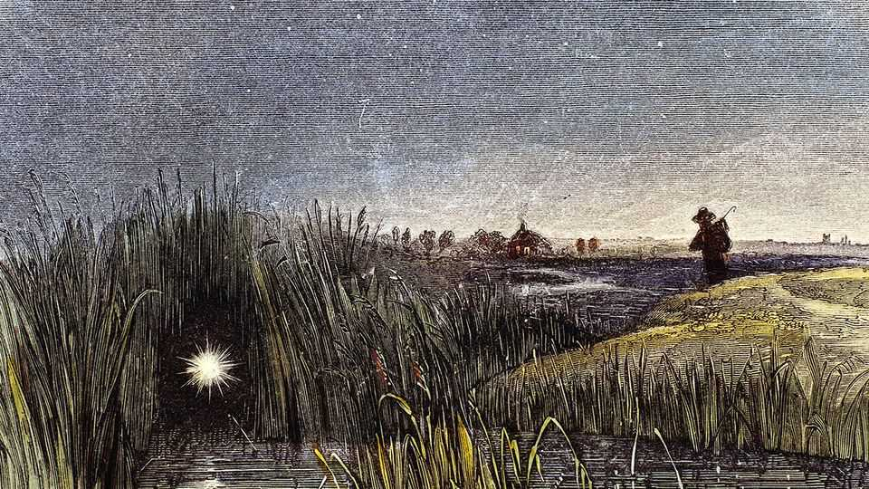

Science & technology | Will-o’-the-wisps
A portent of death may have helped create life
Marsh spirits seem to be created by a miniature version of lightning
October 2nd 2025

THEY WERE flickering blue flames hovering in swamps. They were the spirits of those who had died in the murky waters, bent on leading others to the same fate. They were will-o’-the-wisps and they do exist. Yet, spirits they are not. They are actually caused by the sudden ignition of methane bubbling out of swamps. What remains unknown is how ignition occurs. Explanations have often invoked sparks of static electricity. How static might accumulate in the damp of a marsh, though, has never been adequately explained. Until now. For Richard Zare, of Stanford University, thinks he has solved the mystery. In doing so, moreover, he may also have stumbled across part of the answer to a far bigger mystery: the origin of life on Earth.

Water, en masse, has no electric charge. But droplets of it do. Hydroxonium and hydroxide ions, respectively positive and negative, are created when water molecules break spontaneously in two. They accumulate on droplets’ surfaces, but which sort predominates depends on a droplet’s size. For tiny ones it is hydroxide, making these negative. For larger ones it is hydroxonium, making those positive. That opens the possibility of sparks flying between big and small droplets.

In 2024 Dr Zare showed that such sparks do indeed fly—generating light in the process. He called this microlightning, because a similar process of charge separation generates the bolts of thunderstorms. He also wondered if the same might apply to bubbles, especially the methane-rich bubbles that emerge from swamps.

As they report in the Proceedings of the National Academy of Sciences, he and a group of colleagues designed a microbubble generator, put it underwater and fed air into it. As the bubbles thus created broke surface, a high-speed camera and a nearby light sensor picked up brief flashes. And when the researchers released methane from the bubble generator, the flashes became more intense. The surface temperature of the water also increased, suggesting the methane was burning.

Mystery solved, then. But Dr Zare wonders whether microlightning might also be relevant to the interpretation of an experiment carried out in 1952 by Stanley Miller and Harold Urey. This pair took water vapour, methane, ammonia and hydrogen—all thought by them to have been present in Earth’s pre-biotic atmosphere—and exposed the mix to sparks intended to simulate primordial lightning. The result was a range of organic compounds that looked like a parts list for life’s origin.

Views on the composition of Earth’s early atmosphere have changed. But Dr Zare has repeated the Miller-Urey experiment using nitrogen, carbon dioxide and methane, to conform with modern thinking, and got similar results. He doubts, though, that thunderstorms would yield a sufficient concentration of organic compounds for them to form the polymers that would be the next step to life. They would be too diluted in the atmosphere. But gas bubbling out of the ground would be a different matter. Microlightning-induced

reactions in these more confined circumstances might yield higher concentrations. A new set of experiments awaits. ■

Curious about the world? To enjoy our mind-expanding science coverage, sign up to Simply Science, our weekly subscriber-only newsletter.

This article was downloaded by zlibrary from https://www.economist.com//science-and-technology/2025/10/01/a-portent-of-death- may-have-helped-create-life