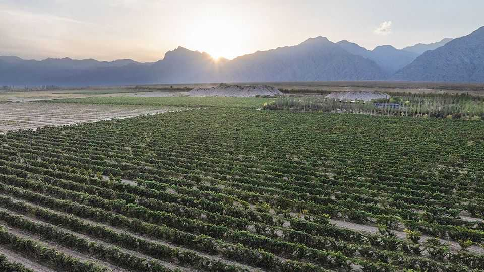
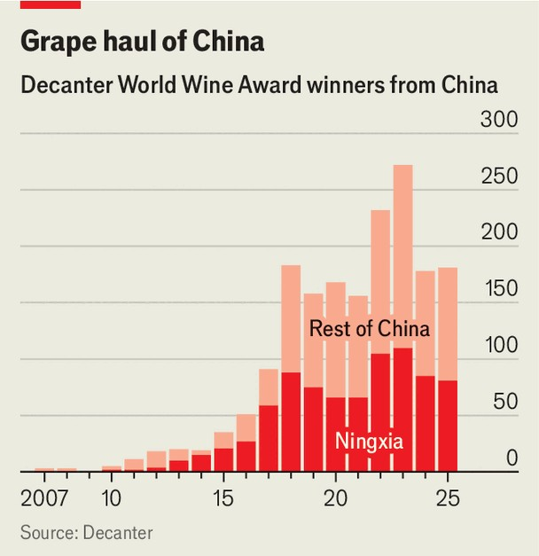
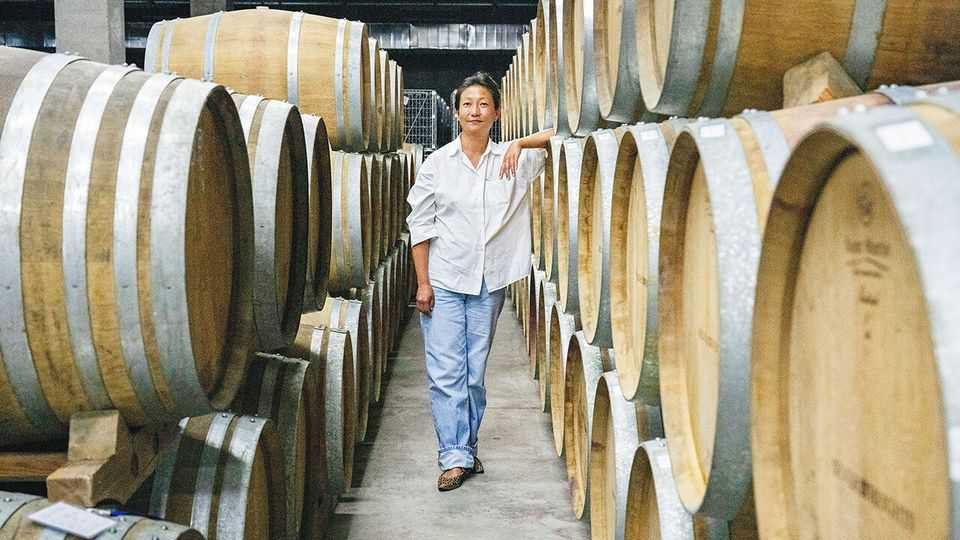

Culture | Feeling vine
Wine from China is finer than Western snobs imagine
Government support and French expertise have made all the difference
October 2nd 2025

IT IS A grape time of year in Ningxia. In August the harvest begins up north, in the shadow of the Helan mountains (pictured). By November more than 40,000 hectares of vineyards—an area roughly four times the size of Paris—will have been combed over. Growers do not enjoy the fruits of their labour for long. Once the harvest is completed, viticulturists get to digging: they must bury their vines before temperatures plummet to -15°C. Ningxia, a region in north-western China close to the Gobi desert, endures harsh winters. Nonetheless, it provides fertile ground for winemakers. The capital, Yinchuan, sits at the same latitude as Napa Valley, a centre of wine production in California. Ningxia gets 3,000 hours of fruit-ripening sun each

year—the same as in parts of Spain. The rocky soil drains quickly and allows vines to put down deep roots.

People have been making wine in China at least since the Han dynasty (206BC-220AD) and perhaps even longer, judging from some archaeological evidence. Today wine is a big industry: in 2024 China produced 118,000 kilolitres of wine, roughly equivalent to 160m bottles (or about the amount drunk at the average office Christmas party). Ningxia is where much of the premium stuff is made. Revenues from wineries in Yinchuan reached 36bn yuan ($5bn) last year, up 20% from 2023.

It is not just the scale that is impressive: Chinese wine tastes better than many Westerners assume. The country’s vintners are earning ever more accolades in the world’s top competitions. This year they claimed 181 medals at the Decanter World Wine Awards (DWWA)—a competition sometimes referred to as the “Oscars of wine”—up from three in 2007 (see chart). Two wines were proclaimed “best in show”. Judges waxed poetic about the “alluring scents of blackcurrant and wild plum” in a red from Ningxia, with its “seductive plunge of fruit and spice”.

To be sure, China’s DWWA medals haul was a fraction of France’s or Italy’s, and some way off Australia’s or Argentina’s. But it managed more

than other “old world” countries such as Austria and Germany. Berry Bros & Rudd, Britain’s oldest wine merchant, has observed that “China has the will and resource to become a very important player”. The country’s “enormous variety of climates and soils” means it can make everything from syrupy dessert wines to dry reds and whites.

Plenty in China are sweet on its wine. Xi Jinping, who obviously has some skin in the game, serves local wine at state dinners. Bruce Li, a sommelier at TRB Hutong, a Michelin-starred restaurant in Beijing, asserts that “If you compare Chinese wines with French or Italian wines, I think some Chinese wines actually taste better.”

Not everyone will agree. But there are two reasons why China’s wine has become more palatable. One is government support. All Chinese schoolchildren memorise a classical Tang-dynasty poem that begins: “Fine wine glows in a luminous glass.” Mao Zedong felt every person should be able to enjoy wine. In 1956 he asked Changyu, the country’s oldest winery, in Shandong, to expand production. (Though Mao promoted the pleasures of plonk, he preferred Kweichow Moutai, a type of spirit.)

Among the people involved in the industry in Shandong was Chen Jianguo, who in 2002 became Ningxia’s party secretary. The local government then announced an ambitious goal of planting 70,000 hectares of vineyards, with the aim of making Ningxia a major global producer. Officials allocated suitable land for the vines, provided subsidies for those cultivating grapes and set up training programmes. They also attracted foreign investment. LVMH, a French luxury-goods giant, decided it wanted a taste of the action, setting up Chandon China, a sparkling-wine producer in Ningxia, in 2013 as well as Ao Yun, a winery in Yunnan.

The other reason for China’s improved output is that its winemakers have learned from the best. Ningxia is sometimes described as “China’s Bordeaux” and with good reason: its winemakers have modelled themselves on their French peers. In the late 1990s a delegation travelled to France to learn from viticulturists there. Among other things, they were taught the importance of growing only a dozen clusters of high-quality grapes per vine instead of 20 or 30 less-flavourful ones. Firms in Ningxia grow many of the

same grape varieties as those in Bordeaux, apply their methods and strive for a similar taste, ageing the wine in French oak barrels.

Chinese vintners who have trained abroad have put theory into practice at home. Among them is Emma Gao (pictured), who studied oenology at the University of Bordeaux. Along with her father, Gao Lin, she runs Silver Heights, a boutique winery set up in Ningxia in 2007.

Two of its wines—a Pinot Noir and a Cabernet Sauvignon—won prizes at this year’s DWWA. (It was their “Family Reserve Chardonnay” that Chinese officials served to Emmanuel Macron and Angela Merkel.) Silver Heights’s bestseller this year is an orange wine with strong acidity and hints of grapefruit. A floral pétillant naturel, or “pét-nat”, made with rice wine from Ningxia, has also proved popular.

Yet despite all the improvements China’s winemakers have made in recent years, Chinese wines do not rank among the world’s most coveted bottles. In a blind tasting in 2023 Jancis Robinson, a critic, noted that Chinese wines “stand out as being less subtle” than those made in other regions because the vines are less mature.

Some suggest that the country has not come close to realising its potential. Ms Gao hopes “to discover the beauty of our terroir”: as well as mastering

Bordeaux-style wines, she wants to work out which other grapes thrive in China’s soils. Silver Heights has expanded beyond the dominant Cabernet Sauvignon, Marselan and Merlot varieties to plant 23 others, including Petite Sirah, Dornfelder Riesling and Spanish Tempranillo. She has been driving all over the country in search of new spots for vineyards: “It may take us hundreds of years to find our niche and direction.”

Another obstacle is that wine culture in China is neither as mainstream nor as passionate as it is in other countries. Beer or baijiu, a liquor, remain the tipples of choice for most. Wine imports, including of the best European stuff, have dropped in recent years because of covid-19, an economic slowdown and crackdowns on alcohol gifting and drinking among officials.

Lots of producers in Ningxia want to step up their exports and target their wares at wine-lovers elsewhere. Devo, a sparkling-wine enterprise in Yinchuan, hopes to sell 50% of its bottles abroad, up from 20% last year. But many European markets are already mature or saturated; America is slapping 30% tariffs on Chinese goods. And in lots of rich countries wine consumption is declining as health-conscious youngsters turn away from booze.

Perhaps the biggest problem for Chinese winemakers is price. Importing specialist high-tech equipment, along with all the burying and digging up of vines in regions such as Ningxia, increases production costs. This means that many Chinese fine wines cost the same, if not more, than their counterparts from the old world, but do not have the same taste or cachet. Wines by Silver Heights cost up to $250; bottles of Ao Yun fetch more than $350. You could get your hands on a grand cru for a similar price. Unless that changes, Chinese fine wine is destined to be drunk by few connoisseurs—no matter how seductive its plunges of fruit and spice. ■

For more on the latest books, films, TV shows, albums and controversies, sign up to Plot Twist, our weekly subscriber-only newsletter

This article was downloaded by zlibrary from https://www.economist.com//interactive/culture/2025/10/02/wine-from-china-is-finer- than-western-snobs-imagine