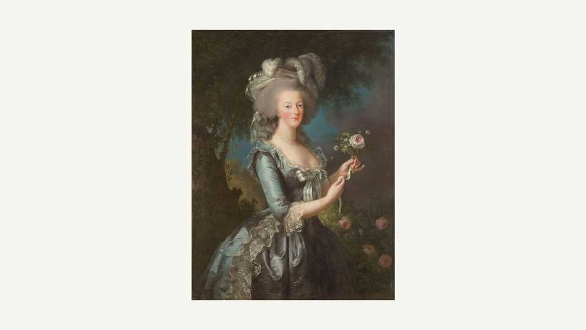

Culture | A wing and a prayer
If you love nature writing, you have Gilbert White to thank
A new book recreates a year in the life of the author of “The Natural History of Selborne”
October 2nd 2025

ON THE EVE of the French revolution in 1789, an English country clergyman quietly prepared for the printing of his book. Like many first-time authors on the eve of publication, he felt not triumph but a kind of terror, “like a school boy who has done some mischief”. Gilbert White need not have worried: he had produced a book that would become both loved and influential. “The Natural History of Selborne” was admired by Charles Darwin, William Wordsworth and Virginia Woolf, observes Jenny Uglow, and treasured by soldiers fighting in the trenches in

the first world war as “a vision of the country they had left behind”. It proved an unlikely but perennial bestseller.

It also helped start a “quiet revolution in natural history”. For, as Ms Uglow writes, the book united the gifts of “an acute empirical observer and a consummate stylist” in its meticulous yet enchanting account of the flora and fauna of a village in Hampshire. If White, a “pioneering field naturalist”, cleared a path towards modern ecology, he also anticipated ethology: the systematic study of animal behaviour. White’s work still inspires authors in the blossoming genre of nature writing.

White was a bachelor who never travelled far or rose high; his income was modest. But he was no fussy misanthrope seeking solace in bats, bees and beans. He had a huge, affectionate extended family, many of whom lived nearby. (Living nieces and nephews alone numbered 39 by 1782, and 62 on his death in 1793.) He treated nature as a conversation, not a battlefield. Recording the story of a horse that befriended a hen, he notes “a wonderful spirit of sociality in the brute creation”.

The esteemed biographer of writers including Edward Lear and Elizabeth Gaskell, Ms Uglow has devised a portrait of White as companionable and keenly observant as its subject. Full-dress biographies exist—Richard Mabey, one of White’s finest successors, wrote the best—so Ms Uglow takes a different approach. She focuses on a single year, 1781, and treats each daily entry in White’s journal as a prompt for a short reflection on his life, times, studies and surroundings.

Flanked by exact records of the ever-changing Hampshire weather, these notes fed his “Natural History” but can also read like elusive Japanese poems. On October 20th, for example: “Leaves fall very fast. Endive very fine. Grapes delicate.” With his rich vegetable patches and abundant “fruit wall”, White certainly ate well. That year gave him ten weeks of grapes, peaches, nectarines and “prodigious” apricots. In another season, “Melons come in heaps.”

Indeed, the gardener sometimes trumps the naturalist. On August 8th White recalled that “We have shot 31 black-birds, & saved our gooseberries.” Some topics and characters recur as in a rural soap opera. On September 14th Timothy, White’s tortoise, was “dull & torpid”. No reptile was ever so lovingly scrutinised as Timothy.

From these fine brushstrokes Ms Uglow creates a captivating picture of the man, his milieu and his age. Although not “a scientist in modern terms”, White looked hard and tested received ideas. He made discoveries, too: the large noctule bat; the tiny, shy harvest mouse; the fact that swifts—a special favourite—“mated on the wing”. He stood on the brink of 19th-century breakthroughs in biology and geology, and his own findings hint at “evidence of adaptation and change” in nature.

White was content being a conventional “parson-naturalist” and a cherished uncle, brother and friend. He was no rebel although, in 1789, he did marvel at “the sudden overthrow of the French despotic monarchy”. Nothing would stop him watching birds, brewing beer, growing cabbages or giving the same undogmatic sermons every year. One of them voices his effusive gratitude for this “beautiful, and glorious World”. His readers, and Ms Uglow’s, can still share that delight. ■

For more on the latest books, films, TV shows, albums and controversies, sign up to Plot Twist, our weekly subscriber-only newsletter

This article was downloaded by zlibrary from https://www.economist.com//culture/2025/09/30/if-you-love-nature-writing-you-have- gilbert-white-to-thank