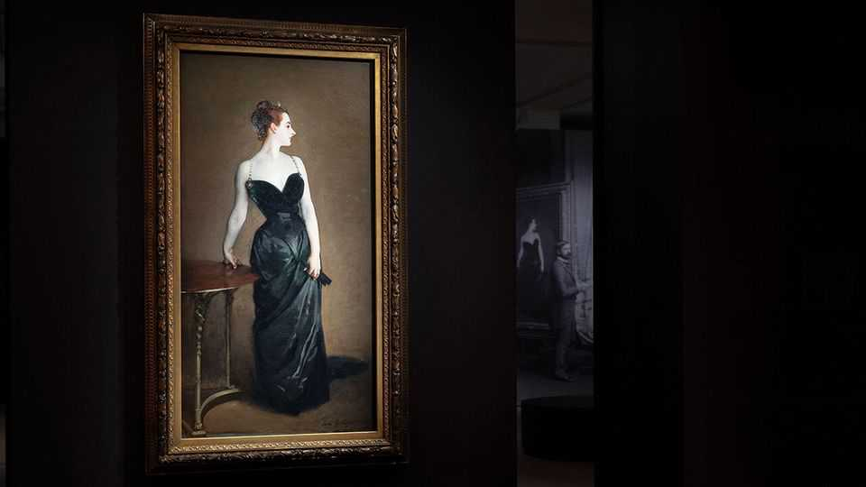
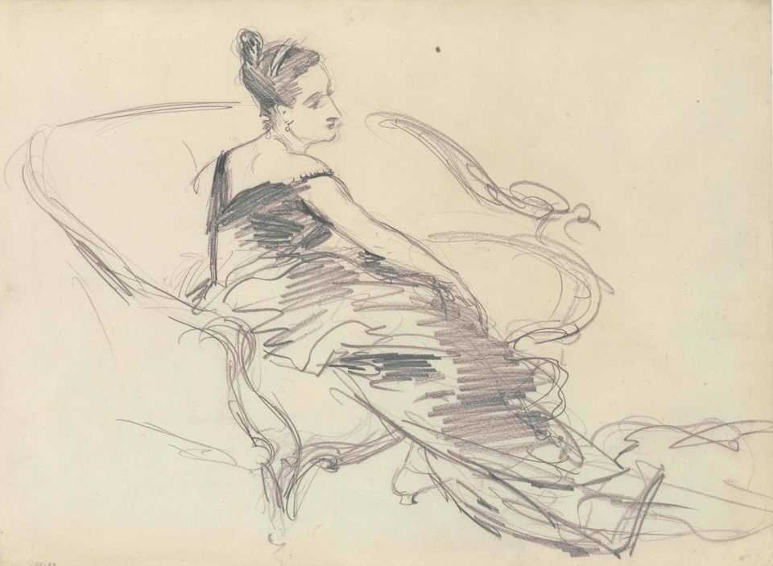
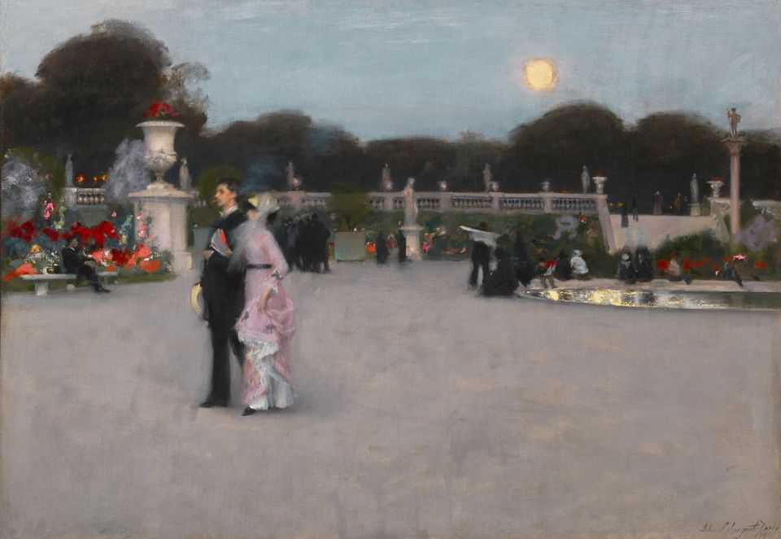

Culture | Paint me a plutocrat
John Singer Sargent, portraitist of the posh, is back in vogue
His paintings offer a glimpse of the Gilded Age
October 2nd 2025

“Detestable! Boring! Curious! Monstrous!” the crowds shouted. “Madame X” (pictured) scandalised visitors to the Paris Salon in 1884, with her heavy make-up and tight black gown whose strap was slipping from her shoulder. To appease the prudes, its young painter, John Singer Sargent, put the dress strap in its proper place, but he cut ties with Paris, leaving for England and, later, America. His paintings, capturing sumptuous fabrics and elegant sitters, evoke the Gilded Age in which he lived. A hundred years after his death, “Sargentolatry” is thriving. The artist has been celebrated in a recent documentary and a spate of museum shows, including at Tate Britain and Kenwood House in London and an excellent

exhibition at the Musée d’Orsay in Paris. The show, focused on his years in France, was hosted at the Metropolitan Museum of Art earlier this year, where it attracted around 500,000 visitors; it welcomed more per day than the museum’s most recent exhibition on Vincent van Gogh, a far more famous name.

Sargent also made an appearance in “The Gilded Age”, a period tv drama: Gladys Russell, a robber baron’s daughter, has her portrait done by him in a formal initiation into Upper East Side womanhood. (Unfortunately, no consultant for the show had taken an art-history course, judging by the result.)

Back in the late 1990s people had “a lot of reservations about Sargent as a high-society portraitist” says Elizabeth Prettejohn, author of the book “Interpreting Sargent” from 1998. Some thought “that it would have been better if he had painted peasants and done something a little bit grittier”. Now “there’s much more willingness” to appreciate his paintings’ “glamour and fashionability” as “something we can all enjoy and have fun with”, she says.

Why is an erstwhile recorder of the rich so popular today? In some ways his paintings offer what social-media posts and television series such as “The Real Housewives” do: both a front-row seat and backstage pass into the luxurious lives of the wealthy. Sargent’s portraits strike a special chord in an era of social media, “where everyone is thinking about how to present themselves to the world and crafting their own image. That is something that Sargent and his patrons understood as well,” says Stephanie Herdrich, a curator of American painting and drawing at the Met. It helps that portraits in general, and Sargent’s in particular, are suited to social media. His subjects’ confronting gazes, bright colours and handsome clothes are intriguing even in a thumbnail size.

Sargent became the most prolific American painter of the 19th century, with some 900 oil paintings to his name. Born to American parents in Italy, he travelled the world. His work was once of interest mainly to Americans and Britons, but today it, too, is travelling farther afield. The Musée d’Orsay’s exhibition is the first solo show devoted to Sargent in France. And his work is increasingly popular in Asia and among Chinese social-media users, especially his glamorous “Madame X”. No one is calling his art “detestable” or “boring” any more, straps be damned. ■

For more on the latest books, films, TV shows, albums and controversies, sign up to Plot Twist, our weekly subscriber-only newsletter

This article was downloaded by zlibrary from https://www.economist.com//culture/2025/10/01/john-singer-sargent-portraitist-of- the-posh-is-back-in-vogue