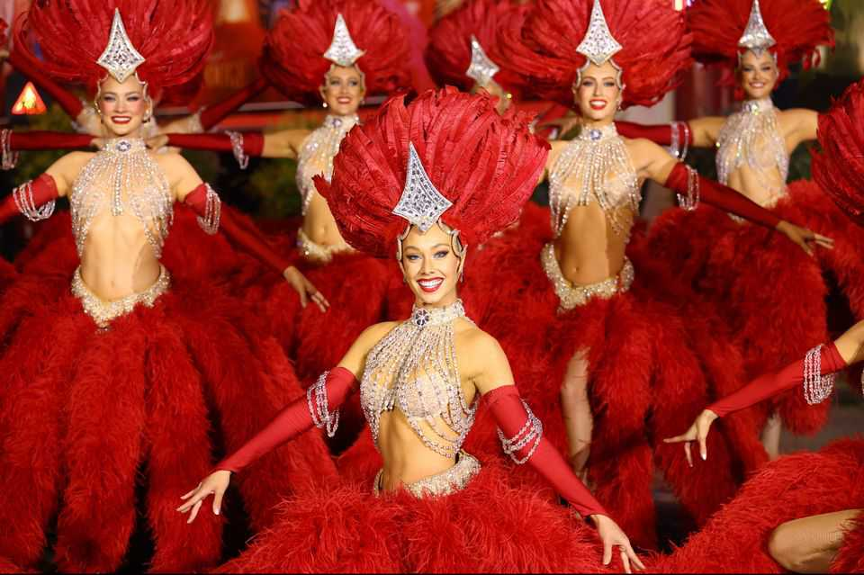

Culture | Razzle dazzle ’em
Spend a day in the life of a showgirl
Taylor Swift is not the only person fascinated by performers. Social-media users are, too
October 2nd 2025

Taylor swift’s new album will take fans backstage. “The Life of a Showgirl”, released on October 3rd, promises to reveal the “beautiful”, “rapturous” and “frightening” life of a female performer. Ms Swift knows as well as anyone what it is like to take to the stage night after night in heavy make-up and jewel-encrusted leotards. She performed 149 concerts as part of her “Eras” tour in 2023-24. In her downtime she wrote this new record. Yet the lives of showgirls aren’t all that hidden: in fact, they are on display online. A troupe of performers on social media are showing off the glitz and glamour of the profession. Allie Goodbun, a dancer at the Moulin Rouge, a cabaret in Paris, has 17.2m likes on TikTok; her profile is a flurry of

rhinestones, red lipstick and feathers. Shealagh Boyajian, another performer, gives her YouTube followers a glimpse of “A Day in My Life as a Las Vegas Showgirl”.

Away from the sultry lounges and glittering revues, showgirls show that their lives can be rather ordinary. “To the regular person, my career is such a peculiar thing,” says Ms Boyajian. “I strive to show my viewers that I also live a very normal life.” There are, of course, a few quirks. The life of a showgirl often includes umpteen costume changes, elaborate props and copious amounts of hairspray. Much of the living also happens in the dark. In one video, Ms Goodbun offers her fans insight into “The Dinner of a Showgirl”, which is wolfed down at 2.30am every night.

Showgirls spend hours working on their craft. Some start the day with yoga or stretching to ensure every twirl and high kick looks effortless. Many follow a strict diet or fitness regime. “People often forget it’s still a job,” says Evana De Lune, an Australian burlesque dancer with some 600,000 followers on TikTok and Instagram. “Performing and producing involves a huge amount of unseen work.”

Posting videos on social media is yet more hard work. But it has become an important part of the business, giving access to audiences far beyond the

music hall. “Your online presence can make or break your career,” says Ms De Lune, who reckons her first big shows sold out thanks to her followers. Internet fame can have downsides, as seasoned performers like Ms Swift know well. Ms De Lune says she has “had to delete thousands of comments, block countless people and deal with ongoing and targeted harassment”.

Trolls aside, the popularity of such videos points to two trends. One is the bizarre virality of “day in the life” videos: people are endlessly interested in where someone buys coffee or what they eat for lunch. The other is an enduring fascination with showgirls. Film-makers including Paul Verhoeven and Baz Luhrmann have dramatised their lives, imagining performers as both dazzling and desperate. “The Last Showgirl”, released last year, looks at what happens when the music stops.

The industry has lost some of its shine of late. Many famous venues have gone under in recent years. The earnings of dancers vary seasonally. Yet the joy of performing—and, for some, of posting on TikTok—has kept showgirls going. Ms Swift’s album will give them a new soundtrack as well as another chance to twirl in the spotlight. ■

For more on the latest books, films, TV shows, albums and controversies, sign up to Plot Twist, our weekly subscriber-only newsletter

This article was downloaded by zlibrary from [https://www.economist.com//culture/2025/10/02/spend-a-day-in-the-life-of-a-showgirl](https://www.economist.com//culture/2025/10/02/spend-a-day-in-the-life-of-a-showgirl)