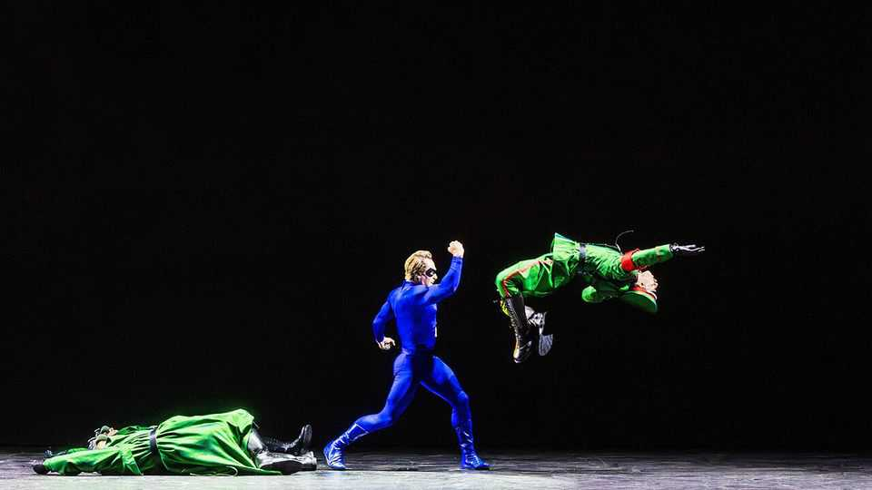

Culture | An unexpected team-up
With “Kavalier & Clay”, the Met is holding out for superheroes
The opera, adapted from a prizewinning novel, brings stunts and sopranos together
October 2nd 2025

THE ESCAPIST, as his name suggests, is skilled at getting himself in and out of tricky situations. With his muscles rippling in a blue Spandex suit— and his motif, a key, gleaming on his chest—he climbs buildings and crosses oceans. In one bravura sequence, set to thrilling music, he leaps past enemy lines and punches Adolf Hitler, knocking the Führer unconscious. The audience erupts into applause. This would not be so unusual were they sitting in a multiplex, but the crowd was gathered at the Metropolitan Opera House in New York. The company is opening its 142nd season without star singers, but with The Escapist and

Luna Moth. The characters first appeared 25 years ago in “The Amazing Adventures of Kavalier & Clay”, a Pulitzer-prizewinning novel by Michael Chabon. The Met’s executives are clearly hoping that these fictional superheroes will prove a draw to the legions of fans of the Marvel and DC franchises.

“Kavalier & Clay” begins in 1939 and tells the story of two cousins. Joe has fled from Nazi-occupied Prague for New York, where he is staying with Sammy. They bond over the creation of a comic book, inspired by Joe’s family’s plight, with a Nazi-bashing protagonist. The novel celebrated the early days of the comic-book industry, with “ink-smirched young men, drinking, smoking, lying around with their naked big toes protruding from the tips of their socks”. Over the years attempts to turn the bestselling book into a film have foundered, despite the superhero genre’s box-office domination.

Mason Bates, an American composer, approached the Met about adapting the book back in 2017 after his first opera, “The (R)evolution of Steve Jobs”, was well received. “It’s a sprawling American epic,” he says of the tale, “but at its heart, it’s about two desperate artists trying to save their family and falling in love while it happens. I think that makes it an opera.”

The book, which runs to more than 600 pages, has been efficiently streamlined. (Mr Chabon was not involved in adapting it.) Action abounds in the first half of the opera; there are old-fashioned arias, too, mostly sung by Sun-Ly Pierce, a mezzo-soprano who plays Rosa Saks, a painter entangled with both men. But much of the piece unfolds in a musical-theatre style, steeped in jazzy sounds for the New York scenes and Slavic themes for the passages in Prague. Many of the most ear-grabbing bits are instrumental and electronic rather than vocal. In its best moments Mr Bates’s score calls to mind Leos Janacek’s opera of 1924, “The Cunning Little Vixen”—itself based on a Czech comic strip.

The book’s superheroes appear visually, artfully rendered in digital animations or via acrobatic dancers who tumble on stage or soar through the air on wires in Bartlett Sher’s nimble production. Mr Bates and his librettist, Gene Scheer, wisely never let The Escapist or Luna Moth break into song. Historically, warbling superheroes have not fared well on stage. A Superman

musical flopped on Broadway in 1966—as did a Spider-Man one in 2011, despite having music by Bono and the Edge of U2.

Was the Met right to put its trust in superheroes? It seems so. The company reports that “Kavalier & Clay” is its top-performing opera at the box office so far this season. Ticket sales for the opening night were the Met’s highest this decade. Mr Chabon, too, is a fan, telling your correspondent that “I feel I need to see it again.”

Whether audiences outside New York will ever see “Kavalier & Clay” is unclear. The Met did not collaborate with another major company on it, so there is no obvious house for another production. What one character says of The Escapist is also true of new operas: “The greatest trick of all is not to vanish…but re-appear.” ■

For more on the latest books, films, TV shows, albums and controversies, sign up to Plot Twist, our weekly subscriber-only newsletter

This article was downloaded by zlibrary from https://www.economist.com//culture/2025/10/02/with-kavalier-and-clay-the-met-is- holding-out-for-superheroes