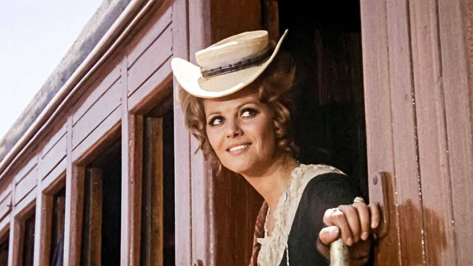
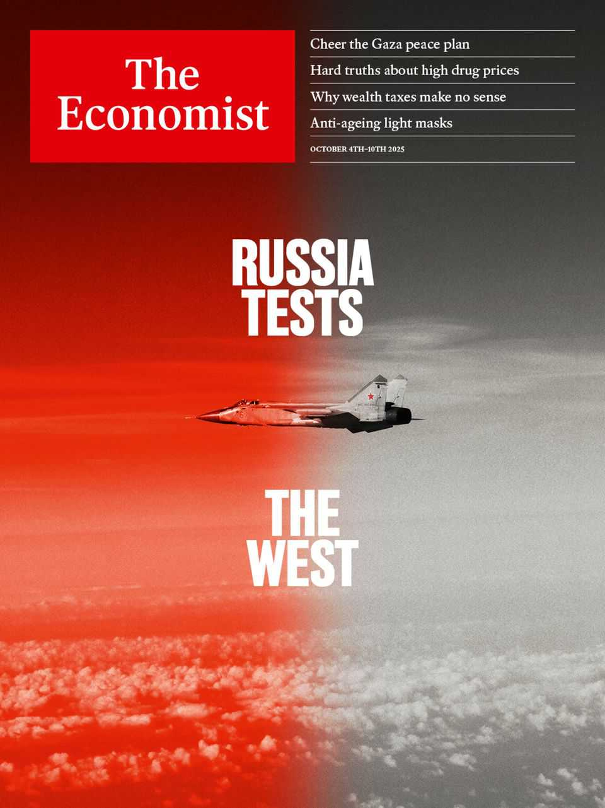

Obituary | A film star by accident
Claudia Cardinale added depth to voluptuousness
The Italian-Tunisian actress died on September 23rd, aged 87
October 2nd 2025

It MAY have been the longest opening sequence in cinematic history. A fly buzzed. A windmill creaked. Rusty water dripped from a tank. A few rough characters squinted into the sun. This was Sergio Leone’s “Once Upon a Time in the West”. A tiny wind blew, and from somewhere, seemingly very far away, came a plaintive phrase on a harmonica. What happened next, after quite a long time, was a man-on-man massacre. But meanwhile, down the railroad line, a woman in a pert straw hat and New Orleans fashions was stepping from a train to take charge. The film score changed then to something fuller and operatic. It came alive. Claudia Cardinale, dressed as Jill McBain, also heard that music. Leone had insisted that Ennio Morricone’s score was played before each scene, to put

his actors in the right mood. Not that, in her case, she needed it. The role of a woman defending her property against murderous bandits suited her fine. At school she had often fought with boys, just to show what girls could do. Being surrounded by men didn’t intimidate her in the least. When Leone said that all his characters knew they would not come out alive, he added, “except Claudia”. She knew she would.

Yet she was there by accident. At 19 she had been pushed onto a stage and crowned “most beautiful Italian girl in Tunisia”, without even meaning to be. The prize was a trip to the Venice Film Festival, where she posed on the Lido in an emerald-green bikini and told the crazed media that no, she didn’t want to be an actress. The more she said that, of course, the more they pressed her. Men were always that way. But cinema was a wonderful thing, a dream; perhaps to take small parts was not so bad. It meant she could afford to bring up Patrick, the little boy she had conceived after being raped by a man she knew. It seemed that everything that had happened to her involved the hand of Fate.

In all she made more than 100 films, which meant she lived as many lives and travelled all over the world. That had been exactly the aim of her tomboy self, the girl who had liked to jump onto trains at the very last moment, just as they pulled out. Her most incredible adventure came in the Amazon jungle in 1981 (again dressed too smartly for the place) as the partner of the seriously deranged Klaus Kinski in Werner Herzog’s “Fitzcarraldo”. While other actors melted down from the heat, Kinski’s megalomania and the weirdness of taking a steamship over a mountain, she was mightily enjoying herself. She was not afraid of Kinski nor of the wild animals. She loved the craziness.

Her real lucky-star year, however, was 1963, when she played the female lead in Federico Fellini’s “8½” and Luchino Visconti’s “The Leopard”. Again, it was a mad time, since Fellini wanted her hair short and blonde and Visconti wanted cascading dark tresses; she was dyeing her hair every week. Fellini also liked to work in a raucous circus, while Visconti insisted on silence. Yet in both films she played a woman who was less a sex object than a strong, motivating force. In “The Leopard” she was a debutante loved by two men, uncle and nephew, in an aristocratic Sicilian family in steep decline; in “8½” she was the Ideal Woman who alone could save a film

director from breakdown. It was clear by then that she was not just another gorgeous Italian siren, even if her voluptuous body drove men just as mad. She was more complicated than that.

The complications began with her voice. It was throaty, husky and dark, mostly because she smoked two packs a day, but also because her languages were French, Sicilian dialect and Arabic, from her Tunisian girlhood. (Although she was an Italian citizen, the French liked to claim her, and gave her the Légion d’Honneur.) Her early films were dubbed; even in “The Pink Panther”, when she played the sozzled Princess Dala, someone else slurred the words for her. But Fellini in “8½” freed her to use her voice as part of her mysterious beauty.

Such freedom was absolutely essential to her. But it was hard-won. At 19 she was signed up to Franco Cristaldi’s studio for seven years. He was 14 years older and so controlled everything: her weight, her hair, her friends. He paid her by the month, not by the film, and treated her like some sort of employee. Cristaldi also told her to conceal both her pregnancy and her baby, so she gave him to her parents to bring up as her younger brother. Eventually she married the man, but not in Italy, so not officially; in 1975 she divorced him, never to marry again. She and her new love, the director Pasquale Squitieri, lived largely apart, he in Rome and she just outside Paris, for the next 40 years. The public imagined she had affairs with most of her leading men, but “No flirting, no flings” was her rule. She was sorry to have turned down Marlon Brando, though. (How could she be so stupid?)

The rift with Cristaldi also marked the end of slavery to studios. In Hollywood, which monopolised stars, Universal wanted her to sign an exclusive contract, but she refused. One contract at a time was quite enough, and she didn’t stay long. Squitieri was in any case an independent film- maker (and a bit of a fascist too; in his “Claretta”, she played the mistress of Mussolini). Work wasn’t hard to get. And she was happy to do what directors wanted, however bizarre, with one exception: she would not be filmed naked.

That point was important. Behind all those roles, she had to preserve her mystery. It took great inner strength for an actress to become someone else in so many films and yet remain herself. Mystery was more important even

than beauty, so she never did anything to her face, laughingly surrendering to time because she couldn’t stop it anyway. If any cinematic moment could approach the real Claudia, it was perhaps the end of “Once Upon a Time in the West”, where Jill McBain gave out water to the dust-covered builders of the new railroad. She had come through, determined and independent, in a man’s world. And, though dusty now herself, she was just as refreshingly lovely as before. ■

This article was downloaded by zlibrary from https://www.economist.com//obituary/2025/10/02/claudia-cardinale-added-depth-to- voluptuousness

Table of Contents

The world this week Politics Business The weekly cartoon Leaders Vladimir Putin is testing the West—and its unity The White House’s plan for Gaza deserves praise Donald Trump’s cure for drug prices is worse than the disease The new SCOTUS term will reshape America’s constitution Unleash the robotaxi revolution Letters Should work restrictions on asylum-seekers in Britain be reformed? By Invitation Kosovo shows that Donald Trump’s Gaza plan can work, writes Petrit Selimi A Nobel laureate on why stablecoins may be nothing of the sort Briefing Why Russia’s micro-aggressions against Europe are proliferating United States The president’s agenda looks safe at the Supreme Court—with a few exceptions Your federal government is now closed for business The president tries to enlist the top brass for “the war from within” Republicans in the West want more wolves killed How a MAGA-aligned Republican has put a Democratic state in play The Americas The deal shielding Mexico and Canada from trade oblivion Jair Bolsonaro is running out of options A German newspaper for Bolivian blondes Asia Can India strike a deal on Russian oil to appease America? Australia’s post-China hangover South-East Asia is being swamped with Chinese goods Japanese politics heats up

Women’s cricket in India is taking off China China is the GOAT of engineering. Right? Bitcoin and a Chinese fraudster in London Xi Jinping wants a spot in your inbox Jerome Cohen was China’s most optimistic critic Middle East & Africa Donald Trump reaches for “eternal peace” in Gaza A big majority of Israelis support Donald Trump’s Gaza peace plan Violent hatred flares between Kurdish cousins Why protests are sweeping Madagascar Africa’s most secretive dictatorship faces an existential crisis Europe The unravelling of France’s centrist project Europe’s biggest military project could collapse Italy’s regions are creating a right to die Moldova defies Russia by re-electing its pro-European government The chilling exception to Trumpian protectionism How Europe crushes innovation Britain Sir Keir Starmer declares a battle for the soul of Britain British men are driving less, and a culture is vanishing Britain’s strict new curbs on junk-food marketing The gold of County Tyrone shows Britain’s barriers to development Britain is trying to create a digital identity system, again A $2bn AI unicorn tests London’s nerve Labour has decided to stop punching its own voters International The flashing red threat from Russia’s dark fleet Can the West survive an age of brinkmanship? Business Donald Trump is waging war on sky-high drug prices. Can he win? Does big pharma gouge Americans? Armin Papperger’s vaulting ambitions for Rheinmetall With Electronic Arts, Saudi Arabia scores a record buy-out The murky economics of the data-centre investment boom How bosses unwittingly exert power

America’s newest media moguls: the Ellisons ByteDance will be better off without TikTok US Finance & economics How the Trump administration learned to love foreign aid Credit markets look increasingly dangerous The economics of self-driving taxis China’s stockmarket rally may hurt the economy The eccentric investment strategy that beats the rest Don’t tax wealth Science & technology Armed forces are using 18th-century technology to spy on enemies Restocking an African lake may ameliorate a debilitating plague A new technique can turn a woman’s skin cells into eggs A portent of death may have helped create life Are red-light face masks worth the hype? Culture Wine from China is finer than Western snobs imagine If you love nature writing, you have Gilbert White to thank John Singer Sargent, portraitist of the posh, is back in vogue Spend a day in the life of a showgirl With “Kavalier & Clay”, the Met is holding out for superheroes Has a bad boy of literature been given his due? Economic & financial indicators Economic data, commodities and markets Obituary Claudia Cardinale added depth to voluptuousness