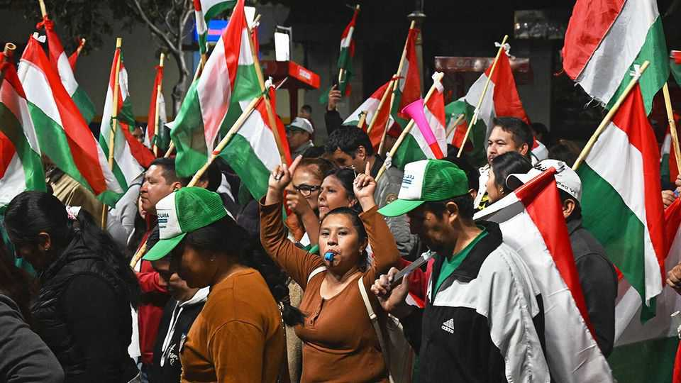
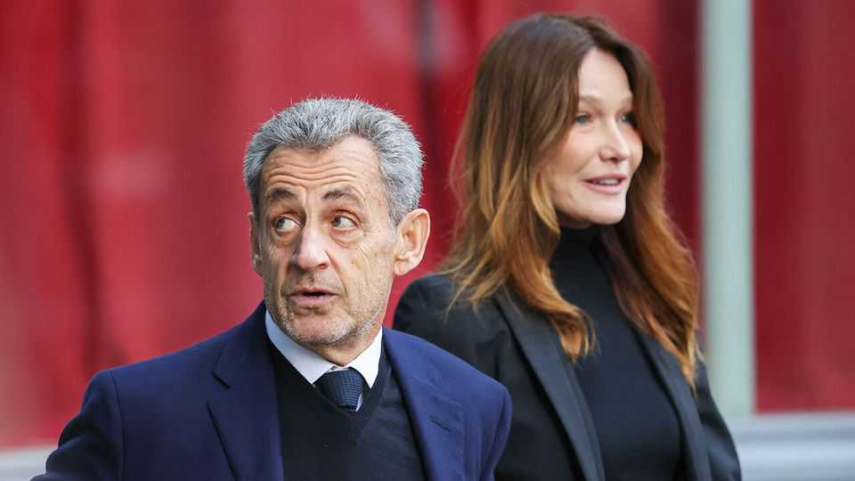

The world this week
Politics
October 23rd 2025

Bolivia’s presidential election was won by Rodrigo Paz, a centrist, defeating a conservative candidate in the run-off. Luis Arce, the left-wing president, decided not to run owing to a schism in the ruling Movement to Socialism, which had held the presidency for 20 years. The left has been booted out amid the country’s worst economic crisis in years. Mr Paz promises to allow the private sector to expand in order to boost growth, but also to protect welfare programmes. Argentina’s central bank signed a $20bn currency-swap deal with the US Treasury just days ahead of midterm elections in Argentina that are seen as a referendum on the austerity policies of Javier Milei, the president. Scott Bessent, America’s treasury secretary, said the agreement would bring economic stability to Argentina, and that the US did not want to see another

Latin American state fail. Details of the plan were not immediately available. American banks are reportedly hesitant to back it.

America’s relations with Colombia deteriorated to a new low when Donald Trump said he would raise tariffs on Colombian goods and suspend aid, and accused its leftist president, Gustavo Petro, of being “an illegal drug leader”. This came after Mr Petro described America’s military strike on an alleged drug-running boat last month in Colombian waters as “murder”. After news emerged that America had struck alleged smugglers in the eastern Pacific for the first time, Mr Petro said that attack was also “murder”.

Meanwhile, a court in Bogotá overturned the conviction of Álvaro Uribe on charges of attempting to bribe witnesses. The court found that a key witness who testified against the former conservative president was not credible, and that wiretaps used to justify the investigation had been illegal. Mr Uribe had been sentenced to 12 years’ detention. Mr Petro denounced the turnaround.

America repatriated two men who survived a military strike on a submersible vessel that was allegedly trafficking drugs in the Caribbean. Two other people were killed in the attack. The men were returned to Colombia and Ecuador with the intent that they be prosecuted. But Ecuador released its citizen, saying it had not received a formal report of a crime being committed.

J.D. Vance, America’s vice-president, Steve Witkoff, Mr Trump’s Middle East envoy, and Jared Kushner, who has been influential in brokering peace deals, visited Israel to bolster support for the ceasefire agreement with Hamas. Militants had earlier fired rockets into an area behind Israel’s line of control in Gaza, killing two soldiers. Israel struck back and briefly suspended aid. Palestinian officials said dozens of people had been killed in the skirmish, without noting how many were combatants or civilians. The American delegation was focused on getting Hamas to disarm, the next stage of the peace plan.

America imposed sanctions on Rosneft and Lukoil, Russia’s two biggest oil companies, after the Kremlin made it clear that Vladimir Putin was not interested in another summit with Mr Trump about Ukraine because its war aims hadn’t changed. The US Treasury said the sanctions, the first by the

Trump administration to target Russian energy directly, were intended to stop the use of oil revenues to buy weapons. Oil prices rose sharply. It was another volte face by Mr Trump. A few days earlier at the White House he had reportedly told Volodymyr Zelensky to surrender parts of occupied Ukraine to Russia. European leaders gathered in London for a summit to discuss using frozen Russian assets to aid Ukraine, among other things.

Nicolas Sarkozy began his five-year prison term, a month after the sentence was handed down for conspiring to use illicit Libyan campaign money. He is the first former French head of state to be jailed since Marshal Pétain, a Nazi collaborator. Questions have been raised across France about why Mr Sarkozy was sent to prison while he appeals against his conviction. His lawyer has requested his release.

Emmanuel Macron said that France’s controversial pension reform, which raised the minimum retirement age from 62 years to 64 and was passed in 2023, had been “necessary” but that it was now up to parliament to decide what to do with it. These were the French president’s first comments following the promise by his newly reinstalled prime minister, Sébastien Lecornu, to “suspend” the new rules until after the next presidential election in 2027. Mr Lecornu won a narrow vote of confidence in the assembly after winning opposition Socialist support with his announcement.

Portugal’s parliament approved legislation that would stop women wearing face veils, such as the burqa and niqab, in public places (except for planes, places of worship and diplomatic functions). Anyone forcing a woman to cover her face could be sent to prison. The bill was proposed by the hard- right Chega party and supported by the centre-right. The president could yet veto it.

Northern Cyprus, which proclaimed itself a state after Turkey’s invasion of Cyprus in 1974, held a presidential election that was won by Tufan Erhurman, who supports the reunification of the island. He got 63% of the vote. Turkey is the only country to recognise Northern Cyprus. In response to the result Turkey’s vice-president, Cevdet Yilmaz, said the “motherland” stood by Turkish Cypriots.

A commission that has been created to investigate the grooming-gangs scandal in Britain suffered another blow when four survivors of sexual abuse quit the victims’ panel. The four women raised concerns about the inquiry’s transparency, and that its remit was being expanded to look at all child abuse, rather than the specific crimes committed by gangs of mostly South Asian origin. They also don’t want the inquiry’s chairman to come from social care or the police, the very institutions that have failed the victims. Shabana Mahmood, the home secretary, insisted the inquiry would not be “watered down”.

Takaichi Sanae took office as Japan’s new prime minister. Ms Takaichi is reportedly preparing a big economic package that will tackle inflation, invest in industries such as AI and chipmaking, and bolster national security. To ease inflationary pressures, the government plans to abolish a “temporary” tax on fuel that has been in place since the 1970s. Stockmarkets rose, but the yen fell; Ms Takaichi has said the government should hold more sway over the central bank and “co-ordinate” policy.

This article was downloaded by zlibrary from [https://www.economist.com//the-world-this-week/2025/10/23/politics](https://www.economist.com//the-world-this-week/2025/10/23/politics)