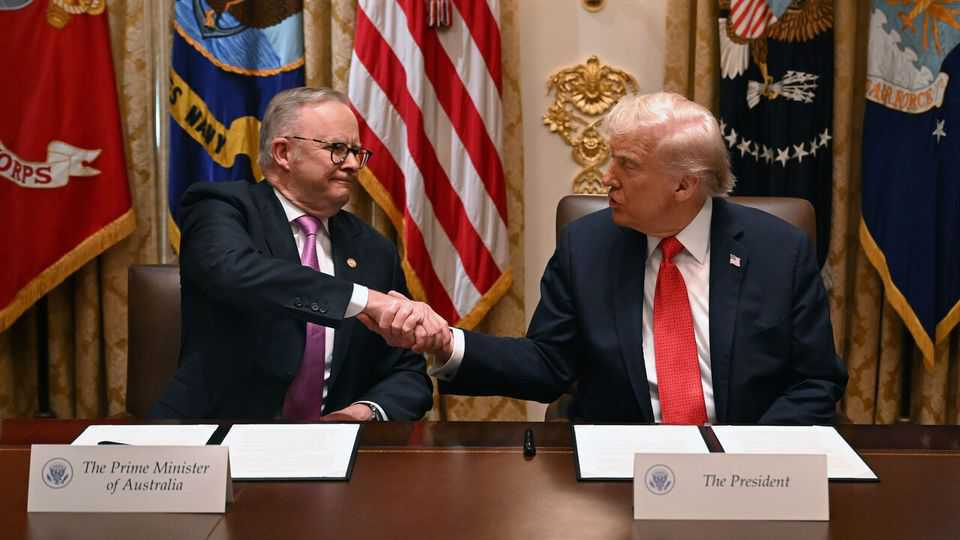
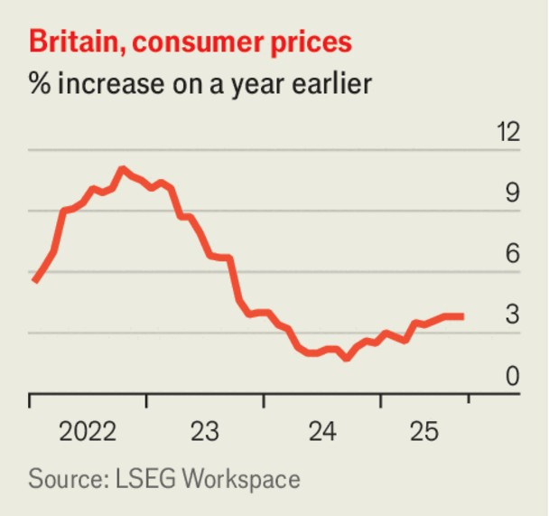

The world this week
Business
October 23rd 2025

Donald Trump signed an agreement with the Australian prime minister, Anthony Albanese, that gives America access to Australia’s deposits of critical minerals and rare earths. The American government is searching for deals to expand its reserves of the raw materials and wean its supply chain off a reliance on China, which dominates global production. China recently tightened its export controls on rare earths, prompting Mr Trump to say he would impose 100% tariffs on Chinese goods in retaliation. China’s economy was 4.8% bigger in the third quarter compared with the same three months in 2024. It was the slowest pace of GDP growth in a year. Although China’s export industry is thriving, domestic demand remains weak.

Britain’s annual rate of inflation remained at 3.8% in September. Markets had expected it to hit 4%, but food prices did not rise as much as predicted. It was the third consecutive month where inflation stood at 3.8%. Although that is stubbornly higher than the Bank of England’s 2% target, the betting now is that interest rates will be cut before the year’s end.

A jury in New York found BNP Paribas liable to pay damages to three Sudanese refugees for its provision of financial services to Omar al-Bashir, Sudan’s former president. The refugees have accused the French bank of aiding the Bashir regime’s genocidal campaign in the late 1990s and 2000s by giving it access to American financial markets. The jury awarded them $21m in damages. Thousands of other Sudanese have joined a class-action lawsuit. BNP Paribas said it was not allowed to introduce crucial evidence at the trial and was confident the verdict would be overturned on appeal.

The chairman of Novo Nordisk and six independent directors are to step down from their roles amid a disagreement with its largest investor, the Novo Nordisk Foundation, over its strategic direction. The company, which makes Wegovy and Ozempic, has fallen behind Eli Lilly in the market for weight-loss treatments.

Despite its record sales in the third quarter, driven by a rush from buyers to claim a now-expired tax credit, Tesla’s net profit fell by 29%, year on year, as it spent more on AI. Meanwhile, ISS, which guides shareholders on how they should vote at company meetings, advised Tesla’s investors to reject a proposed pay package of up to $1trn for Elon Musk. Although it is linked to future performance, the package is no guarantee that Mr Musk will not be distracted by his other ventures, said ISS.

General Motors raised its forecast of annual profit and said the costs it expects to incur from tariffs will come in a bit lower at up to $4.5bn, rather than the $5bn it had previously projected. The carmaker’s stock surged by almost 15% to a record high. That was despite GM booking a $1.6bn charge because it is reducing its capacity to make electric vehicles amid a slowdown in demand.

Netflix’s share price plunged after its quarterly operating-margin came in below guidance (it had booked charges from a tax dispute in Brazil). It also gave little detail about ad sales, other than saying it had been a record quarter. Netflix has stopped issuing subscriber numbers but revenue grew by a healthy 17%, year on year. The fall in the stock underlines investors’ skittishness about future profits at tech firms.

Netflix is said to be one of several companies interested in making a bid for Warner Bros Discovery. Warner has noted the “unsolicited interest” from “multiple parties” and reportedly rejected a nearly $60bn offer from Paramount. It reiterated its previously announced plan to separate its film studio and cable broadcast businesses, but said it would consider other alternatives, such as a “transaction” for the whole company or separate deals for Warner Bros and Discovery.

The government shutdown in America has forced Unilever to delay the demerger of its ice-cream business. The company said the Securities and Exchange Commission had been unable to process the documents to allow shares in the business to trade in a secondary listing in New York. The stock was supposed to start trading in the main listing in Amsterdam on November 10th. The SEC has had to put most of its staff on furlough, delaying other share offerings.

Amazon was reported to be planning to expand its use of robotics, which could mean it employs 600,000 fewer workers than it would otherwise need by 2033. That would be despite selling twice as many products as it currently does by then. Amazon said the reports were misleading. The reports also said Amazon was expecting a backlash and training executives not to use terms such as “automation” or “AI”.

This article was downloaded by zlibrary from [https://www.economist.com//the-world-this-week/2025/10/23/business](https://www.economist.com//the-world-this-week/2025/10/23/business)