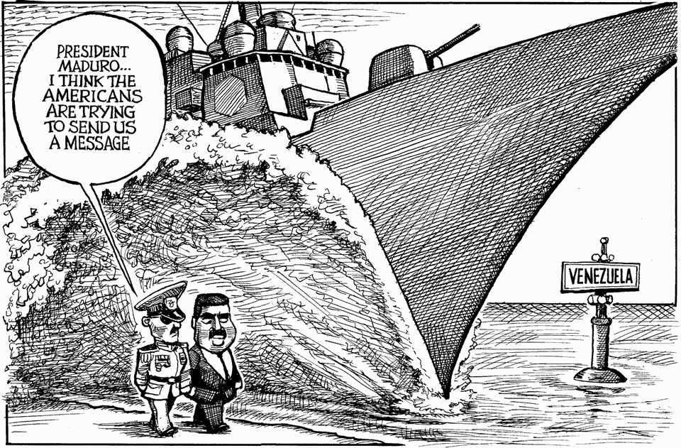

The world this week
The weekly cartoon
October 23rd 2025

Dig deeper into the subject of this week’s cartoon: Donald Trump has turned the war on drugs into a real warThe new war on drugsBrute force is no match for today’s high-tech drug-runners The editorial cartoon appears weekly in The Economist. You can see last week’s here. This article was downloaded by zlibrary from https://www.economist.com//the-world-this-week/2025/10/23/the-weekly-cartoon

Leaders

Why China is winning the trade war Javier Milei faces his most dangerous moment yet To save the world’s tropical forests, learn from Brazil The migration schemes even populists love Never mind your children’s screen time. Worry about your parents’