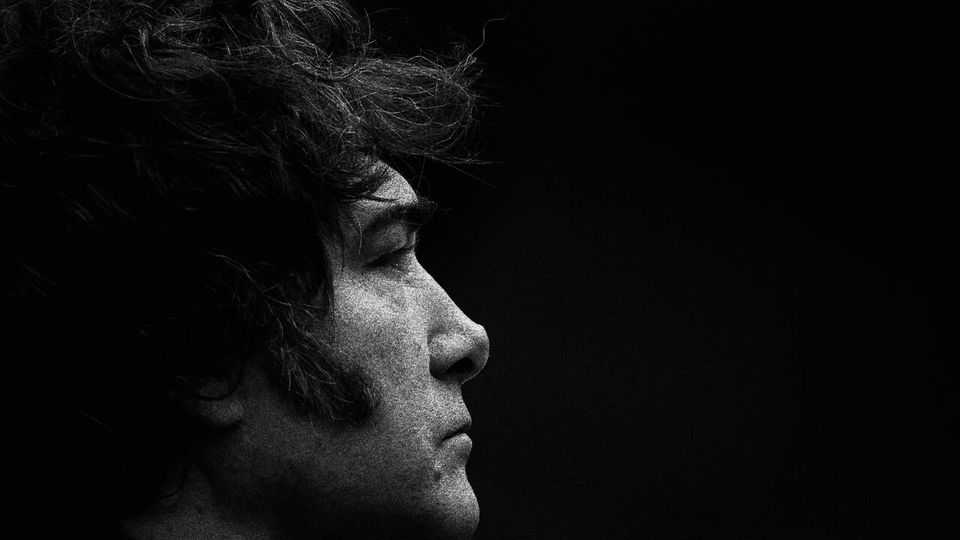

Leaders | Peso peril
Javier Milei faces his most dangerous moment yet
He could still survive a currency run and knife-edge election
October 23rd 2025

For Argentina’s president, Javier Milei, congressional elections on October 26th are a make-or-break moment. They could spell disaster for his radical reform programme. The Argentine peso is overvalued and under strain. Despite generous offers of help from America, it threatens to crash out of the band set for it by Mr Milei’s government. Blowing any more cash defending it is pointless. Yet there is still a pathway for Mr Milei to continue his effort to tame Argentina’s bloated state and end its decades of decline. He has had big successes. Monthly inflation has fallen from 13% when he took office to about 2%. The country’s poverty rate is at its lowest since 2018. He has taken an axe to Argentina’s out-of-control public spending and culture of patronage. Mr Milei’s great weakness is that, to stop prices from

spiralling in a country where few trust the government or the central bank, he relied on keeping the peso strong.

Instead of being a temporary tool, managing the currency has become a trap. Even after he partially floated the peso in April alongside an IMF bail-out, Mr Milei has sought to maintain its artificial strength. Defending the exchange rate has cost billions and pushed interest rates sky-high, slowing growth. Voters now fret about jobs more than inflation.

President Donald Trump views Mr Milei as an ideological soulmate and has offered unprecedented financial support. On October 21st Scott Bessent, America’s treasury secretary, said he had signed an “economic stabilisation” agreement with Argentina. Already the Trump administration has offered Argentina a $20bn swap line, spent nearly $1bn buying Argentine pesos and tried to corral Wall Street banks into putting together a $20bn support package. Markets remain unconvinced, however. The peso has continued to weaken; Argentina’s ten-year dollar bonds trade below 60 cents on the dollar.

Two nightmare scenarios are possible. One is that Mr Milei’s party performs badly in the elections, and he is unable to veto legislation in the lower house even as Argentina is forced into a chaotic devaluation. That would mean financial mayhem and political strife. The other is that the government clings to the strong-peso policy, blowing more scarce dollars to prop up the currency, and keeping interest rates exorbitantly high, damaging growth. Either way, reform would die.

Yet there is a third way. If Mr Milei’s party wins a third of the seats in the lower house, it will be able to defend his presidential veto. Polls suggest this is possible. Mr Milei should then float the peso. To avoid chaos he should announce a new framework for setting domestic interest rates to control inflation, providing the economy with an anchor. Argentina has tried something like this many times before, but alongside Mr Milei’s fiscal discipline it could be enough to ride out a temporary inflation spike. American support could help the central bank to reduce volatility as the peso finds a new level, at far less risk of loss for American taxpayers than the interventions being made by the Treasury now. A floating peso would also boost competitiveness and growth.

At the same time as this financial reset, Mr Milei must announce a political reset on election night, making clear he will seek to build a broader coalition. Laws passed by a majority in Congress have more weight than the decrees that he has largely relied on so far. For Argentina the script sounds familiar: an exchange-rate crisis suffered by a government that is unable to marshal adequate public support. For decades this story has always led to disaster. Yet there is still a chance for Mr Milei’s project to have a different ending. ■

Subscribers to The Economist can sign up to our Opinion newsletter, which brings together the best of our leaders, columns, guest essays and reader correspondence.

This article was downloaded by zlibrary from https://www.economist.com//leaders/2025/10/21/javier-milei-faces-his-most- dangerous-moment-yet