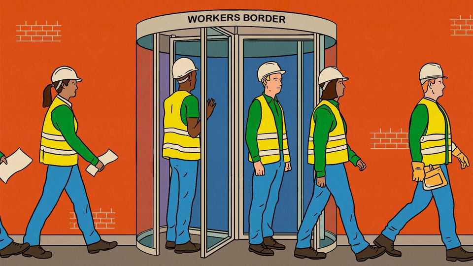
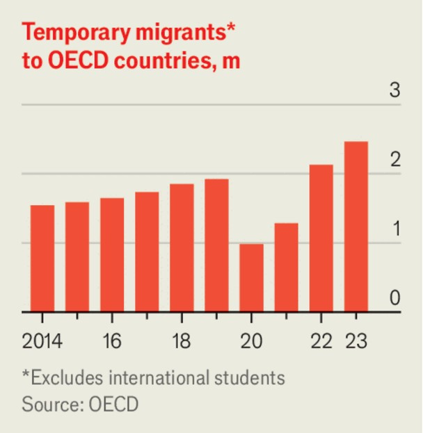

Leaders | Cross-border temping
The migration schemes even populists love
Why temporary workers bring great benefits
October 23rd 2025

Across the rich world, temporary migration is on the rise. The number of short-term visas offered to working migrants rose by nearly 1m between 2014 and 2023, to 2.5m, with no sign of slowing. The increase is not limited to places that are generally more open to migrants; even populist Hungary and Italy, and traditionally migration-averse Japan and South Korea, are embracing them. The idea of short-term migration makes many observers in the West queasy. For some, it conjures up images of workers toiling for long hours in grim conditions for paltry wages. Horror stories of bosses seizing passports, or migrant maids being preyed on by employers, periodically make headlines. In fact, well-designed temporary worker schemes offer great benefits to all

parties. And as the political tide turns against migration, they may be the only feasible way to admit low-skilled workers.

Populist parties from America and Britain to France and Italy have stoked anti-immigration sentiment, and benefited at the ballot box. But with local populations ageing, firms are desperate for workers. Short-term visas offer a way to thread the needle, which is why Italy has issued large numbers of temporary visas to migrants in less skilled occupations. Although Japan, South Korea and Taiwan offer few routes to permanent residency, they have brought in hundreds of thousands of such workers each year.

At the same time, worries about whether low-skilled migrants impose a burden on welfare states are rising. The fiscal impact of migration depends on the skills of the migrants and the rules governing their access to public benefits. In most Western countries, low-skilled migrants who stay long enough receive a pension and health care as they grow old, while paying far less in tax than highly skilled migrants do. Governments can avoid such costs by restricting migrants’ access to welfare, as Gulf states do, or by insisting that they go home before they retire. Many are choosing the latter. Hence the popularity of guest-worker schemes.

Temporary migration offers big benefits to migrants and source countries, too. Lant Pritchett of the London School of Economics notes that low-skilled work in America offers migrants from the 11 largest developing countries a chance to quintuple their wages, even after accounting for lower prices back home. If two-thirds of the demographic shortfall in the labour force of the rich world was offset by a rise in the number of temporary workers, it would raise global wages by $6trn in today’s prices by 2050. Source countries benefit when migrants send money home, seeding businesses and putting relatives through school. Last year low-income and lower-middle-income economies received in remittances a sum worth a hefty 5.4% of their combined GDP.

To make temporary migration schemes more politically acceptable, however, they must be improved. Many of them lack flexibility. In parts of the Middle East, the kafala system binds a migrant to a single employer, so that to be sacked is to be sent home. This is a recipe for abuse. Countries that have reformed kafala, such as Saudi Arabia, have made their labour markets more dynamic, allowing workers to switch to higher-paying and more productive employers.

Portable visas, which allow migrants to switch jobs, are better for migrants and hosts alike. Last year Australia extended the amount of time workers have to find a new employer after leaving their first sponsor from 60 days to 180. Such flexibility boosts efficiency and curbs the power of cruel bosses.

Another change concerns the rule of law. If migration sceptics fear that guest workers will slip away into the shadows, then their support for temporary migration will wane. But there are ways to discourage this. New Zealand’s seasonal farm workers are notably less likely than their peers in Australia to overstay their visas, for instance, for two reasons. The first is that businesses are fined when workers abscond, giving employers a strong motive to screen and monitor employees. The second is that there is no mechanism for workers to lodge asylum claims which allow them to remain in the country more or less indefinitely, blunting their incentive to try to do so.

There are limits to the benefits of guest work, especially compared with permanent migration. Short-term visas make it hard for migrants to become entrepreneurs, limiting innovation. Portable visas are better, but still less

flexible than free movement. Skilled migrants bring such great benefits that countries should be striving to keep them, rather than repelling them with $100,000 visa fees, as America now does.

When voters are suspicious of permanent migration, guest workers are better than having no migration at all. Well-designed schemes can be safer for the people taking them up, bring more benefits to the host country, and strike a balance between migration scepticism and liberal principles. ■

Subscribers to The Economist can sign up to our Opinion newsletter, which brings together the best of our leaders, columns, guest essays and reader correspondence.

This article was downloaded by zlibrary from https://www.economist.com//leaders/2025/10/23/the-migration-schemes-even-populists- love