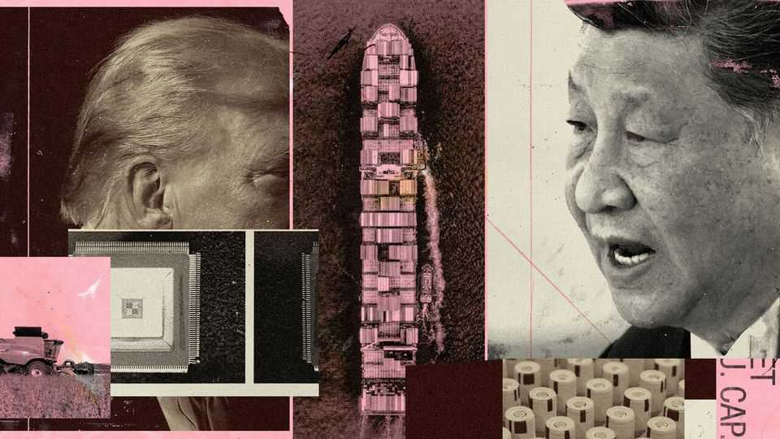
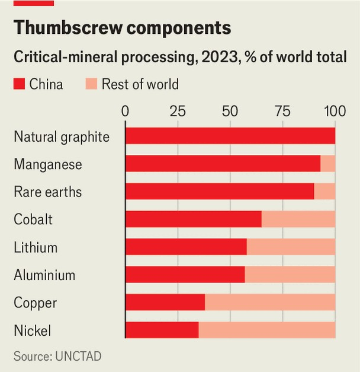
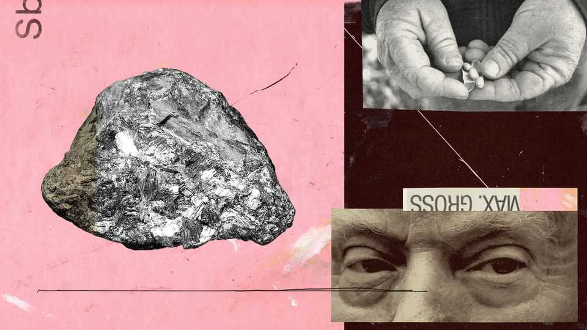

Briefing | Fighting fit
China is using America’s own trade weapons to beat it
It has spent years pinpointing America’s weaknesses and mitigating its own
October 23rd 2025

SEVEN YEARS ago, when America’s trade war with China was just getting started, the Chinese science and technology ministry did something unusual. Its official newspaper, which usually confines itself to puff pieces about China’s accomplishments, instead published 35 articles over three months detailing the country’s weaknesses. Each one examined a specific “chokepoint”—a technology critical to the economy that China could not produce, forcing it to rely on foreign imports. The series, entitled “What is choking us?”, was a remarkable exercise in self-criticism. It also marked a turning-point, little noticed beyond Beijing at

the time. China had grasped that the trade war was about vulnerabilities as much as tariffs. It catalogued its own weaknesses and then set about identifying America’s. Seven years later, this foresight is paying off.

Donald Trump is expected to meet Xi Jinping, his Chinese counterpart, in South Korea next week—the first meeting between the two leaders since Mr Trump returned to the White House. Until recently it was predicted to be a mild affair, reinforcing a tariff ceasefire in place since the summer and paving the way for a more ambitious trade deal next year.

Then, two weeks ago, to the surprise of Mr Trump and just about everyone else, China unveiled its most ferocious export controls yet, giving itself the power to disrupt American supply chains. Cue furious counter-threats by Mr Trump and an ugly blame game. Was China, as its officials claimed, merely responding to America’s provocations? Or was it unleashing chaos on the global economy, as the Trump administration maintained?

In fact, China’s confidence reflects a startling fact: it is winning the trade war with America. It has devised forms of economic coercion inspired by, but more effective than, America’s own; it is dissuading third countries from siding with America and it is reinforcing Mr Xi’s standing at home. But victories in trade wars are rarely absolute or permanent. China has to be careful not to press its advantage too far, lest its successes rebound on it.

Ever since Mr Trump’s first small tranche of tariffs back in 2018, Chinese officials have repeated the same dictum. “If you want to fight, we’ll fight you to the end. If you want to talk, our door is wide open.” In practice China’s emphasis is shifting unmistakably towards fighting.

Talking got it only so far: the trade deal negotiated during the first Trump presidency was implausible from the outset. Moreover America, under both Mr Trump and Joe Biden, imposed ever-tighter export controls on it. China concluded, not unreasonably, that America did not plan to make peace. It has also come to believe that Mr Trump is more likely to respond to pressure than to flattery and forbearance.

Were the fight purely about tariffs, China might well have lost. America exported $140bn of goods to China in 2024; China sent $440bn back. That

gives America three times as many targets. But China has found other ways to fight.

China’s political system gives its officials more levers to pull. Take soyabeans, until recently its biggest import from America. The government appears to have ordered Chinese buyers to shift all purchases to other countries, mainly Brazil and Argentina, leaving American crops to rot in the field—an “economically hostile act”, Mr Trump says. Antitrust probes into big American firms such as Google, DuPont, Nvidia and Qualcomm have multiplied over the past year, too, as tensions have flared.

But China’s most effective weapon has been to mimic America’s export controls. A telling demonstration came in December, in the waning days of the Biden presidency. Barely 24 hours after America had announced fresh restrictions on exports of computer chips to China, China banned exports to America of gallium, germanium and antimony—all used in high-tech manufacturing. If Mr Trump had been paying attention, he would have seen this episode as a warning.

In April, after Mr Trump announced swingeing tariffs on “Liberation Day”, China and America engaged in an almost comical tit-for-tat that left both countries charging rates of more than 100% on each other’s products. That escalation dominated the headlines. But more important in the long run was China’s decision to restrict exports of seven rare-earth elements and related magnets that are used in weapons, cars and electronics. Exporters needed licences to ship rare earths abroad, and American buyers were frozen out. “We just won’t tolerate the US hitting us anymore, and we believe we have the capability to fight back,” says Tu Xinquan of the University of International Business and Economics in Beijing.

China had identified a chokepoint that caused severe pain in America. Rare earths appear in nearly every high-tech product. Although they are quite common in geological terms, China dominates mining and has a near- monopoly on refining (see chart). As inventories outside China dwindled, firms warned that their factories would soon come to a standstill. America blinked. It agreed to lower tariffs on Chinese goods to 30% as part of a 90- day truce, which has since been extended. China cut its tariffs on American goods to 10%, and started to let rare earths flow again.

The past few weeks have seen another flare-up in hostilities. In late September America’s sanctions bureau expanded its blacklist to include majority-owned subsidiaries of banned firms. American officials said they were just closing a loophole, but China considered the move a big escalation since it affected thousands of companies. America was also going ahead with new fees on Chinese-made ships at American ports, despite Chinese objections.

On October 9th China took its export controls to a new level, establishing a global licensing regime for virtually all rare earths as well as for rare-earth production technologies and lithium-ion batteries. If implemented rigidly, China could almost dictate which high-tech goods got made beyond its borders and by whom. Sean Stein of the US-China Business Council says

that China was effectively “trolling” America. America’s restrictions on semiconductor exports had been designed to stop China making chips smaller than 14 nanometres. China’s new rare-earth controls impose extra scrutiny on exports of rare earths to be used in such chips. “They are sending a message that it’s time for payback,” Mr Stein says.

What makes export controls so powerful for China is its industrial heft. Its manufacturing output—35% of the global total—is threefold America’s and exceeds that of the next eight countries combined. Until the early 2000s Chinese manufacturers were more reliant on inputs from America than American firms were on Chinese inputs. By 2020 that had flipped, and then some: American manufacturers are three times more reliant than Chinese ones on inputs from the other, according to Richard Baldwin, a trade economist.

America now leads in only a handful of critical domains, of which high-end semiconductors are the most important. But China is pouring money into chips and making progress, gradually dulling the bite of America’s controls. On rare earths, the picture is the reverse. America has only one active mine and virtually no refining capacity. A $3bn partnership with Australia signed on October 20th aims to change that, but new mining and processing facilities could take half a decade to come online. China sees this “as a near- term leverage asymmetry in its favour”, says Feng Chucheng of Hutong Research, a Chinese research firm. Put bluntly, America’s chip controls are headaches for China, but China’s rare-earth controls threaten to paralyse America.

Such power comes with risks. It is easy to make the case that China has overreached. Its licensing regimes apply worldwide, not just to America. That has alarmed third countries. By September China had approved just 19 of 141 European licence requests, apparently a deliberate squeeze. Scott Bessent, America’s treasury secretary, talks of rallying other countries to break China’s grip.

China is gambling that the Trump administration will not make much headway. Its attempts to co-ordinate with Australia, Canada, Europe and India look hypocritical after months of bashing them with tariffs. “Some countries have followed US instructions because of US long-arm

jurisdiction,” says Wu Xinbo of Fudan University. “When it comes to China in the future, they may be more cautious.” An early test is a dispute over control of Nexperia, a Chinese-owned, Dutch-headquartered chipmaker. China’s goal, ultimately, is to make countries as wary of crossing it as they are of defying America.

Calibrating this policy is hard. Moving too aggressively might prompt a backlash while hobbling Chinese exporters. Already the G7 group of rich countries is working on a plan to create alternatives to China for critical materials. Yet China will not be quaking in its boots. As recently as 2023 the G7 agreed on a “five-point plan” to dent China’s rare-earth dominance, but has little to show for it.

Some of China’s delays in granting licences reflect the difficulty of building up a complex new system from scratch. But bureaucrats have also been demanding intrusive information about end-users. It has asked some overseas buyers to upload photos of their factories, for instance, to prove they have no connection to the defence industry.

The system, if enforced as written, would be an onerous addition to global trade rules. America’s export-control regime presumes companies are innocent unless identified as wrongdoers. In China’s case, every company must prove its innocence. “If you read China’s controls literally, they are an order of magnitude more aggressive than anything the US has ever done,” says Gerard DiPippo of RAND Corporation, a think-tank.

In the lead-up to the summit in South Korea, American officials have indicated that they want China to scrap its licensing system entirely. But having just launched it with great fanfare, China is unlikely to dismantle it. Instead, it may mollify critics by granting big exemptions.

Even if it backs down in this way, China has already proved that it can inflict serious pain on the American economy. A striking element of its new export controls is the inclusion of lithium-ion batteries, which are essential both to electric vehicles and to power grids. If China wants to weaponise its industrial clout, it can go further than rare earths.

China’s success in the trade war is also reinforcing the Communist Party’s domestic authority. The Trump administration’s decision to whack China with tariffs was, in part, grounded in the belief that its economy was in terrible shape and external pressure would leave it begging for mercy. Just this month Mr Bessent said that China’s decision to opt for export controls was “a sign of how weak their economy is”. Both he and Mr Trump have said that China is either already in a depression or could soon land itself in one if it does not back down.

They are mistaken. The Chinese economy, though mired in a property crash and suffering from deflation, has areas of vigour. Much like America itself, it is in the midst of a boom in artificial intelligence, with spending on all things AI soaring. An index of the 300 biggest Chinese stocks is up nearly 20% this year, a sharp contrast with the start of the trade war in 2018, when it sank. There is more to the economy than the stockmarket, but its performance belies talk of a deep recession.

More fundamentally, the way the trade war has played out so far is a validation of Mr Xi’s obsession with trying to shore up China’s defence and strengthen its offence against America. “Instead of coming running for negotiations, Xi is the one that is making moves and the United States is struggling to keep up,” says Jon Czin of the Brookings Institution, a think- tank. “It doesn’t feel like Trump is the one in control now, and that is the goal for China. Xi is driving the dynamic.”

A common criticism of Mr Xi is that his rule has been bad for the economy. Private businesses have resented his statist approach and have suffered from his various crackdowns on finance, property and tech. But standing up to America’s economic bullying appears to be extremely popular, judging by a surge in patriotic posts and short videos on social-media platforms. Ren Yi, a pro-government blogger with a sizeable following, captured this spirit in a widely shared article. “Clear-eyed observers know that America has played almost all its cards and is itching to slam them all on the table at once,” he wrote. “But China has only just begun playing its cards and is still reluctant to show them.”

What might victory look like for China? It must tread carefully. “If China keeps these rare-earth controls, and if they throttle supply to American

manufacturers whenever they like, that is a gun to the American economy’s head. No American president can accept that,” says Rush Doshi, a national- security official in the Biden administration. China still has vulnerabilities: America could block shipments of aircraft engines or, as Mr Trump has hinted, restrict exports of the advanced software that China needs for designing semiconductors. Most ominously for China, it has no answer to America’s power over global finance. America could severely disrupt China’s international trade and investment flows by stopping big Chinese banks from trading dollars.

Success will come from demonstrating resolve without humiliating Mr Trump. Ahead of the meeting in South Korea, Chinese advisers have signalled that they are in no rush to sign a trade pact. Instead, they want to see the restoration of calmer dialogue between the two superpowers. Optimists had hoped that the two countries might eventually strike a “grand bargain”, with big reductions in tariffs and pledges by China to invest many billions in America. That was always dubious and now seems especially far- fetched. Instead, China’s main goal is “conflict management”, says Mr Tu.

Any deal reached when Messrs Trump and Xi meet at the end of October is likely to be modest. Tariffs will not go away but at least should not go higher, an assurance that would be welcomed by businesses on both sides.

Both governments may also agree to water down their export controls. As a sweetener, China would resume soyabean purchases, which Mr Trump wants and is easy enough for China to do. The threats, counter-threats and escalations of the past year would mercifully come to an end, at least for a time.

An extended truce would give both countries time to prepare for the next phase of their trade war, which will eventually come. American officials now have a better measure of their vulnerabilities, which include batteries, pharmaceutical ingredients and more. Diminishing them will take years and cost vast sums. Mr Doshi talks of the need for “allied scale”: if America works with other countries, from the G7 to India, they could easily surpass China’s industrial muscle. But that requires a White House intent on co- operating with allies—not Mr Trump’s forte.

China also faces a long road. As well as trying to conquer semiconductors, it is also battling for supremacy in AI. In addition, it will have to overcome two challenges of its own making. One is domestic. The push for self- reliance requires vast capital outlays that have diverted resources from consumption. The trade war has exacerbated this. Building extra capacity, subsidising chip factories, stockpiling critical materials—all of this costs money that could have been used to boost pensions or improve health care. At some point, Mr Xi may need to choose between prioritising self- sufficiency and promoting consumer spending in a way that could stabilise growth. The trade war may be winnable but it is not cheap.

The second challenge concerns international relations. Seven years ago, China feared being backed into a corner by America. Today, it faces a different problem: how to wield its newfound leverage without making other countries feel cornered and pushing them into America’s arms. That China is grappling with this concern, rather than buckling under an American trade assault, shows how far the balance has shifted. But overconfidence brings dangers of its own. ■

This article was downloaded by zlibrary from https://www.economist.com//briefing/2025/10/23/china-is-using-americas-own-trade- weapons-to-beat-it

United States

America’s gerrymander war is heating up A Supreme Court case could help entrench Republican power How the Trump administration could make sensible rules for drones America’s government shutdown is its weirdest yet Golf simulators and gyms are luring Americans back to the office In the race for Virginia governor, Democrats see boring as a plus Donald Trump has turned the war on drugs into a real war