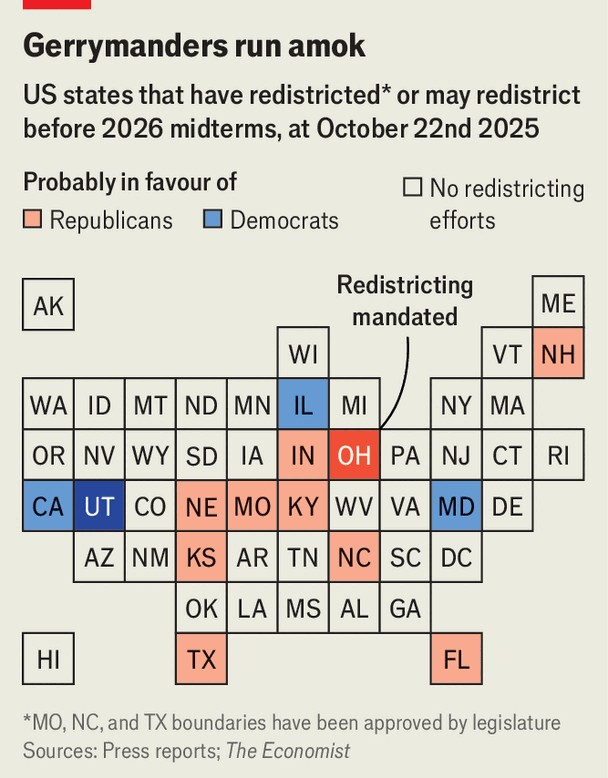

United States | California scheming
America’s gerrymander war is heating up
Democrats’ hopes to regain power in Congress may turn on a vote in California on November 4th
October 23rd 2025

ROD GUICE is not shy about sharing his political opinions. While greeting people outside a lodge in Bakersfield, a big city in California’s agricultural middle, he says he does not believe in climate change and insists that Gavin Newsom, the state’s Democratic governor, must be recalled. But a different issue brought him out early this morning: a rally to oppose Proposition 50, a ballot measure that will allow California’s legislature to implement a new congressional map that favours Democrats. “Prop 50 is going to destroy what’s left of California,” he says. In normal circumstances, redistricting happens once a decade after the census to adjust for population changes. But in July President Donald Trump

began to pressure Republicans in Texas to carve up their congressional map to deliver five more seats in the House of Representatives to their party. The move kicked off a national redistricting war without modern precedent that could eventually involve more than a dozen states (see map). The ballot measure in California started as a bluff by Mr Newsom to get Texas Republicans to back down. “Maybe we’ll do it here in California as well”, the governor mused on his podcast the same month.

When Texas passed its new map in August, Mr Newsom’s cheeky threat morphed into an organised statewide campaign. As America’s most populous state, California is the only place Democrats can find enough seats before the midterms to counter Texas’s partisan gerrymander. But because the Golden State has an independent redistricting commission, the legislature needed voters to approve their plan. If Prop 50 passes, lawmakers will be able to redraw districts through 2030. Election day is November 4th but millions of Californians are already voting early.

Usually the president’s party loses seats in midterm elections. Mr Trump’s approval rating is sinking, but with Democrats floundering, a blue wave seems less likely than in 2018, when the party took back the lower chamber. In a close contest, marginal gains from gerrymandering could decide the House and, therefore, whether Mr Trump will have to reckon with losing

dominance over Congress. (Republican prospects in the Senate are much better than in the House; in any event, gerrymandering is irrelevant in those statewide votes.) Yet how the redistricting war will shake out is far from certain.

Polling suggests California voters narrowly back Prop 50. Their support increases slightly when the election is framed as an attempt to counteract Mr Trump’s meddling in Texas. Because of Democrats’ voter registration advantage in California, Mr Newsom does not need to change the minds of independent and Republican voters; he just needs to make sure more Democrats are angry at Mr Trump than want to preserve California’s independent commission. The governor may be succeeding. Roughly 13% of voters had already cast their ballots by October 22nd. Democrats make up about 45% of the state’s registered voters but are so far responsible for 51% of early returns.

The opposition admits it is behind. “I think Prop 50 is going to be hard to beat”, says Carl DeMaio, a Republican state lawmaker campaigning against the measure. Prop 50 is on its way to becoming one of the most expensive ballot measures of all time. With two weeks to go, spending is nearing $150m, and Democrats are outraising Republicans and good-governance groups two to one.

Gerrymandering sometimes produces district shapes almost comical in their inventiveness (see maps). The crowd in Bakersfield audibly gasped when they heard that the redrawn 2nd district would include lots of Republicans along the Oregon border, and a dangling arm that hugs the coast and scoops up Democrats in the Bay Area. In addition to making five more seats winnable for Democrats in 2026, the new map would shore up support for Democratic incumbents in vulnerable districts.

House Democrats probably cannot win the redistricting wars nationally, no matter what happens with Prop 50. They are talking to lawmakers in Maryland and Illinois about redrawing maps there. “Our hope is that every elected Democrat steps up to the plate,” says Pete Aguilar, the chair of the House Democratic caucus. Redistricting before 2026 is also possible in Oregon, but it would be hard to draw another Democratic seat there without endangering the re-election of current members.

There are simply more Republican-run states willing and able to redraw their maps. Missouri Republicans found another seat for their party by splitting Kansas City—though litigation and a potential referendum could block the new map there. This week North Carolina added another Republican seat to the tally. The president is finding new ways to exert leverage over politicians who would resist him. Indiana’s Republican governor suggested on a local radio show that he was worried his state would lose out on federal funds if it chooses not to redistrict.

Kelly Ayotte, the Republican governor of New Hampshire, could face a primary challenge from a Trump ally if she opposes gerrymandering. If the Supreme Court undermines part of the Voting Rights Act in time to affect the 2026 midterms, and Republicans go on a gerrymandering spree, then a Democratic-led House gets harder to envision.

Redrawing maps to favour a certain party does not assure victory. Republicans can feel confident about their two new districts in south Texas only if Latinos who voted for Mr Trump remain steadfast in their support. Yet Mr Trump’s popularity among young and Latino voters has slipped since he took office. California Democrats tweaked the borders of the 22nd district, a majority-Latino area that includes Bakersfield, in the hope that they could finally wrest this swingy seat from Republicans. But it could still be a toss-up. “I think that the Democrats are making very bad assumptions in the same way that Texas Republicans are making very bad assumptions,” says Mike Madrid, a Republican strategist who studies Latino voters. The result of all this tit-for-tat may be that neither party gains a big advantage.

There could be other costs from a national wave of gerrymandering. Studies show that voter turnout suffers in less competitive districts. Both parties have embraced the idea that losing power could be cataclysmic for America. That could make other kinds of election-meddling more likely. Border Patrol agents showed up at the launch of Mr Newsom’s Prop 50 campaign. He alleges that the Trump administration sent them to intimidate Californians rallying to thwart the president.

How will the redistricting war end? Recent history offers few clues. The last time mid-decade gerrymandering swept the country was during the Gilded Age and back then things cooled down only when Republicans handily won,

says Nicholas Stephanopoulos of Harvard University. In modern times, though, the courts and popular referendums can be a check on cheating. Mr Aguilar insists that his party would be happy to disarm. “I believe that independent redistricting is good, it’s right and it’s fair”, he says. “But not if it’s only done by six or seven states.” ■

Stay on top of American politics with The US in brief, our daily newsletter with fast analysis of the most important political news, and Checks and Balance, a weekly note from our Lexington columnist that examines the state of American democracy and the issues that matter to voters.

This article was downloaded by zlibrary from https://www.economist.com//united-states/2025/10/23/americas-gerrymander-war-is- heating-up