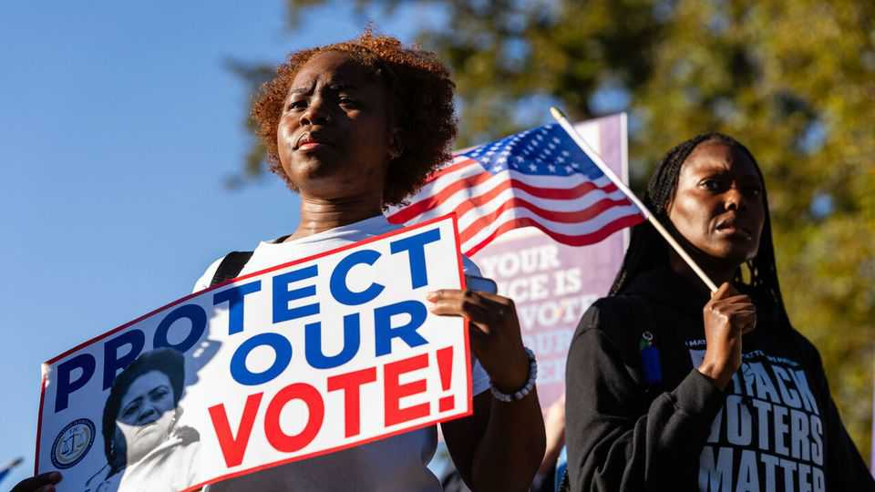

United States | Redistricting
A Supreme Court case could help entrench Republican power
The justices are weighing whether to gut the Voting Rights Act
October 23rd 2025

Section two of the Voting Rights Act, the landmark civil-rights law enacted in 1965, prohibits any state election rule that “results in a denial or abridgement” of a citizen’s right to vote because of their race. For decades courts have used section two to protect the voting power of racial minorities when legislatures draw electoral-district maps. That era may soon end, however, and if it does, the change may offer Republicans new and potent possibilities for partisan gerrymandering to entrench party power. At issue is a pending Supreme Court case, Louisiana v Callais, concerning Louisiana’s congressional map. At oral arguments on October 15th Chief Justice John Roberts and his five fellow conservative justices gave every

indication that they may bar race as a consideration when such maps are drawn, usually by state legislatures. The court will issue its decision by next summer, but the justices could decide to act sooner.

In practice, applying section two has constrained Republican partisan gerrymanders. If it is gutted, a number of Republican-controlled states are likely to attempt ambitious remappings. One estimate suggests Republicans could eliminate as many as 19 Democrat-held districts in the House of Representatives, or 9% of the party’s current caucus. More realistic estimates suggest the number is between six and 12, assuming Republicans take an aggressive approach, as they have recently in Texas, Missouri and Utah.

These numbers would not guarantee Republicans a perpetual majority in the lower house. If Democrats won the popular vote by a similar margin to the so-called “blue wave” midterms of 2018 (nine percentage points), they would almost certainly overcome such gerrymandering. But the possible Republican advantage could be substantial, around five or six points—larger than the Democrats’ current polling lead. Such a skewed electoral system would be akin to those adopted by dominant parties in illiberal democracies like Hungary and Singapore. America would be alone among its rich democratic peers. ■

Stay on top of American politics with The US in brief, our daily newsletter with fast analysis of the most important political news, and Checks and Balance, a weekly note from our Lexington columnist that examines the state of American democracy and the issues that matter to voters.

This article was downloaded by zlibrary from https://www.economist.com//united-states/2025/10/23/a-supreme-court-case-could- help-entrench-republican-power