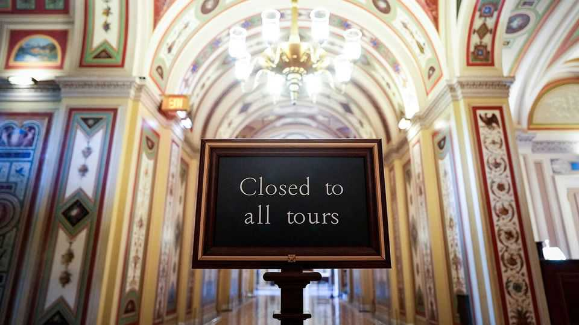

United States | Awkward silence
America’s government shutdown is its weirdest yet
It is oddly tolerable for Democrats and Republicans, at least for now
October 23rd 2025

America’s government shutdown is now the second-longest on record. On October 22nd it overtook the 21-day shutdown of 1995-96, which turned government funding into the hostage-taking mechanism it is today. At the time Republicans, led by Newt Gingrich, produced a spending bill with deep cuts to social-welfare programmes that were anathema to President Bill Clinton. Mr Clinton refused to sign it. Late-night negotiations eventually yielded a compromise. “We ought to end this,” pleaded Bob Dole, the Republican Senate leader. “It has gotten to the point where it is a little ridiculous.” There is little such urgency this time around. House Republicans have not been in session on Capitol Hill since mid-September, well before the

shutdown began on October 1st. Mike Johnson, the Republican speaker of the House, says his party has done its job by passing a stop-gap bill that keeps spending at current levels. Democrats have now rejected that bill 12 times in the Senate. They continue to demand an extension to health-care subsidies which are due to expire at the end of the year. Overall, Americans still blame Republicans for the shutdown, according to YouGov polling on behalf of The Economist. But the public is increasingly displeased with both sides.

Yet neither Democrats nor Republicans look likely to budge anytime soon. Despite initial hand-wringing over the potential economic damage, the shutdown has proven oddly tolerable, at least for now. Donald Trump has engaged in budgetary chicanery, some say illegally, to minimise the pain. The Department of War, for example, repurposed around $8bn in funds to pay 1.3m members of the armed forces. Some agents from ice, the fbi and Homeland Security also seem to be receiving their pay cheques. Elsewhere, the president pledged to use tariff revenues to fund a food-aid programme for low-income mothers and their children. He also said he would resume $3bn in farm-aid payments. “Trump is doing everything to make the shutdown as manageable as possible,” says a Republican congressional aide.

Meanwhile, the administration is trying to hurt Democrats. It has frozen or cancelled around $28bn reserved for projects primarily located in Democrat- run areas. Russell Vought, the director of the Office of Management and Budget (omb), has tried to fire 4,100 federal workers and plans to slash at least 10,000 government jobs overall. But Democrats seem unfazed. If anything, it has strengthened their resolve. Many see the threats as hollow, not least because they argue the omb wants to carry out federal lay-offs regardless of a deal. “They were firing people right and left before the government shutdown,” noted Dick Durbin, a senior Democratic senator.

Most Americans are yet to feel the pain. Less than 2% of the country’s jobs are in the federal government. The usual shutdown irritations seem to have been softened. People are, for example, still going to the country’s national parks, which the administration has decided to keep open.

How does this all end? The economic costs will pile up the longer the shutdown drags on. Between 0.1 and 0.2 percentage points could be trimmed

from annual gdp for each week the shutdown lasts, reckons Oxford Economics, a consultancy. More pressingly, funding for the Supplemental Nutrition Assistance Programme, more commonly known as food stamps, that provides tens of millions of people with food aid, will start to run out in several states by November 1st. That may be enough to focus the minds on Capitol Hill, say congressional aides.

There are some efforts under way to reach a compromise. John Thune, the Republican Senate leader, has offered to hold a vote on health-care subsidies, but only after Democrats reopen the government. Yet few Democrats trust Republicans to keep their word. Mr Trump’s repeated moves to rescind congressionally appropriated funds have left many lawmakers wondering why they would sign up to a budget that may simply be ignored by the president, or undone by a pliant Republican majority. That is not only ridiculous; it is Washington’s new reality. ■

Stay on top of American politics with The US in brief, our daily newsletter with fast analysis of the most important political news, and Checks and Balance, a weekly note from our Lexington columnist that examines the state of American democracy and the issues that matter to voters.

This article was downloaded by zlibrary from https://www.economist.com//united-states/2025/10/22/americas-government-shutdown- is-its-weirdest-yet