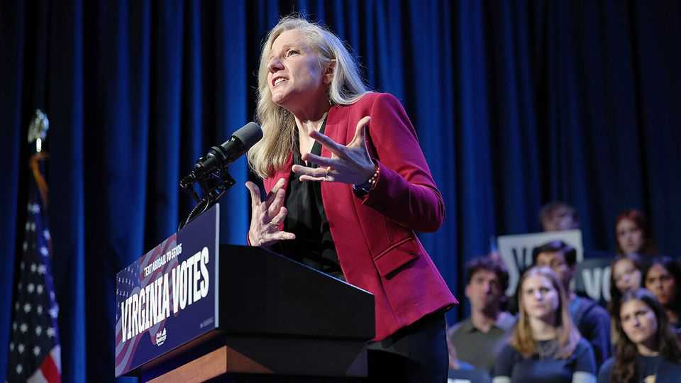

United States | Wonk appeal
In the race for Virginia governor, Democrats see boring as a plus
Abigail Spanberger’s campaign has been strikingly substantive
October 23rd 2025

When bill nye the Science Guy took the stage at the Jefferson Theatre in Charlottesville, the crowd roared. The presenter of a science-education television programme was there to stump for Abigail Spanberger, the Democrat running for governor of Virginia in the election on November 4th. The pair first bonded over conversations about science and space policy, he explained. “Some call her a moderate. I call her someone who’s paying attention.” Ms Spanberger has embraced her inner wonk on the campaign trail and, if the polls are accurate, it seems to be working. A former narcotics cop and CIA officer, she now leads Winsome Earle-Sears, the state’s Republican

lieutenant-governor, by around nine points in polling averages. Her stump speech is about Virginia’s economy.

The campaign has recently been disrupted by an imbroglio involving loathsome texts fantasising about killing the speaker of the Virginia House that were sent in 2022 by Jay Jones, the Democrat running for attorney- general, who campaigned alongside Ms Spanberger. Ms Spanberger called the messages “abhorrent” but hasn’t asked Mr Jones to withdraw. Her handling of the matter has been awkward at times, and Republicans have sought to use the resonant issue of political violence to slow her momentum.

For a flap like that to upend the race, though, a lot would have to go wrong for the Democrats. Virginia is the only state where an incumbent governor cannot seek re-election. Open races held in the year after a presidential election mean the national mood matters more. In the past ten contests, the party in the White House has won the Virginia governorship just once.

This year the electorate may be particularly keen to punish Donald Trump’s party. The state has a higher share of federal workers than almost any other and the Trump administration has fired swathes of them. The government shutdown is now dragging into its fourth week. That is hurting well- educated commuters in northern Virginia and working-class defence contractors in Hampton Roads, a military hub on the state’s southern coast.

Unlike New Jersey, the other state choosing a governor in November, Virginia has been steadily moving to the left. Its voters have become more Democratic than the rest of America’s with each presidential vote since 2012 (see chart). In 2016 and 2024 Virginia was the only southern state to reject Mr Trump, although he did better in November than in 2020. Demography helps explain the Democrats’ resilience in the state. “We are America’s capital of white suburban women,” says Ben Tribbett, a Democratic strategist in Reston, “and that is one of the only groups of voters that Kamala Harris gained with.”

Ms Spanberger, the mother of three school-age girls, is using her centrist credentials to run a big-tent campaign. In 2018 she flipped a House of Representatives seat long held by Republicans. In Congress she rebuked the Democrats for calling to “defund the police” and said that Joe Biden’s New Deal-inspired ambitions went too far. Months later Mr Biden greeted her on a phone call saying: “Hello Abigail, it’s President Roosevelt.”

Since setting her sights on Richmond, Ms Spanberger has styled herself as “vanilla, but in a thoughtful way”, says J. Miles Coleman of the Centre for Politics at the University of Virginia. Her campaign is almost mockably substantive, churning out weekly position papers on health care, housing and tariffs. That may explain why her opponent’s effort to paint her as a radical

leftist has seemed to sputter. Mimicking Mr Trump’s best taunt of Ms Harris, Ms Earle-Sears claimed that “Spanberger is for they/them, not us”. But the most incendiary footage of Ms Spanberger shows her saying that lgbtq people deserve “the same legal rights as anyone else”.

Ms Earle-Sears has a stellar biography. An immigrant from Jamaica, she served in the Marines before she became the first black woman elected statewide in the former capital of the Confederacy. But her gubernatorial campaign has been “void of any kind of message”, says a Republican operative. She has raised less than half as much money as Ms Spanberger, has skipped typical meetings with business groups and has been frosty with the local press. Mr Trump has not endorsed her.

That distance from the president may give Ms Earle-Sears some freedom to match Ms Spanberger’s pragmatic campaign down the final stretch. She argues that Virginia should diversify its economy to protect itself from actions by the federal government. “They sneeze and we catch the cold,” she says. But it may be coming too late. A win for Ms Spanberger would suggest that, with a disrupter like Mr Trump in the White House, plenty of people are craving someone a bit boring. ■

Stay on top of American politics with The US in brief, our daily newsletter with fast analysis of the most important political news, and Checks and Balance, a weekly note from our Lexington columnist that examines the state of American democracy and the issues that matter to voters.

This article was downloaded by zlibrary from https://www.economist.com//united-states/2025/10/23/in-the-race-for-virginia- governor-democrats-see-boring-as-a-plus