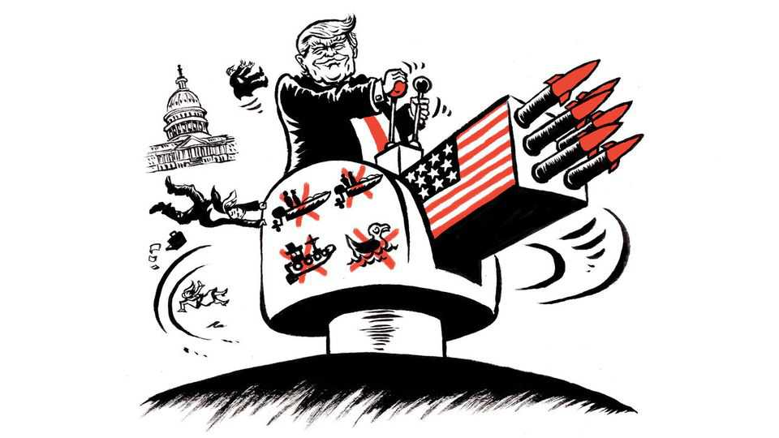

United States | Lexington
Donald Trump has turned the war on drugs into a real war
And Congress needs to block the metaphor before it kills again
October 23rd 2025

Of all the failures by Congress this year to fulfil its role under the constitution—to insist upon its authority over spending and tariffs or upon the continued existence of agencies it voted into being—nothing is as dangerous as its reluctance to scrutinise the Trump administration’s killings of people it says are smuggling drugs by sea. Even those members of Congress who accept at face value all of Donald Trump’s claims should be worried that a future president will exploit this precedent to invoke sweeping powers to kill based on his word alone—not to mention that other countries, including America’s adversaries, will seize upon his creative reading of international law.

The killings, of at least 34 people in eight strikes since September 2nd, are also a case study in how cannily Mr Trump is choosing where and how to test the limits of presidential power. Maybe your own attention is already beginning to wander: after all, who can afford to spare much concern for accused drug smugglers? And who can prove the president wrong? The dead, and the drugs, if any, have vanished beneath the waves.

Well, most of them: two people survived an American strike on October 16th, and the American navy plucked them from the water. That their survival was inconvenient was demonstrated by how the administration dealt with them. It immediately sent them home. Once dunked in the soothing waters of the southern Caribbean, men whom America had deemed too dangerous to live were rendered harmless enough to be spared American custody. That development also happily spared the administration the risk of a habeas corpus petition that could have opened the missile strikes to judicial review.

Mr Trump posted on social media that “the two surviving terrorists” were being sent back, one to Ecuador and the other to Colombia, for “detention and prosecution”. His confidence that justice would be done was particularly surprising in the case of Colombia, since his administration had previously accused that country of coddling “narco-terrorist groups”. The following day, Mr Trump called Colombia’s president, Gustavo Petro, an “illegal drug leader”—not the kind of man, you’d think, in whose hands an American president would entrust a lethal enemy, however wet.

Lawyers who worked in past administrations to develop a legal framework for the war on terror have been stunned by the Trump administration’s own feat of smuggling. Having transposed the vocabulary of that war to anti-drug enforcement, it is now using that language, along with the terminology of international law, to package and deliver the same lethal military tactics. The State Department designated drug cartels as “foreign terrorist organisations” in February, a move that in itself did not authorise the use of force. After the administration began its strikes, it said in a notice to Congress that America was in a “non-international armed conflict” against “non-state armed groups” engaged in “an armed attack against the United States”—all signifiers of obeisance to international law meant to prevent state murder by governing the use of lethal force as a first resort.

But consider just the foundational assertion. Is a drug smuggled for profit really equivalent to the weapon of an invader attacking America? “You’re just using metaphors to turn something into what it isn’t,” says Stephen Pomper, the chief of policy at the International Crisis Group, a non-profit, who was a senior director of the National Security Council under Barack Obama.

The administration has so far persuaded Congress and the public, numbed to such tactics by the war on terror, to settle for the metaphor. It has released no evidence to support the president’s claims the ships carried fentanyl, which comes mainly by land from Mexico. It has not told Congress what “armed groups” are responsible. It has simply dismissed claims that fishermen from Colombia and Trinidad have been among those killed.

And, unlike the lawyers who struggled to define when the Obama administration could use drones to kill certain accused terrorists, it has not specified what lawyers call a “limiting principle” to a president’s exercise of lethal force against drug cartels. If drug smugglers can be labelled terrorists, deemed to be waging war against America, and then slain at presidential command, then other people he identifies as terrorists could be just as vulnerable. “It isn’t so easy, if you take the kinds of leaps that he’s taken with regard to these strikes and run roughshod over the law, to figure out what would stop him from using the same kind of actions against another deemed threat, whether from outside the United States or even from inside,” Mr Pomper says.

The limits, if any, that Mr Trump has in mind for his exercise of lethal force is the kind of matter one would expect Congress to be curious about. One might also expect Congress to show some curiosity about the abrupt announcement, on October 16th, that the admiral leading American forces in Latin America has decided to step down in December, two years ahead of schedule.

Past presidents have also stretched their powers to wage wars and even to start them. Indeed, Mr Trump is gesturing at precedents they set. But “This administration is going further, and going further with less public, detailed defence of what they’re doing,” says Peter Feaver, a political scientist at Duke University. “I think the biggest difference is that Congress is not

holding this administration to account in the way that they did even to Trump 1.0, let alone to Biden and to Bush.”

Just because Mr Trump has labelled some migrants and even leftist opponents as “terrorists” does not mean he will use the armed forces against them. But right now it’s not clear what, besides his own inclinations, might prevent him. ■

Subscribers to The Economist can sign up to our Opinion newsletter, which brings together the best of our leaders, columns, guest essays and reader correspondence.

This article was downloaded by zlibrary from https://www.economist.com//united-states/2025/10/23/donald-trump-has-turned-the- war-on-drugs-into-a-real-war

The Americas

Javier Milei’s fate turns on an upcoming election. Can he win? Colombia has finally drawn Donald Trump’s ire The obvious economics of preserving the Amazon