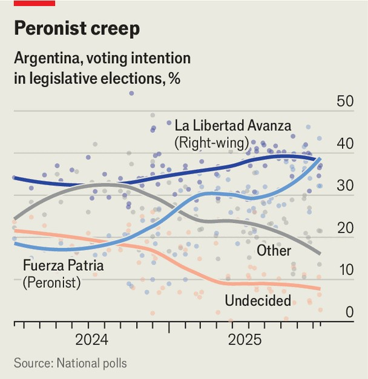

The Americas | Argentina’s future
Javier Milei’s fate turns on an upcoming election. Can he win?
It is a battle to be the least disliked
October 23rd 2025

Never before have midterm elections in Argentina grabbed so much global attention. The Trump administration has thrown the financial might of the United States behind both President Javier Milei and the Argentine peso, turning the vote on October 26th into a political football in Washington and front-page news in the rest of the world. Bond markets scrutinise every poll. Yet one crucial group seems uninterested: the Argentines. In Buenos Aires, the capital, billboards are rare, rallies are modest and apathy is widespread, even at campaign events. “I’m obliged to be here,” says Emiliano, who is walking in a small march for Peronism downtown. The distant Peronist-run municipality that he works for as a street cleaner

brought him there. Who will he vote for? “I don’t know.” Every major political leader, including Mr Milei, is viewed negatively by a majority of Argentines. “In New York there is much more interest in the election than here,” says Gala Díaz Langou of CIPPEC, an Argentine think-tank, who recently visited Wall Street.

Mr Milei won office in 2023 by exciting voters with radical plans and furious condemnation of “la casta”, the political class. Since then, huge cuts to spending have pulled monthly inflation down from 13% to about 2%. Poverty has fallen to its lowest level since 2018. Mr Milei has slashed red tape, improving everything from internet access to airlines. At the start of the year it looked as if he had a good shot at a thumping win in the midterms, where half the seats in the lower chamber and a third of those in the Senate are up for grabs. Now, Mr Milei’s project is at risk of unravelling.

The slide began in February, when he promoted a dodgy cryptocurrency which soon collapsed in value. In August his sister was accused of taking a cut of the disability agency’s spending on medicines. They both deny any wrongdoing. Mr Milei has also made political boobs. Overconfident, he decided to run rival candidates in the provinces of powerful governors rather than seeking to build coalitions. They punched back hard. One group formed a party to run against him nationwide; many more backed rebellions in Congress that repeatedly defeated his government.

Mr Milei also relied heavily on a strong peso to pull down inflation, even after floating it within bands in April as part of an IMF bail-out. He assumed that low inflation would win the election. Yet keeping the peso high made it hard to build up reserves, left the country vulnerable to exchange-rate crises and became a drag on growth and jobs. Worse, voters now care more about jobs than inflation.

All this came to a head on September 7th with legislative elections in Buenos Aires province, home to 40% of the population. Mr Milei’s party, Liberty Advances (LLA), lost to the incumbent Peronists by 14 percentage points. Markets panicked and ditched pesos. That prompted the central bank to spend over $1bn in two days to stop the peso crashing out of its band, draining Argentina’s dollar reserves to the dregs. Desperate, Mr Milei called the Trump administration, which sees him as a kindred spirit. It stumped up

in extraordinary fashion: a $20bn swap line, almost $1bn in peso purchases and an effort to corral another $20bn from private banks. Yet, as The Economist went to press, the peso was still under heavy strain.

Still, LLA should perform much better in national midterms than it did in September. For one thing, the pummelling the government received may well scare centrist voters into turning out rather than staying home, as many did then. They may be unenthusiastic about Mr Milei, but they loathe the Peronists. Mr Milei is also more popular in the interior of the country than in the province of Buenos Aires. Many voters will still reward him for reducing inflation. Had the peso crashed out of the band he would have been in deep trouble, and Mr Trump’s intervention appears to have avoided that.

Yet he still faces several problems. The ballot papers show photos of the candidates leading the party lists. Many LLA candidates are unknown compared with their more established rivals. Some are just odd. “I don’t know the candidates really, I’m voting for Milei,” says Ezequiel Salazar, a young interior designer. LLA will need lots of voters to focus similarly on Mr Milei rather than his candidates.

That will be particularly tested in Buenos Aires province. The head of the LLA list there, José Luis Espert, was accused of having received $200,000 from a man indicted in the United States for drug-trafficking, money he insists was for legitimate consultancy work. He stood down nonetheless, but too late to remove his photo from the ballot. Mr Milei’s outsider, anti- corruption brand may have been broken by these repeated scandals, says a well-connected political consultant.

Mr Trump’s efforts to help Mr Milei win could also backfire. The perceived assault on Argentine sovereignty may fire up the Peronist base. “We don’t have a president, we have a guy receiving orders,” fumes Óscar Rubén from La Matanza, a Peronist bastion in the outskirts of the capital.

The biggest issue is the weight of Argentines’ wallets. “What good are falling prices if people haven’t got work,” says Mr Rubén. Even for those with an income, purchasing power is weak. Equilibra, an Argentine consultancy, has studied the average real income of 14.5m Argentines, including private and public employees as well as pensioners, since Mr

Milei took office. It found that it fell sharply, recovered somewhat, then since March has stagnated at around 6% below pre-Milei levels. People are focused on keeping their heads above water, says María Jimena López, a leading Peronist candidate in the province of Buenos Aires. “They see that every day the water keeps rising.”

This leaves an unusually wide range of possible outcomes. Markets will tumble if, together with his allies, Mr Milei fails to marshall the third of the seats in the lower chamber that he needs to prevent his vetoes being overturned. If his party polls below 30%, then chaos will ensue, especially because Mr Trump hints that he may walk away if Mr Milei loses.

The government dismisses such gloomy talk. It says that Mr Milei is guaranteed to pick up quite a lot of seats because he has so few at the moment, and that this should reassure markets. “Whatever the outcome, the instability disappears,” says Federico Sturzenegger, the minister for deregulation. Yet even with more seats, if Mr Milei’s approval rating is low he will struggle to control Congress.

A good scenario for Mr Milei is a five-point win, with his party securing enough seats to defend his vetoes. Any serious reforms on tax, labour or pensions would still require serious coalition-building to get through

Congress. Even a narrow win that forces Mr Milei to rely on somewhat friendly parties to defend his veto may suffice to prevent initial market panic. Pollsters suggest that is the most likely result (see chart), though they were badly over-optimistic about his chances in the Buenos Aires provincial election.

The days immediately after the election will be crucial. “All the discussion about the percentages [of the vote] is less relevant, relative to whether we show we can generate a working coalition in Congress,” says Mr Sturzenegger. That won’t be easy. The most obvious ally will remain the PRO, the right-wing party of a former president, Mauricio Macri. But it will not roll over. “The conditions will be onerous,” says Fernando de Andreis, who was Mr Macri’s chief of staff, “even more than those of the last year and a half.” A fiendishly difficult two years beckons. ■

Sign up to El Boletín, our subscriber-only newsletter on Latin America, to understand the forces shaping a fascinating and complex region.

This article was downloaded by zlibrary from https://www.economist.com//the-americas/2025/10/23/javier-mileis-fate-turns-on-an- upcoming-election-can-he-win