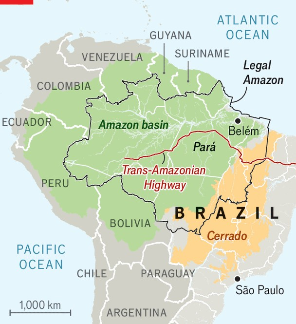
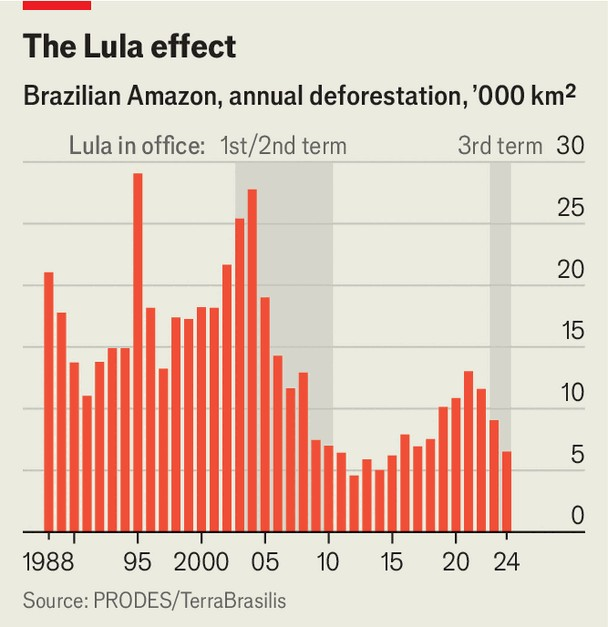
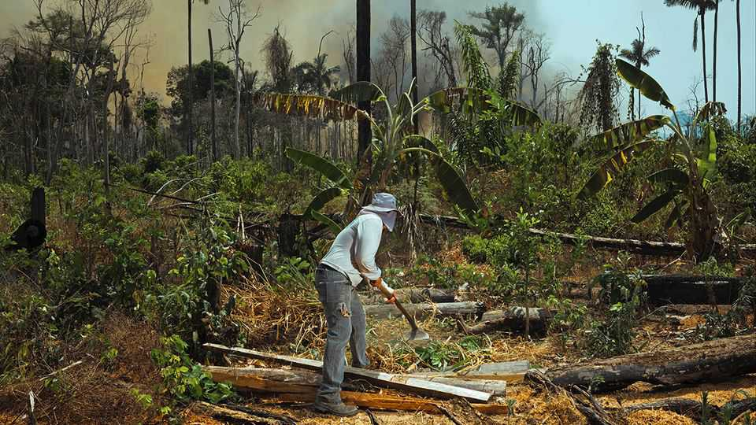
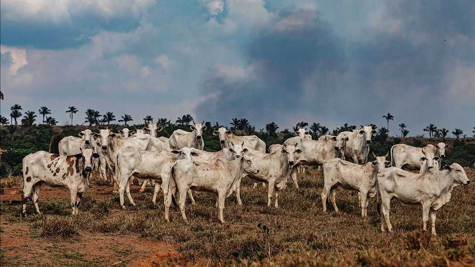

The Americas | The gigantic green world
The obvious economics of preserving the Amazon
It provides Brazil’s world-beating farmers with water, and keeps carbon locked up for the rest of us
October 23rd 2025

Delegates to the UN’s annual COP climate-change conference, to be held this November in the city of Belém at the mouth of the Amazon, will not need to travel far to see the void where the rainforest used to be. Heading south on the BR-010 highway into the interior of the state of Pará, they will soon reach vast open spaces cut out of dense tropical forest. White zebu cattle with curved horns and humped backs huddle for shade under the few remaining trees, or forage in the scrubland.

In theory, stopping the deforestation of the Amazon is among the cheapest ways of curbing global warming. Brazil’s “Legal Amazon” region, which encompasses nine states and 60% of the entire forest (which also spreads into Peru, Colombia and other neighbouring countries), emitted warming gases in 2018 equivalent to 33 tonnes of carbon dioxide for each of the 28m people in the region. Almost all of the emissions came from clearing rainforest for farming. They are about as high per person as those in Qatar, a country made rich by producing vast amounts of oil and gas, belching out carbon dioxide in the process.

Residents of the Legal Amazon benefit little from emitting carbon on the scale of a petrostate: the region’s GDP per person is $5,900. The figure in Qatar is about $76,000. “No single country has emitted so much [per person] and created so little wealth,” points out Beto Veríssimo of Imazon, a think- tank in Bélem. Destroying the Amazon is not just environmentally devastating, it is also economically unrewarding.

That suggests a trade. People in the Legal Amazon extract only a meagre living from the forest, but it provides an invaluable service to the rest of the world, storing roughly five years’ worth of global carbon dioxide emissions. It also serves Brazil. Trees pull water up through their roots, use it to circulate nutrients, then allow some of it to evaporate through their leaves

into the atmosphere. Combined with a prevailing southwesterly, the 400bn trees in the Amazon create moisture-laden winds which, after they eventually hit the Andes, turn south and dump rain on Brazil’s farming heartland. Without this water-transport mechanism, much of the best farmland in Brazil and South America would be arid.

If the forest were destroyed, any chance of meeting the goals of the Paris COP agreement of 2015 to limit global warming to well below 2°C above pre-industrial average temperatures would disappear. Brazil’s agribusiness, easily the main chunk of the country’s export-led economy, would also wither without its free atmospheric aqueduct. Whether the forest will disappear, and if so when, cannot be determined merely by extrapolating current rates of deforestation over time. About a fifth of the Amazon has been destroyed in the past half-century, but scientists worry that it is now approaching a tipping point beyond which its water-transport system will no longer sustain it, let alone Brazil’s farmers.

Valuing the forest as if it were an economic asset—treating its carbon storage, water regulation and biodiversity as services rendered, rather than free gifts—would make its preservation economically rational and could make its residents richer. Its services are immensely valuable. One study suggests the Amazon provides around $40,000 of value per square kilometre

of standing forest each year, giving it a fair asset value of around $3trn, about 50% more than the retailer that shares its name. Keeping it intact costs far less. Juliano Assunção and José Alexandre Scheinkman, economists at Pontifical Catholic University of Rio de Janeiro and Princeton University respectively, reckon that a carbon price of $25 per tonne would squeeze out cattle ranchers, since landowners could make more money by allowing reforesting. That is a bargain compared with rich countries’ own efforts to mitigate climate change: for instance, the EU’s emissions-trading system charges €80 ($93) for a permit to emit a tonne of carbon.

Brazil will promote a version of this trade at the COP. Its government is keen to inaugurate the Tropical Forests Forever Facility (TFFF) to endow rainforests. Governments, sovereign-wealth funds and philanthropic outfits are to capitalise the fund with a mooted $25bn; Brazil has announced it will provide $1bn. This will then be leveraged by borrowing in international markets and investing the proceeds into higher-yielding emerging-market and corporate bonds, creating a pot worth some $125bn. The fund will then pay governments that limit deforestation to 0.5% per year, verified by satellite imagery. If forest cover goes down faster, they get nothing. A fifth of the payments must go to indigenous people or “traditional communities”. Brazil reckons that if all goes well, this will pay around $400 per square kilometre of standing forest per year.

Brazil’s numbers are probably optimistic. Rich countries are cutting back aid budgets and running scared of anti-green populists. Climate summits have a track record of launching new funds that become bogged down in questions of governance and implementation; promises are made but money does not follow. The income for the TFFF ultimately comes from taking investment risk. There will be defaults on the bonds in its portfolio. And even if it is a wild success, the TFFF alone will not cover the cost of preserving the Amazon. The region needs an economic model that can both protect the forest and deliver prosperity to the people who live there.

From space, deforestation looks like a fish skeleton. Motorways are the spine. Before the Trans-Amazonian highway opened in 1972, less than 1% of the Amazon had been cut down. The road was part of the military dictatorship’s strategy to change that. General Emilio Medici, president at the time, attended the road’s opening, at which a Brazil nut tree was

ceremonially chopped down. A plaque next to its stump describes the road as a “historical launchpad towards the conquest of this gigantic green world”.

The dictatorship saw the Amazon as both an insecure frontier and an unproductive wasteland. Opening it up was meant to make Brazil safer and richer. The slogan of the time was “a land without people for people without land”. Settlers were encouraged to move in and offered tax breaks, subsidies and other incentives to set up cattle ranches. Indigenous people already in the forest were often murdered or kidnapped to get them out of the way.

The ribs that branch off from the spine often come from perverse incentives. They are the work of land-grabbers, known as grileiros (crickets), named after the practice of putting insects in a box with fraudulent land deeds to age the papers and legitimise claims over the territory. Putting cattle on seized land has a similar effect. Brazil’s constitution includes special protection for “productive property”. Farming is just a ruse. A typical cattle ranch in Pará, the historic frontier for deforestation, produces less than 100 animal units, a standard measure of meat from livestock, per square kilometre. That is agriculturally backward. Brazil’s best farms boast around 400.

Economists talk about the “extensive” and “intensive” margins of production. Think of this in terms of labour: a company can hire more workers, thus increasing production along the extensive margin. Or they could try to get more output from workers they already have, expanding the intensive margin. It is the same with land. The method of cattle-ranching in the Amazon is extensive. It uses a lot of land, but not very intensively. That was encouraged by a military dictatorship that wished to occupy as much of the forest as possible, as well as by economists who believed that Brazil’s comparative advantage in trade came primarily from its huge landmass rather than technology or skill.

Yet since the 1970s and the founding of the research agency Embrapa (under the same General Medici), Brazil has become one of the world’s leading agricultural exporters by applying scientific know-how to raise the intensive margin of its agribusinesses. The agency’s technicians developed varieties of soy, maize and cotton that were better suited to tropical climates. They came

up with a way to farm the acidic lands of the cerrado, a savannah-like ecosystem that abuts the Amazon, by putting limestone into the soil. Most Brazilian economists now conclude that the country’s eight-fold rise in agricultural output since the 1970s has overall been “land sparing”. The majority of the gains came from reducing the area of land used per unit of agricultural production.

Intensifying cattle-ranching by using modern farm techniques to improve yields in deforested land in the Amazon would let Brazil increase its exports while still leaving enough land to let the forest grow back. A more intensive model also requires more labour, suggests Flávio Carminati, a rancher and soyabean farmer in Pará. He boasts that his cattle farm, which uses the latest genetically engineered grass from the Netherlands to fatten more cows faster, is both more efficient and employs far more people than his neighbours who are less keen on whizzy technology. Because agricultural expansion was so unproductive in the past, and cleared so much forest, there is now little trade-off between development and nature in the Legal Amazon.

Of the land that has been cleared, around half is now classed as “degraded pasture”, a wasteland left when the nutrients have been stripped from the soil. Another 28% is used for typically inefficient cattle ranching, with the remainder left to other kinds of farming. Adopting the best techniques for

raising cattle on the worn-out pasture would let the country export more meat, while also leaving land over for reforesting. For instance, Mombak, a carbon-credits company whose customers include Microsoft and Google, restores the nutrient profile of soil in degraded pasture. This speeds up regrowth and increases the amount of carbon sequestered.

Yet improved agricultural productivity does not necessarily lead to saving the land. While technological advances mean that less land can be used to produce more food, the forces of supply and demand sometimes mean that increased efficiency simply leads to more consumption. If you can produce more with less, why not produce even more with more? Higher output per square kilometre provides an incentive to deforest a larger area of rainforest. Intensification spares land only if people value that land as standing forest.

Property rights and their enforcement help with this. “Where there is a void, that creates an opportunity,” says Jair Schmitt, director of environmental protection at Ibama, Brazil’s environmental police. Because of the size and remoteness of the Legal Amazon, the Brazilian state cannot be physically present throughout it. Mr Schmitt compares it to the American West in days of yore. So to enforce the law, Ibama relies not only on lawmen but on satellite imagery. It cross-references information on land ownership, forestry licences and so on to work out if a patch of forest has been deforested illegally. If it determines that an environmental crime has been committed, it issues an “embargo”, meaning that the area is no longer eligible for rural- credit schemes that provide cheap loans to farmers. More legitimate businesses, such as soyabean traders, are supposed to check on these embargoes.

Imazon estimates that there is no ownership information for 28% of the Brazilian Amazon. Between 2008 and 2012, 40% of the deforestation in the region occurred within these unregistered areas. They usually sit under the jurisdiction of state governments rather than the federal one, for which Ibama is responsible. (Other federal agencies enforce the law in indigenous and environmental reserves.) And state and municipal police have their own priorities. Embargoed areas can launder cattle, selling them to middlemen who disguise ownership before moving them on to fattening farms. Slaughterhouses struggle to assess the whole cattle supply chain, which often goes several farms deep.

But while it is imperfect, Brazil’s model of enforcement does work. Between 2004 and 2012, during the first two terms of Luiz Inácio Lula da Silva, Brazil’s current president (known as Lula), deforestation fell by 80%. As politicians eased up (or, in the case of Jair Bolsonaro, the far-right former president, encouraged deforestation), it rose again, but never to the levels of destruction seen in the late 1990s. That is partly thanks to the proliferation of protected areas and to an increase in the amount of forest handed over to its indigenous residents.

The World Resources Institute (WRI), a pressure group based in Washington, calculates that the area of land controlled by indigenous people in Brazil grew from 75,000 square kilometres in 1985 to 1.1m in 2017, or from less than 1% of Brazil’s land to almost 13% of it. Protected areas rose from 130,000 square kilometres to 1.3m over the same period. In combination that means an area the size of the Democratic Republic of Congo now has clear ownership rights, cutting through the ambiguity that facilitated land-grabbing.

With more of the Amazon in the hands of the people who live there, the next step is to free them to use their land profitably. In the jargon of environmental economics this is “monetising the ecosystem services”, a term used to refer to the economic benefits that humanity gets free of charge from nature. For the Amazon these fall into three categories: the storage of billions of tonnes of carbon; the regulation of vast flows of water; and acting as a reservoir of biodiversity, providing a home for millions of species that exist nowhere else on Earth.

Getting the rest of the world to pay for carbon-storage services in the Amazon is a tough job. Although not explicitly about paying for carbon, the TFFF is the most promising effort for some time. In contrast, monetising the Amazon’s hydrological services would chiefly involve payments within Brazil. The flow of water through the Amazon generates hydroelectricity that meets around two-thirds of the country’s needs. That saves Brazilians some $660m a year in electricity costs, according to a forthcoming paper by Rafael Araujo, an economist. It also helps irrigate Brazil’s agricultural heartland, saving farmers a fortune on mechanical irrigation. Properly pricing these indirect benefits to farmers elsewhere in Brazil would fund transfer payments to areas that protect the forest. The cost could be passed

along to the final consumers of Brazilian soyabeans, many of whom are in China.

“We are focusing on the bioeconomy,” says Marina Silva, the environment minister. The term refers to the sustainable harvesting of the forest’s biodiversity, combining modern science and traditional knowledge. Profits from products such as açaí berries, a palm-tree fruit used in trendy breakfast dishes, depend on preserving the forest. Other trees provide nutrients and a home for pollinators.

Alex Atala, a fine-dining chef in São Paulo, notes that the Amazon is twice the size of the EU and holds a much wider array of species. Variations between French vineyards produce flavours much valued by connoisseurs, as do its pastures, via its cheesemakers. The Amazon, he suggests, could do the same. At his restaurant he serves a species of ant that delivers a burst of lemongrass to the palate. The rainforest gave the world chocolate and latex: what other pleasures might it contain?

Embrapa, which has hitherto focused on squeezing more from each unit of land, now packages sustainability along with productivity. Its researchers promote new kinds of agroforestry as well as new models for cattle-ranching that keep more trees and preserve and restore the soil. Its new forestry

systems mimic the primary rainforest, mixing açaí, cacao, black pepper and timber species so that shade-tolerant crops thrive beneath taller canopies, adding organic matter and deeper roots. These can be planted on degraded pasture, raising output and biodiversity, and storing far more carbon than cattle ranches. But they carry upfront costs, which makes them tricky to implement for small farmers working in a country with high interest rates. They can take decades to bed in.

The forest has two economies, says Eduardo Amaral Haddad of the University of São Paolo. One involves producing goods such as açaí. The other is producing services that benefit the whole world. The value of the bioeconomy will only ever be small compared with these global services. While the delegates to the COP will munch on tropical fruits between meetings or enjoy açaí stout at a hipster bar in the regenerated docks, the rest of the world is mainly interested in the Amazon’s role as a vast sink for carbon emissions. The WRI estimated that the Amazon’s bioeconomy was worth roughly $2bn in 2020, a pittance relative to the $120bn a year in value the forest generates from its role as a carbon sink. Both can coexist, however, and the profits from açaí may help bridge the gap between the needed carbon price of $25 and the income that the forest will receive from the TFFF, which will probably be lower.

Messrs Assunção and Scheinkman reckon that historically Brazil valued the real forest at the equivalent of about $6 per tonne of carbon stored every year. That is based on the fact that the country did not deforest as much as it could have done before 2008, when Norway and Germany started paying it not to do so via the Amazon Fund. The value Brazilians now put on the Amazon is probably higher. Brazil’s current government has said it will bring deforestation down to zero by 2030.

Liberal Brazilians worry that Lula and Ms Silva are getting old, and that they rely on a Congress dominated by their opponents. Brazil will elect a new president next year. No other combination of president and environment minister has succeeded in reducing deforestation to the extent that they have (Ms Silva was also Lula’s environment minister during his first two terms). Whether or not the rest of the world stumps up to protect the Amazon, only Brazilians have the power to preserve their gigantic green world. ■

Sign up to El Boletín, our subscriber-only newsletter on Latin America, to understand the forces shaping a fascinating and complex region.

This article was downloaded by zlibrary from https://www.economist.com//the-americas/2025/10/23/the-obvious-economics-of- preserving-the-amazon

Asia

What is Taiwan’s plan B? Takaichi Sanae becomes Japan’s first female prime minister How to win prizes and lose influence America and Britain target Asia’s sprawling scam industry