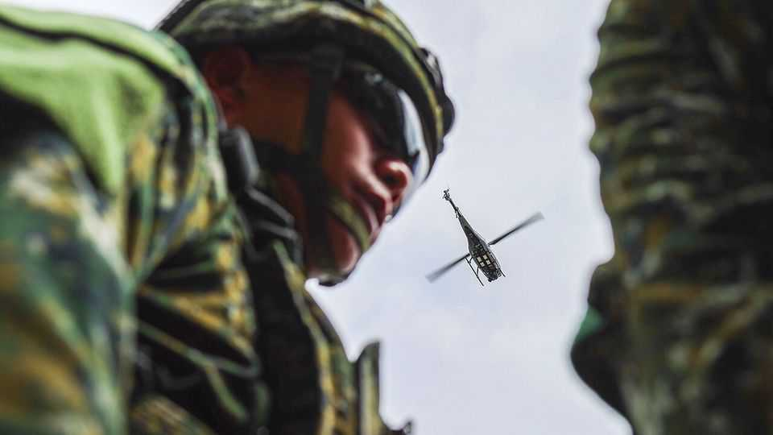
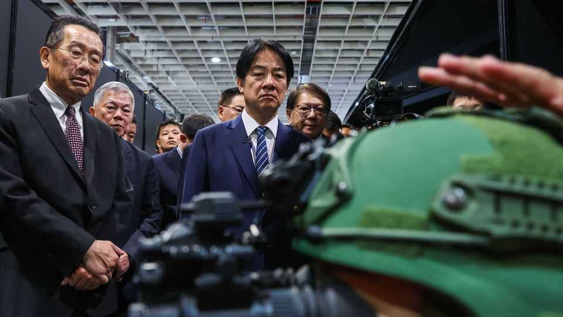

Asia | Doomsday designs
What is Taiwan’s plan B?
It is starting to hedge against the risk that America abandons it
October 23rd 2025

Officials in Taiwan were quietly optimistic when Donald Trump was re- elected. Among his advisers were several diehard China hawks determined that America stand by its vow to help Taiwan defend itself against any attack from the Chinese mainland. Taiwanese diplomats and military commanders also recalled Mr Trump’s first term, when he increased arms sales and official contacts with the island. Besides, Taiwan has a “silicon shield”: it is home to the world’s biggest producer of the semiconductors that are used by America’s AI industry. Less than a year later, Taiwan is confronting one of its deepest fears: what happens if America abandons it? Officially, American policy has not changed. But Mr Trump is preoccupied with negotiating a trade deal with

China that could also encompass Taiwan. He hinted at that in May by suggesting that such a deal would be “great for unification and peace”. Although American officials later walked that back, Mr Trump jangled nerves in Taiwan again on October 19th by saying that he expected to discuss the island in a planned meeting with his Chinese counterpart, Xi Jinping, in South Korea at the end of October.

And these are not the only shocks. Mr Trump has hit Taiwan with steeper trade tariffs than those he has imposed on Japan and South Korea; demanded that the island increase defence spending to 10% of GDP (from 2.5% last year); and asked TSMC, its chipmaking giant, to move much of its production to America. Other troubling signs include his putting off planned stopovers in America by Taiwan’s president, Lai Ching-te, and failing to approve new arms sales to the island.

Meanwhile, most of the China hawks have been purged from his administration, giving way to isolationist officials who want to secure the American homeland at all cost. And Chinese officials have been pressing long-standing demands for America to water down its commitment to Taiwan, possibly by explicitly opposing any move to declare formal independence.

Taiwan’s government says its relationship with America remains strong. In recent weeks, however, Taiwanese officials have been scrambling to adjust their public messaging, private diplomacy, economic policy and defence planning in response to these developments. Their primary aim is to convince Mr Trump to sustain America’s commitment to Taiwan. But they are also starting to hedge against the risk that he makes a strategic “grand bargain” with Mr Xi at the island’s expense.

The shift was evident in President Lai’s national-day address on October 10th. His remarks on mainland China were notably restrained. Since Mr Lai took office in 2024 he has made a series of public comments that have angered China and unnerved some American officials, including in last year’s national-day address. China has staged large military exercises in response, accusing Mr Lai of separatism and warning that he was “playing with fire”. This time, Mr Lai trod gingerly, apparently to avoid disrupting Mr Trump’s trade talks.

Another contrast with last year’s address was Mr Lai’s pledge to boost defence spending. He vowed to increase it to more than 3% of GDP in 2026 and to 5% by 2030. He also unveiled plans to build an air-defence system called “T-Dome” over Taiwan. And he pledged to supplement regular defence spending with a “special defence budget” later this year. Although that may struggle to get through parliament, officials say it could be worth as much as $33bn and that a lot of it could be spent on American weapons.

Those plans are part of an effort to convince Mr Trump that Taiwan is investing in its own defence. And the way they were presented reflects a recognition that previous lobbying in America was too geared towards China hawks whose influence is fading. Even the branding of “T-Dome” was meant to get Mr Trump’s attention by encouraging comparisons to his “Golden Dome” missile-defence system.

Mr Lai also took the unusual step of appearing on a popular American right- wing radio show on October 7th. Not only did he tout his defence plans: he said Mr Trump should win a Nobel peace prize if he got Mr Xi to abandon the use of force against Taiwan. Shortly afterwards, Mr Lai met Matt Schlapp, a right-wing American political activist (Taiwan’s top military think-tank had invited him to visit Taipei).

While this charm offensive plays out, Mr Lai has been quietly boosting defence ties with partners other than America. In his national-day address he said his government would “collaborate with the military industries of advanced nations”. Taiwanese officials are reluctant to be more specific, citing the risk that China penalises countries involved. But the focus is on drones and such “asymmetric” capabilities. And the outreach appears to have focused on Europe of late, as countries there increase their own defence spending in response to Russia’s invasion of Ukraine.

European governments and companies were somewhat better represented than usual at Taiwan’s biggest defence show in September. Germany’s trade office in Taipei took part for the first time; it set up a pavilion showcasing four German firms. Airbus turned up, too; it showed off a tactical aerial drone. In Poland that same month, a Taiwanese defence-industry delegation agreed with Polish and Ukrainian counterparts to co-operate in manufacturing aerial drones.

European and other non-American partners are unlikely to provide Taiwan with big-ticket weapons, given the risk of Chinese recriminations. But there is scope for discreet co-operation between defence companies. Taiwan is an alternative supplier of high-tech electronic components for countries trying to become less reliant on China, including in the defence sector, says Lai Chun-kuei of the Taiwanese government’s Research Institute for Democracy, Society and Emerging Technology. In exchange, Taiwan wants technology and expertise to help build its own capabilities.

Some critics say all this is too little, too late. Even if Mr Trump and his supporters approve of Taiwan’s defence spending, they have deeper differences with the island’s ruling Democratic Progressive Party on issues such as gender, green energy and the death penalty, says Alexander Huang, a former envoy in Washington for the main opposition party, the Kuomintang (KMT). Mr Lai’s defence-spending plans could also face resistance between now and the island’s next presidential election in 2028. Cheng Li-wun, who was chosen as the KMT’s new leader on October 18th, is opposed to boosting the defence budget.

Certainly none of these plans is sufficient to compensate should American security guarantees vanish. The hope in Taiwan, though, is not that it can

find a substitute for America. It is that it can bolster its own capabilities just enough to keep Mr Xi convinced that the costs of an invasion, even if successful, outweigh the benefits. Without America, that may not be achievable. But there is no other good plan B. ■

This article was downloaded by zlibrary from [https://www.economist.com//asia/2025/10/23/what-is-taiwans-plan-b](https://www.economist.com//asia/2025/10/23/what-is-taiwans-plan-b)