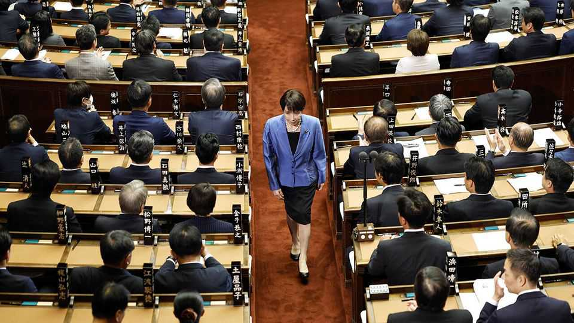

Asia | Breaking the mould
Takaichi Sanae becomes Japan’s first female prime minister
Hawkish on security policy, dovish on fiscal policy and traditionalist on social policy, she will move her country to the right
October 23rd 2025

TAKAICHI SANAE, a conservative hardliner, has become Japan’s 104th prime minister, and the first woman to hold the job. Japan’s Diet voted to approve her nomination on October 21st, following her election as head of the ruling Liberal Democratic Party (LDP) earlier this month. Her confirmation marks a big step forward for gender equality in one of the world’s most patriarchal democracies. Yet Ms Takaichi, a security hawk, fiscal dove and arch social conservative, promises to shift Japan’s politics to the right.

The daughter of a police officer and a salaryman, Ms Takaichi grew up in the ancient capital of Nara, in western Japan, where she rode a motorcycle and played drums in a heavy metal band. She entered parliament in 1993 after a short stint in television news; she became known as both a detail- oriented policy wonk and a traditionalist culture warrior. With her everywoman background, polarising views and nationalistic flair, she is of the global political zeitgeist. But her brand of conservatism is older-school. She calls Britain’s Iron Lady, Margaret Thatcher, a role model and positions herself as the political heir to the late Abe Shinzo, another Japanese prime minister.

The LDP hopes Ms Takaichi will help the party re-establish its grip on Japanese politics. The party lost large chunks of seats in both houses during elections over the past year, leaving it leading a minority government. Ms Takaichi wants to win back right-wing voters who have been drawn to younger, populist outfits. So she kicked off her campaign with a screed against misbehaving foreigners. And she opposes reform on bellwether social issues, such as whether to allow married couples to keep separate surnames or whether to allow female succession in the imperial family.

Yet by installing a female prime minister, Japan has nonetheless struck a blow for gender equality. The country’s women have long been underrepresented in both business and politics: it comes 27th of 29 OECD countries in The Economist’s glass ceiling index. Ms Takaichi promised to bring more women into her cabinet; her team will include the first-ever female minister of finance. She has also spoken publicly about her own health struggles related to menopause and has pledged to expand access to women’s health services.

Ms Takaichi stumbled early on her road to the premiership. Komeito, the LDP’s longtime ally, left the ruling coalition following her election as party leader; for a while there was an outside chance that opposition parties would rig up an agreement that kept her out of the top job. In the end Ms Takaichi managed to shore up support by forming a new partnership with the Japan Innovation Party (Ishin), a centre-right outfit based in Osaka, the country’s second city. But the LDP and Ishin will still hold only a minority of seats in both houses of parliament, meaning that they will need support from lawmakers outside the coalition to carry out their agenda.

In many ways Ishin is a more natural partner for the LDP than Komeito. The two parties share a vision of a prouder, more muscular Japan. By contrast, Komeito often acted as a brake on the LDP’s more hawkish plans. The new coalition will be able to move faster on security policy: it aims to loosen restrictions on Japan’s arms exports and expand its intelligence-gathering apparatus; it may push to raise defence spending beyond the 2% of GDP the country currently plans to reach by 2027.

Yet there will be new tensions as well. Both parties want to help households struggling with rising living costs, but they do not entirely agree on how to do it. Ms Takaichi favours government stimulus; Ishin is a small- government party that calls for “deep-cutting reforms”. As conditions for its support, Ishin demanded that the LDP come up with a plan for cutting the number of seats in the Diet and that it establish a “government efficiency bureau” focussed on trimming fat from the public sector.

Very soon foreign affairs will also start demanding Ms Takaichi’s attention. As Japan’s leader she is due to attend two big summits at the end of this month: a meeting of ASEAN leaders in Malaysia and a gathering in South Korea of the leaders of the Asia-Pacific Economic Co-operation (APEC) countries, a regional grouping that includes America and China. Her revisionist views on Japan’s wartime history may make it difficult to maintain recent progress in relations with South Korea and to stabilise relations with China.

The biggest challenge will be forging a connection with Donald Trump. Ms Takaichi may regret the $550bn tariff and investment deal that her predecessor struck with America’s president, but she knows Japan cannot afford to alienate its sole security ally. Her cabinet includes the chief negotiator of that pact, a sign that Japan intends to see it through. Mr Trump is expected to visit Japan on his way to the APEC meeting. Ms Takaichi will have little time to prepare for her debut on the international stage. ■

This article was downloaded by zlibrary from https://www.economist.com//asia/2025/10/21/takaichi-sanae-becomes-japans-first- female-prime-minister