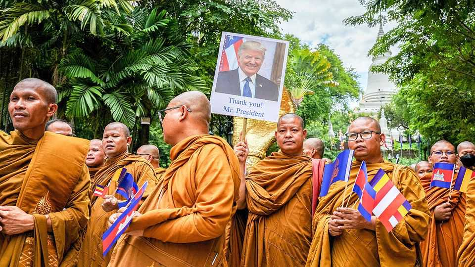

Asia | Trump in South-East Asia
How to win prizes and lose influence
America’s president pushes for a peace conference in Malaysia
October 23rd 2025

Donald Trump seems to want one thing in particular from his imminent trip to South-East Asia. He is one of more than a dozen national leaders currently expected to fly into Kuala Lumpur, Malaysia’s capital, for a clutch of regional meetings taking place from October 26th-28th. The main reason Mr Trump is planning to join them, whisper diplomats from the region, is not to discuss big security issues such as tensions around Taiwan or in the South China Sea. Instead, they say, he wants to preside in person over the signing of a peace agreement between Cambodia and Thailand. The roots of this lie in a conflict in July, when the two neighbours engaged in five days of skirmishes in areas of their shared border that are subject to a long-running territorial dispute. Forty-three people died in the latest bout of

fighting; hundreds of thousands were displaced. The old enemies looked as though they might keep on firing missiles at each other, until Mr Trump threatened to shove up American tariffs on products from both countries. That unorthodox intervention does appear to have accelerated a ceasefire.

Yet the dispute smoulders on, even if not at quite the same intensity. Both Thailand and Cambodia agreed they would pull troops back from positions on the border; they have yet to do so. Thailand is refusing to return 18 Cambodians captured during the conflict; observers from the Association of South-East Asian Nations (ASEAN) have not yet been permitted to visit the disputed regions. Cambodia’s irascible strongman, Hun Sen, who supposedly retired in 2023, continues to mouth off about Thailand on Facebook. As for Thailand’s newish prime minister, Anutin Charnvirakul, he promised to take a hard line on the border dispute when he came into office last month.

What Mr Trump knows of all this is unclear. What he wants, say diplomats involved in the negotiations, is a ceremony that shows him bringing the prime ministers of the two countries together—thus bolstering a reputation as a great peacemaker. In theory he could try to use that moment to force Cambodia and Thailand, an American ally, to make painful concessions that would ensure a more lasting peace. It is more likely, say those same diplomats, that he will settle for the two sides signing an agreement that largely restates the terms of the ceasefire they backed in July (this time with flashbulbs popping).

That this risks becoming the primary focus of Mr Trump’s trip to Malaysia seems suboptimal, given how rarely American presidents succeed in jamming trips to South-East Asia into their schedules. American allies who will attend the East Asia Summit—one of the big meetings that is taking place in Kuala Lumpur—are planning to call out China’s sabre-rattling on Taiwan and its aggressive manoeuvres in the South China Sea.

Yet Mr Trump’s schedule suggests he will leave Malaysia before that event even begins. Takaichi Sanae, Japan’s new prime minister, will also leave early; she is expected to head home in order to welcome Mr Trump to Japan, where he is going next. This may well permit China (represented at the events by Li Qiang, the prime minister) to become the dominant voice on the

final day of the summit. It plans to sign an upgrade to its free-trade agreement with ASEAN that will ease the sale of digital services and climate tech.

Mr Trump is hardly the first American leader to pay South-East Asia’s summits short shrift. Joe Biden skipped all but one of the regional meetings that took place during his tenure; Mr Trump himself attended only one during his first term. Aides to both men argue that they improved relations with a few key South-East Asian countries, despite this. But a recent study published by the Lee Kuan Yew School of Public Policy in Singapore offers empirical backing to those who argue that America is losing influence in the region. It finds that nine out of ten South-East Asian countries have become more “aligned” with China in recent years (see chart).

China’s influence stems primarily from its economic ties with the region, but “it backs this with consistent diplomacy,” according to a report by the Lowy Institute, a think-tank in Sydney. America by contrast “is a more peripheral presence”, particularly for the South-East Asian countries that lie closest to China’s borders. Mr Trump’s quixotic intervention in the region’s most recent conflict will do little to change that. Indeed, a fleeting and distracted trip to the neighbourhood could speed up America’s diminution in the region. ■

This article was downloaded by zlibrary from [https://www.economist.com//asia/2025/10/23/how-to-win-prizes-and-lose-influence](https://www.economist.com//asia/2025/10/23/how-to-win-prizes-and-lose-influence)