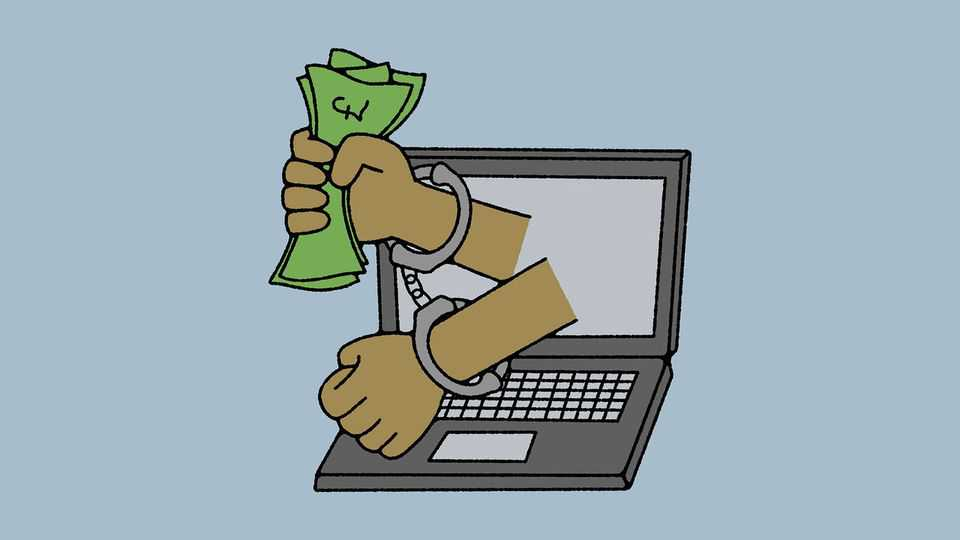

Asia | Banyan
America and Britain target Asia’s sprawling scam industry
That alone will not halt the rise of online fraud
October 23rd 2025

The haul was staggering: approximately $15bn in cryptocurrency, the most America has ever seized. On October 14th America’s government said that it had grabbed this from Chen Zhi, the Cambodian chairman of Prince Group —a conglomerate that the Department of Justice (DOJ) alleges has become “one of Asia’s largest transnational criminal organisations”. America and Britain also announced that they were placing sanctions on the Cambodian company. It is the biggest strike of its kind to date on people whom authorities accuse of involvement in Asia’s sprawling online scam industry. America’s DOJ alleges that Prince Group has made enormous profits operating compounds from which people carry out so-called “pig-butchering

scams” (in which criminals build trust with a victim by phone or online before stealing their money, often through fake cryptocurrency investments). The sanctions announced this month bar the company, its subsidiaries and seven individuals linked to the firm from doing business in America or Britain, and from using those countries’ financial institutions. Britain also froze 19 properties in London linked to its investigations, including an office building worth £100m ($133m). The Prince Group has previously denied involvement in scam operations, reports the Associated Press.

Joint action by America and Britain implies a new determination to curb online fraud. Globally the industry is thought to make more than $500bn a year; if this figure is even close to correct, it would make online scamming one of the world’s biggest illicit industries, on a par with the illegal drug trade. Its participants run a wide variety of wheezes, including sophisticated cons that involve tricking people into believing that they are participating in romantic relationships, only to end up separated from their cash. Americans are losing billions every year “with life savings wiped out in minutes”, said Scott Bessent, America’s Treasury secretary.

Cambodia has become the industry’s epicentre, according to Jacob Sims, an expert on transnational crime in South-East Asia. The United Nations thinks Cambodia’s scam businesses are making around $12.5bn a year. That is more than the country’s garment sector, its largest formal industry. Some 200,000 people from various countries are believed to work in Cambodia’s scam factories. The compounds they toil in are surrounded by barbed wire and security cameras; some have armed guards. Some of those involved take part voluntarily. Others have been enslaved.

Western action follows growing firmness by Asian governments. In recent years China has arrested hundreds of thousands of its own citizens for their involvement in scamming. On September 29th China sentenced to death 16 people who ran scam operations in northern Myanmar. It has also been putting pressure on the governments of Myanmar, Thailand, Cambodia and Laos to do more. Singapore has passed new laws against money-laundering and the misuse of sim cards for crime. Some see grounds for hope. “If the West cuts off the criminals’ financial flows and China goes after individual kingpins, we have a chance of stopping this industry,” says one Asian diplomat.

Not everyone is so optimistic. The riches to be made from online fraud give scammers every incentive to find new ways to keep their businesses running. Lately scam centres have been popping up in remote places such as Oecusse, an exclave belonging to Timor-Leste, as well as in Papua New Guinea and other Pacific Islands, according to the United Nations Office on Drugs and Crime. Now that Western cops and lawmakers are paying closer attention, scam bosses in Cambodia are considering moving their operations to countries including the UAE and Georgia, says a person who works in Cambodia’s scam industry.

They can probably afford not to hurry: Cambodia’s government has shown no immediate sign of cracking down. More than a week after the American and British sanctions were announced, compounds that have been linked to the scam industry appeared untouched by Cambodian police.

Investigations in the West are a big step forward. Yet action against one alleged player can only ever make modest ripples in a business as massive as online fraud. Efforts to quash an industry that is lucrative, adaptable and extremely well-protected still have a very long way to go. ■

Subscribers to The Economist can sign up to our Opinion newsletter, which brings together the best of our leaders, columns, guest essays and reader correspondence.

This article was downloaded by zlibrary from https://www.economist.com//asia/2025/10/23/america-and-britain-target-asias- sprawling-scam-industry

China

Why America and China can’t escape their toxic cycle of trade talks China has a grave problem Why Hong Kong is going for gold