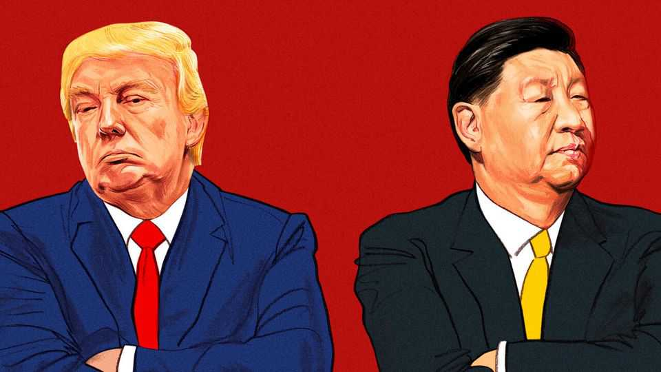

China | Channel hopping
Why America and China can’t escape their toxic cycle of trade talks
The sides lack seasoned interlocutors and it shows
October 23rd 2025

NAME-CALLING, gaslighting, stonewalling, over-generalising: talks between China and America bear the hallmarks of a toxically dysfunctional relationship. For months, negotiations have veered between temporary truces and explosive escalations. The latest flare-ups might scupper plans for a meeting between Donald Trump and Xi Jinping at a multilateral summit in South Korea at the end of October. For now it seems to be on: preparatory talks are due in Malaysia around October 25th. Still, hopes for more than another fragile truce are slim. And one big reason is the poverty of communication lines.

In Mr Trump’s first term, the two sides dealt with communication problems by using the “Kushner channel”. To the frustration of American trade and security officials, Mr Trump often negotiated via a back channel between his son-in-law, Jared Kushner, and Cui Tiankai, China’s ambassador to Washington, DC at the time. China hawks fumed that it frustrated their plans. But other White House insiders say that it helped lay the ground for the first two Trump-Xi summits and, ultimately, for the “phase one” trade deal signed in 2020.

This time, there are no reliable back channels. And official talks, led by Scott Bessent, America’s treasury secretary, and by Chinese vice premier He Lifeng, appear deadlocked after four rounds since May. So far, they have struggled to agree on the outcome of those previous talks, let alone hatch a trade deal and set a date for a bilateral summit in Beijing. Mr Bessent even lashed out publicly against Mr He’s top aide recently, calling him “unhinged”.

Messrs Bessent and He are no slouches. The former used to run a big hedge fund; the latter is a seasoned administrator. Both are trusted by their respective bosses. But they have relatively little experience of negotiating with the opposite side and lack a sophisticated understanding of each other’s political and economic systems. Nor do they have the kind of professional rapport that Robert Lighthizer, America’s trade representative in Mr Trump’s first term, developed with Liu He, China’s top economic adviser at the time.

With Mr Kushner preoccupied by the Middle East, there have been efforts to find other go-betweens. Some of the world’s most powerful business leaders have been touted as potential intermediaries, including Elon Musk of Tesla, Jensen Huang of Nvidia and Stephen Schwarzman of Blackstone. Some may be able to pass messages between the two leaders. None, however, is sufficiently close to either to be a reliable conduit for broader negotiations. American politics makes it hard to play that role, as advocates of better relations with China are often denounced as traitors or communists. Politics complicates things on China’s side, too.

Friction with America and Mr Xi’s concentration of power have made Chinese officials more reluctant to show initiative and paranoid about appearing weak in bilateral talks. The recent purge of two top Chinese

diplomats with good contacts in Washington, Qin Gang and Liu Jianchao, has added to their worries. Mr Qin succeeded Mr Cui as ambassador to America in 2021 and was foreign minister for seven months before being ousted. The current Chinese ambassador is not nearly as well connected in America. Nor is he thought to have much clout with Mr Xi. And the retirement of Wang Qishan as China’s vice-president in 2023 closed down, or narrowed substantially, another potential channel: a former banker, he had close relations with Wall Street titans including Hank Paulson and John Thornton.

Further muddling the picture on the American side is Mr Trump’s gutting of the National Security Council (NSC). A dearth of China expertise has made it harder to co-ordinate between the multiple agencies involved in China policy. And Mr Trump has shown no inclination to replicate the communication channel that existed between President Joe Biden’s national security adviser, Jake Sullivan, and China’s foreign minister, Wang Yi, in 2023-24.

The administration’s “contradictory impulses” were recently exemplified by the commerce department imposing tough new measures on China, even as the White House lobbied it to buy more soyabeans and passenger jets, says Sarah Beran, a former NSC China director now at Macro Advisory Partners, a consultancy. She adds that apparent differences over outcomes of earlier talks suggested that participants had not pinned down the language of public statements or sufficient detail for lower-level officials to build on between rounds.

Deep divisions have also emerged within the Trump camp, especially between security hawks and tech-industry leaders. One potential intermediary caught in the crossfire was Mr Huang, boss of Nvidia. He has met Mr Trump several times this year and accompanied him on foreign trips. He is well connected in China, too, travelling there at least three times since January and meeting officials including Mr He, the vice-premier. His lobbying seemed to pay off over the summer when Mr Trump lifted restrictions on the sale of some of Nvidia’s AI chips to China.

But China was spooked by White House officials’ suggestions that they wanted to make it dependent on American technology. So in September it

banned its major tech companies from buying Nvidia’s AI chips. And Mr Huang has since provoked a backlash after suggesting in an interview that the term “China hawk” was a “badge of shame”. Steve Bannon, a former adviser to Mr Trump, said Mr Huang should go to prison.

Chinese officials are confused about whom to speak to. “The Trump 2.0 team is more of a club of loyalists than a cohesive unit, unlike the 1.0 team that housed some strong-minded and veteran bureaucrats,” said Da Wei, an expert on China-America relations at Tsinghua University, at a recent conference. He said it was even tricky to tell who spoke for Mr Trump among security hawks.

Not that China has stopped trying to find back channels. It has recently reactivated Mr Cui, who retired in 2021, to try to make contact with the president’s close allies or family members. Mr Cui has visited Washington at least twice this year for meetings with business leaders and think-tanks. He has also sought meetings with administration officials (although it is unclear how much success he has had).

Progress is possible in discrete areas: in September Messrs Bessent and He helped to negotiate a deal to put the American operations of TikTok, a short- video app, in domestic hands. Nor is it such a bad idea to want direct communication between the two countries’ leaders. The problem is their completely different approaches to diplomacy. Mr Trump is relying on his own “magnetism and negotiating skills” to make a deal with Mr Xi in person, says Chris Johnson, a former CIA China analyst who runs China Strategies Group, a consultancy. That is “just not how the Chinese operate,” he says. Mr Xi believes in procedure and is unlikely to do anything without a clear agenda laid out in advance.

One alternative approach would be to bring in Mr Kushner or another person close enough to Mr Trump to act as a reliable back channel. Another would be for Mr Bessent to rely more heavily on the vast expertise within the Treasury and other departments. But without overhauling communication lines, progress appears limited to smaller, transactional issues. And even if a broader agreement is somehow reached, the risk is that it quickly unravels. ■

Subscribers can sign up to Drum Tower, our new weekly newsletter, to understand what the world makes of China—and what China makes of the world.

This article was downloaded by zlibrary from https://www.economist.com//china/2025/10/20/why-america-and-china-cant-escape- their-toxic-cycle-of-trade-talks