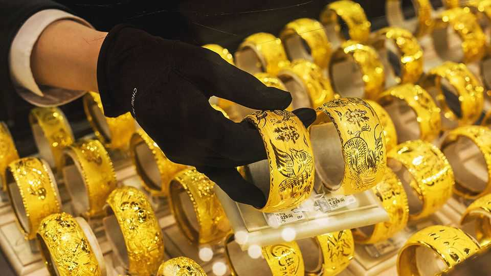

China | Piling into uncertainty
Why Hong Kong is going for gold
It wants to become a trading hub for the precious metal
October 23rd 2025

A MOMENTOUS VAULT lies hidden within Hong Kong’s bustling airport. Inside sits almost 150 tonnes of gleaming gold worth more than $20bn at current prices. Over the next three years the plan is for this depository to expand to hold almost seven times as much. That would be twice the amount held in a reserve near rival Singapore’s Changi airport. Gold prices have climbed by 60% in the past year and went above $4,380 per troy ounce this month. Prices then fell by 5.3% on October 21st—the steepest one-day drop in five years—as hopes rose that global trade tensions might ease. Yet despite the uncertainties, Hong Kong’s government wants to enter a new golden age.

For decades the bullion market has run mostly through London and New York. Although those cities dominate global price-setting and futures- trading, respectively, Hong Kong hopes to position itself as a trusted gateway to China, the world’s biggest producer and consumer of gold. In June the Shanghai Gold Exchange opened its first offshore vault in Hong Kong and launched two new yuan-denominated gold contracts tailored to global investors.

Officials hope that the city’s bid to become a global gold hub will enhance it as a financial centre, according to Christopher Hui, a secretary for financial services and the treasury. Last month John Lee, the city’s leader, said storage capacity would be expanded from 200 to 2,000 tonnes within three years and that a central clearing system for gold transactions will be created. The government also wants more related investment products, such as tokenised assets. It hopes to form a union for gold traders.

The plans are turning heads. MKS Pamp, a gold trader and refiner, decided to open regional headquarters in Hong Kong this year. “The government’s initiative really was very attractive,” says James Emmett, the company’s boss. Central banks and other big investors diversifying away from the dollar may also boost demand for a non-Western gold-trading hub. Dig a little deeper, however, and it is clear that not all glitters. Hiring gold aficionados is hard in Hong Kong. The city has inferior warehousing facilities compared with Singapore. Some traders may also fret about Beijing’s influence in the city.

The question is not whether Hong Kong can outperform other global hubs, it is whether it can offer something complementary, argues Mr Emmett. Hong Kong’s time zone helps in that regard. And many will be familiar with its British-style common-law system. Its status as a freeport with no foreign- exchange controls on the movement of precious metals is also attractive. Even so, the city still needs to prove its worth. ■

Subscribers can sign up to Drum Tower, our new weekly newsletter, to understand what the world makes of China—and what China makes of the world.

This article was downloaded by zlibrary from [https://www.economist.com//china/2025/10/23/why-hong-kong-is-going-for-gold](https://www.economist.com//china/2025/10/23/why-hong-kong-is-going-for-gold)

Middle East & Africa

How to preserve Africa’s natural riches for everyone Two flawed elections show the dangers of one-party rule Qatar is a crossroads at a crossroads After Gaza, Israeli politics are even less predictable