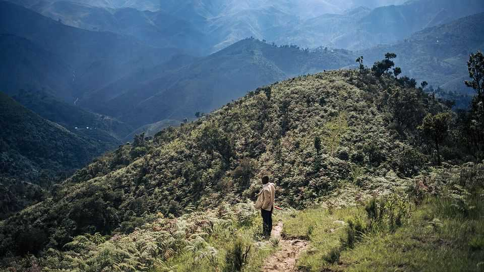

Middle East & Africa | Save a tree, make a mint
How to preserve Africa’s natural riches for everyone
Conservationists want to make the world pay to look after its rainforests and wildlife
October 23rd 2025

For a dose of hope about the future of rainforests, go to Inganda in the Democratic Republic of Congo. A nine-hour drive from the nearest town, this village deep in the Congo basin is home to a mix of Bantu and Pygmy peoples living in clay huts along a dusty track. Soaring trees blot out the sun. But after a short trek into the forest, the sky opens and shimmering cassava fields appear in the clearing. The largest trees have been left standing, a boon for the snakes and chimpanzees that have been returning to the area. The animals’ numbers are rising because the villagers no longer hunt them for meat, says a guide.

The idyll is being helped along by the Norwegian-backed Community Fund for Forests (CFF), which doles out cash to villagers in return for a pledge to shield a portion of their land from development. The idea is that the payments will reduce reliance on the slash-and-burn farming common in the region and help protect the forest from encroachment by logging companies. Similar efforts are under way across Africa in a bid to stop the continent’s rainforest from going the way of the Amazon, which has lost some 20% of its tree cover since the 1970s. Their advocates hope that such schemes will protect African biodiversity and help the world mitigate climate change without compromising economic development.

Can they? African nature is in focus ahead of COP30, the UN climate summit, in Brazil in November. The continent is home to more than a quarter of the earth’s intact ecosystems and “iconic” species of special ecological significance. The Congo basin is the largest carbon sink on earth, bar the world’s oceans (see map). To arrest global warming, UN member states have vowed to protect 30% of the planet’s land and seas by 2030, and to halt and reverse deforestation by the end of this decade. Little progress has been made on these goals. To get anywhere near attaining them, protecting Africa’s vast natural riches is crucial.

Past models of conservation have not always done this well. National parks, many of which were fenced off during the colonial era, bring in tourists bearing dollars for government coffers. But their benefit for local people has been much less obvious. Earlier this year African Parks, a charity which manages parks on behalf of governments across Africa, admitted that its rangers had carried out abuses against members of the Baka tribe in Congo- Brazzaville. Even where national parks are well run, their presence does little to help preserve semi-protected areas such as conservancies, where wildlife, livestock and their owners live side by side and which contain much of Africa’s richest flora and fauna.

The CFF is one example of an alternative approach. A growing body of research suggests that, given the right incentives, indigenous populations are often the best custodians of the land on which they live. But that requires making the protection of African nature financially viable for them as well as for national governments. In Inganda a mix of cash injections, concessions for development and assistance for indigenous groups to secure legal tenure over their land is supposed to incentivise residents to limit farming and other business to government-approved areas, while leaving most of the forest intact. Similar efforts are afoot across the continent.

Aligning incentives is crucial. For now, people in Inganda welcome the money from the CFF. But if using or selling parts of the forest that are supposed to be off-limits proves more profitable than the fund’s cash, there is little to stop them ditching it. In a nearby village that is not part of the programme, residents have sold their land to a Chinese logging firm that has built wide roads to transport trees to Kinshasa, the capital. Even if people do not want to sell, enforcing property rights is difficult. The Congolese state is weak and corrupt and has been accused of complicity in illegal logging.

Across the continent Kitengela-Kipeto, a savannah area near Nairobi, Kenya’s capital, faces a related problem. A long-running programme of donor-funded payments, which locals receive for protecting their land from development, is “totally inadequate”, says Nickson Ole Parmisa, a local leader. The price is not “equal to the value of the land”, he says. Where landowners have sold up, Kitengela’s wild open pastures are interrupted by stone quarries and strips of farmland.

To address this, EarthAcre, a Kenyan startup, has developed a payment platform that allows participants to receive multiple streams of income. These will include new biodiversity credits, or “nature assets”. They are designed to one day be sold to investors and companies hoping to offset their impact on the environment by paying landowners in Africa to shield their own plots from degradation. Another layer of financing is expected from carbon credits, a market that William Ruto, Kenya’s president, has described as his country’s “next significant export”. The point is to maximise the income landowners can earn from protecting their plots and thereby discourage them from selling it, explains Patita Nkamunu, the group’s co-founder.

Phillis Nkapapa, a 67-year-old Maasai widow, says her first biodiversity payment of 18,000 Kenyan shillings ($140) helped pay for her grandchildren’s schooling. In exchange, she is encouraging her family to grow trees, maintain grass banks (to sequester carbon) and keep their land free of fences so that lions and other wildlife can roam. She also promises not to make or burn charcoal. To ensure that such promises are kept and the underlying ecosystem remains healthy and intact, EarthAcre uses a variety of technologies that can measure biodiversity down to “each leaf, each blade of grass”, claims Viraj Sikand, another co-founder. This, it hopes, will help

put a price on preserving nature and convince investors keen to boost their green credentials to pour money into the effort.

To work on a large scale, such programmes must eventually attract billions of dollars in funding. That looks far off. The global market for biodiversity credits was estimated to be worth less than $10m in 2024. Funding commitments for the UN’s targets to preserve biodiversity and stop deforestation are some $700bn short of the estimated annual need. For its part, the carbon market has taken a reputational hit in recent years. Doubts linger over the carbon-saving potential of credit schemes, especially those linked to forests. Allegations of “greenwashing” abound. Even rich countries that have not turned actively hostile to climate-mitigation policies are cutting financing. That hardly bodes well for the creation of new markets.

Can these problems be overcome? Lee White used to think so. As Gabon’s environment minister until 2023, he has done more than most to champion the idea that countries with large rainforests could earn billions by keeping their trees standing. Gabon, where the wild-elephant population has rebounded by some 60% since the 1990s thanks to sustainable logging practices, served as a glowing example. The military junta that ousted Mr White’s government has largely kept up its environmental policies. Yet as rich countries waver in their green commitments and markets for natural capital struggle to take off, he is more pessimistic than he used to be. “What we were trying to do in Gabon was develop without losing the forest,” he says. Conservationists across Africa remain determined to prove that possible. ■

This story is part of a reporting project that received financial support from the Pulitzer Centre.

Sign up to the Analysing Africa, a weekly newsletter that keeps you in the loop about the world’s youngest—and least understood—continent.

This article was downloaded by zlibrary from https://www.economist.com//middle-east-and-africa/2025/10/23/how-to-preserve- africas-natural-riches-for-everyone