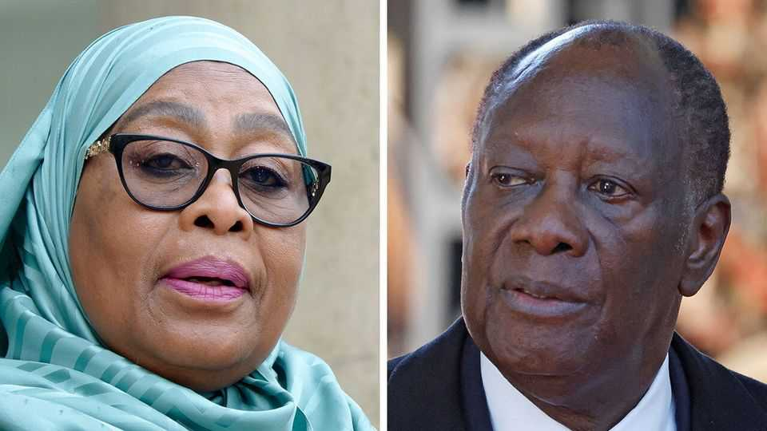

Middle East & Africa | Predictable outcomes
Two flawed elections show the dangers of one- party rule
Rulers in Tanzania and Ivory Coast may be overestimating their countries’ stability
October 23rd 2025

They are the emerging stars of their respective neighbourhoods. In west Africa, Ivory Coast is experiencing an economic renaissance. In the east, Tanzania has achieved annual GDP growth of 6% on average for the past two decades. Both have relatively low inflation and, compared with some of their neighbours, manageable public debts. As voters in both countries head to the polls this month, their rulers can trumpet one strength: stability. For Alassane Ouattara, Ivory Coast’s president, and Samia Suluhu Hassan, his counterpart in Tanzania, stability is the elixir of growth. This is one reason why the 83-year-old Mr Ouattara, who claims “experience” is needed

to tackle the economic and security challenges facing his country, is running for an unconstitutional fourth term on October 25th. The ruling CCM party in Tanzania, which has held power since independence in 1961, makes similar arguments. Mrs Samia, who took office after the death of her predecessor in 2021, is leaving nothing to chance as she prepares to face voters for the first time on October 29th. Though the outcome of neither election is in doubt, the drive to eliminate competition may prove self- defeating.

The upcoming polls share several similarities. Both Tanzania and Ivory Coast have presidential systems where enormous power is concentrated in the executive. This increases the political stakes, and thus the possibility of violence. But the ruling parties in both countries wield influence—or, in the CCM’s case, outright control—over key institutions such as the judiciary and the electoral commission. Both incumbents are running for re-election against little-known candidates.

Lawfare of this sort is most brazen in Tanzania, where the electoral commission (whose members are picked by the president) has simply barred the main opposition party, Chadema, from taking part. The party’s leader, Tundu Lissu, is on trial for treason; the verdict is scheduled, conveniently, for two weeks after the election. “The whole thing is cooked up,” says Vincent Mughwai, Mr Lissu’s brother. The leader of Tanzania’s second- biggest opposition party, ACT-Wazalendo, has also been disqualified on procedural grounds.

Similar tactics are on display in Ivory Coast. As many as 55 presidential candidates have been barred from competing in the election. This includes the two who would have posed the most serious challenge: Tidjane Thiam, a former boss of Credit Suisse, and Laurent Gbagbo, a former president who refused to concede to Mr Ouattara in the election in 2010, sparking a brief civil war. Mr Thiam’s exclusion is ostensibly due to a legal technicality outside Mr Outtara’s control (a court deemed Mr Thiam ineligible to run on the grounds that he was not an Ivorian citizen when he announced his candidacy). However, in Ivory Coast such institutional outcomes “tend to work in the favour of the ruling party”, notes Beverly Ochieng of Control Risks, a consultancy.

Mr Ouattara is popular, especially in the country’s north and centre where he is credited with a strong economic recovery after the civil wars of the 2000s and early 2010s. Even so, his government is resorting to repression. On October 17th it announced a two-month ban on political rallies. Around 700 people were arrested in one week this month, according to the public prosecutor, who claimed the suspects had been planning “acts of terrorism” against state institutions. Some 44,000 police and soldiers are said to have been deployed to prevent unrest.

But this is nothing compared with the state brutality on display in Tanzania. Perhaps because it fears a “Gen Z” uprising similar to those that have recently rocked Madagascar and neighbouring Kenya, the government has unleashed repression unlike anything the country has seen since the return of multiparty politics in the 1990s, says Erick Kabendera, an exiled journalist. Scores of young people and opposition figures have disappeared in recent months. On October 6th a former CCM bigwig who had recently spoken out against the regime was abducted from his home. Chadema’s deputy chairman was arrested on October 22nd when he arrived at court to attend his boss’s trial.

Tanzania’s much-lauded stability may not last. Despite solid growth, the CCM has too little to show for its decades of uncontested rule. Poverty remains stubbornly high and inequality is rising. Earlier this month riots broke out in Dar es Salaam, the commercial capital. Dissidents are calling for mass protests on election day. Far from being a model for the continent, Tanzania may prove a warning. ■

Sign up to the Analysing Africa, a weekly newsletter that keeps you in the loop about the world’s youngest—and least understood—continent.

This article was downloaded by zlibrary from https://www.economist.com//middle-east-and-africa/2025/10/23/two-flawed-elections- show-the-dangers-of-one-party-rule