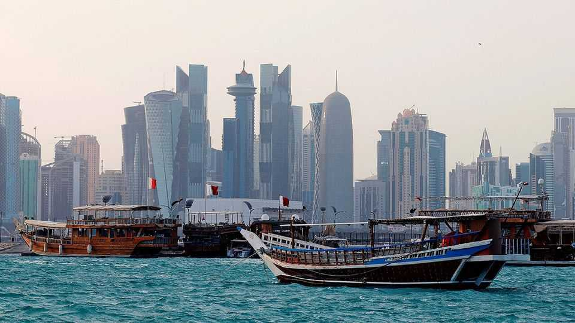

Middle East & Africa | Redefining Doha
Qatar is a crossroads at a crossroads
After Gaza it needs to protect itself from attacks and rev up an overbuilt economy
October 23rd 2025

QATAR can feel like a place defined by who passes through. It has carved out a geopolitical niche by hosting regional rebels and politicians for peace talks. It relies on an American air base for security. After 2010, when it was chosen to host the 2022 football World Cup, its economy was based on getting ready for the tournament. Its best-known company is an airline. For the past few years, that model has looked wobbly. Qatar was attacked twice this summer: Iran bombed the American air base in June; three months later Israel tried to assassinate leaders of Hamas, a Palestinian militant group, who were in Doha discussing a Gaza ceasefire. The economy,

meanwhile, is still smarting from the end of the World Cup. There are too many businesses and not enough visitors to patronise them all.

With the Gaza war finally over, the tiny Gulf emirate is at a turning-point. It needs to adjust its foreign policy to shield it from future attack. It also needs to turn its attention back to the economy—which even some officials admit was overlooked amid two years of chaos in the Middle East.

Qatar says it is still bent on mediating regional disputes. In September, for example, it helped negotiate the release of Elizabeth Tsurkov, an Israeli- Russian researcher held captive for two years by an Iraqi militia. But its efforts are increasingly focused elsewhere. It brokered talks between Rwanda and the Democratic Republic of the Congo, which culminated in a peace deal in June. It is also mediating between the Colombian government and the Clan del Golfo, a drug gang.

Officials in Doha say they have turned their attention further afield because there are simply fewer conflicts worth trying to arbitrate in the Middle East. Doing so also carries less risk: Colombia, after all, seems unlikely to bomb Doha if the gang proves intransigent. The Hamas leaders were in Doha at America’s behest, so that it could negotiate with them. But Qatar has long been a sponsor of Islamists across the region. The Israeli strike was not the first time its patronage invited trouble. When four Arab states imposed an embargo on Qatar in 2017, the emirate’s support for the Muslim Brotherhood was high on their list of grievances.

Will it now loosen its links with the Islamists? Some diplomats speak of a long-running power struggle between advisers loyal to the previous emir, who abdicated in 2013, and those appointed by his successor. The old guard is said to push a more ideological foreign policy. “He needs to get rid of these guys,” says one diplomat from a Gulf country, referring to the current emir. Easier said than done: his predecessor is also his father.

A bellwether will be the tone on Al Jazeera, the state-owned satellite-news channel. Its Arabic service took a staunchly pro-Hamas line throughout the war. Last month the government shuffled its management. The new boss is a member of the royal family.

At the same time, Qatar is looking for a more formal guarantee that America will protect it. On September 29th Donald Trump issued an executive order declaring that attacks on Qatar would be treated as “a threat to the peace and security of the United States”. It was not quite the ironclad security guarantee of the NATO charter, but officials hope it will be a useful deterrent. They aim to finalise a more detailed defence pact next month.

That would help reassure a business community unnerved by the summer’s attacks. Qatar’s economy is fuelled by its vast natural-gas reserves. The World Cup set off an incomparable building boom: the government ploughed more than $200bn into building stadiums, hotels, a metro and other infrastructure. A post-tournament hangover was inevitable, though it may have eased. The economy grew by 2.8% in 2024, up from 1.2% in 2023.

Still, signs of a glut are everywhere. At 69%, last year’s hotel-occupancy rate was nine percentage points behind Dubai and ten behind Abu Dhabi. The property market looks saturated, too. Rental prices for villas fell by 7% over the past year. Apartments were down by 5%. Around 20% of the shop fronts in Doha’s malls are thought to be vacant and rents are at a ten-year low.

There is still plenty of life around West Bay, the high-rise diplomatic district, or the downtown souq. Yet Lusail, a sleek new city north of Doha that hosted the World Cup final, feels like a ghost town. Restaurants and cafés are empty. Elsewhere, labourers complain of unpaid salaries.

While Saudi Arabia pours enormous sums into diversifying its economy, and the United Arab Emirates enjoys a boom driven by rich expats, Qatar can feel like a throwback to an earlier model of the Gulf: one that depends on hydrocarbons, state-run firms and a smattering of tourists.

Perhaps that does not matter yet. Most Gulf states rely on oil exports, and demand for the black stuff may soon peak. Qatar’s gas will enjoy growing demand for years to come. It also has a mere 400,000 citizens, far fewer than any of its neighbours. Diversification is less urgent than in Saudi Arabia, with its 20m citizens.

For now, then, Qatar is waiting for change. A visitor driving to town from the airport passes a series of bright red signs for the World Cup stadiums, one of which was meant to be dismantled and donated to a poor country (it is still intact). They feel like vestiges of a livelier era. But there will be more people passing through soon. In December Qatar will host the Arab Cup, the second time in a row it has done so. ■

Sign up to the Middle East Dispatch, a weekly newsletter that keeps you in the loop on a fascinating, complex and consequential part of the world.

This article was downloaded by zlibrary from https://www.economist.com//middle-east-and-africa/2025/10/23/qatar-is-a-crossroads- at-a-crossroads