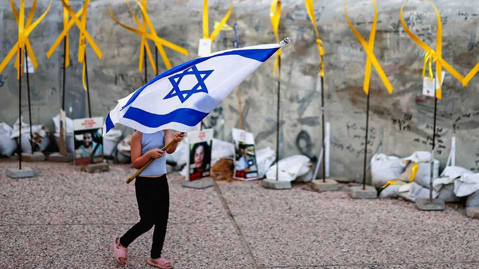

Middle East & Africa | Crisis rekindled
After Gaza, Israeli politics are even less predictable
The trauma of the war may affect next year’s election in surprising ways
October 23rd 2025

THE SHAKY ceasefire in Gaza had lasted for barely a week, but the Knesset, Israel’s parliament, which opened its winter session on October 20th, was back to its pre-war crisis. Yariv Levin, the ruling Likud party’s justice minister, announced plans to resume legislation limiting the powers of the supreme court and the attorney-general. His colleague the Knesset Speaker refused to dignify the court’s president with his title. In response, Yair Lapid, leader of the opposition, called him “Speaker of half the Knesset”. Isaac Herzog, the president, deviated from his planned speech, chiding the politicians “for sheer discourtesy, disrespect for human dignity, disrespect toward institutions”.

With the war over, at least for now, attention is turning back to domestic politics. A parliamentary election must be held by the end of October 2026. Less than a third of Israelis still back Binyamin Netanyahu, the prime minister. His bloc of hard-right and ultra-religious parties is predicted to fall well short of a majority. But the opposition ranges from secular nationalists to Islamic conservatives and Arab communists. With little in common besides their desire to replace Mr Netanyahu, they will find it hard to coalesce around a candidate for prime minister and form a new majority coalition, leaving the field wide open.

Israeli politics were fractious before the war. Between 2019 and 2022 Israel held five elections, in which voters remained split down the middle over whether or not Mr Netanyahu should be returned to office. Back then the opposition fought the long-serving prime minister over his government’s plans to eviscerate the supreme court and over the corruption charges against him (he denies wrongdoing).

Since then, the country has suffered Hamas’s surprise attack of October 7th 2023, and in response fought the longest war in its history. All Israelis have been personally affected by the war. More than half a million served in the Israel Defence Forces (IDF) in the past two years, most of them reservists who were away from their families and jobs for months. Every part of the country has come under fire from missiles and drones fired from Gaza, Iran, Lebanon, Syria and Yemen.

That has affected Mr Netanyahu’s standing. Many blame the prime minister both for his government’s failure to predict the attack, and for not ending the war sooner. “There is a very strong feeling that the basic contract, that the government’s role is to provide security, has been blatantly breached,” says Dahlia Scheindlin, a political strategist and pollster. “It’s hard to predict how that feeling of betrayal will be reflected in the election.”

The war has stoked resentment at the ultra-Orthodox community, some 14% of Israel’s 10m people, whose members refuse to enlist in the IDF for religious reasons. The supreme court has ruled their exemption from military service unconstitutional. But because ultra-Orthodox parties are a key part of Mr Netanyahu’s coalition, the government has not heeded the court ruling.

The community has also enjoyed increased public funding. The anger at Mr Netanyahu’s partners could create new political alliances.

That is especially true because the war has changed Israelis’ political identity in unexpected ways. According to a long-term public-opinion survey by AGAM Labs, a think-tank, 65% of Israelis now consider themselves right-wing (up from 56% three years ago). Only 13% identify as left-wing. Yet 79% were in favour of ending the war in Gaza. When asked whether they prefer “normalisation” agreements with Saudi Arabia and other Arab states or annexing the occupied West Bank, only 32% chose annexation. And though more Israelis than three years ago consider their religion central to their identity, only slightly more than a quarter want to see the country governed by religious law.

That puts them at odds with Mr Netanyahu’s government, says Gayil Talshir, a political scientist at Hebrew University who is part of the team that conducted the survey: “The election is going to be about how Israelis define their identity and the kind of Israel they want to live in.” ■

Sign up to the Middle East Dispatch, a weekly newsletter that keeps you in the loop on a fascinating, complex and consequential part of the world.

This article was downloaded by zlibrary from https://www.economist.com//middle-east-and-africa/2025/10/22/after-gaza-israeli- politics-are-even-less-predictable

Europe

Germany’s much-ballyhooed “autumn of reforms” is a damp squib Poland refuses to extradite a Nord Stream suspect Western drones are underwhelming on the Ukrainian battlefield France puts a former president, Nicolas Sarkozy, behind bars Turkey’s fabled textile industry is coming apart at the seams Can Ukraine get past the bouncer on the EU door?