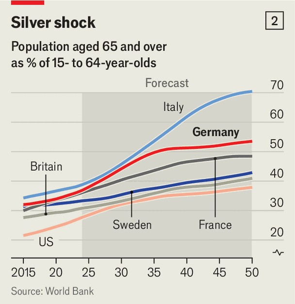

Europe | Of coalitions, commissions and compromises
Germany’s much-ballyhooed “autumn of reforms” is a damp squib
Friedrich Merz’s government is drifting as the economy stagnates
October 23rd 2025

ASK ANA PAULA BÜSSE, who oversees job centres in Hannover, about the tangled web of Germany’s benefits system and you receive a reply that blends Proustian complexity with Kafkaesque absurdity. Is the recipient’s income low enough for housing benefit? If so, he must apply in one place. If he has a child these benefits will be paid from another; the systems ask similar questions but apply varying definitions and income thresholds. Eligibility for one benefit may mean another is withdrawn, though they are assessed at different times. And so on. The Munich-based Ifo Institute enlisted the help of ai to tot up the total number of benefits in Germany. It reached over 500 before giving up.

Getting a grip on the welfare system was meant to sit at the heart of Friedrich Merz’s promised “autumn of reforms”. Germany must “dare to try new things”, the conservative chancellor said this month. After a whirlwind first few months in office focused on diplomacy and security Mr Merz vowed to return his focus to the country’s economy, now in its sixth year of stagnation (see chart 1), and its sprawling Sozialstaat, which gobbles up close to a third of gdp. Companies are sounding the alarm, and capital is fleeing. But so far the reform results are meagre.

Witness the Sturm und Drang over a tweak to Bürgergeld, an income- support programme claimed by 5.5m that has acquired a significance for conservatives far beyond the 3.5% of welfare spending it represents. After weeks of shadowboxing, this month the coalition of Mr Merz’s Christian Democrats (cdu), its Bavarian ally, the Christian Social Union (csu), and the Social Democrats (spd) agreed to tighten sanctions for Bürgergeld recipients who miss appointments or refuse job offers. “The debate has been quite populist at times,” says Dagmar Schmidt, an spd mp involved in the talks. Jessica, a single mother in Berlin, says she fears the reform because she struggles to find work as it is.

Mr Merz, a habitual overpromiser, has said Bürgergeld reforms could yield a tidy €5bn ($5.8bn) in annual savings by nudging people into work, but the

government’s own figures promise a fraction of that. Officials accept that the political impact of the change overshadows the fiscal. Ms Büsse, whose job centres administer Bürgergeld, would prefer a sharper focus on digitising the creaking welfare system, unifying benefits and cutting red tape.

The system creates not only bureaucratic headaches but perverse incentives. At some income levels, marginal tax rates can exceed 100% as benefits are withdrawn more quickly than wages rise; hardly ideal in a country with the lowest working hours in the oecd, a club of rich countries. Ifo reckons combining some benefits and improving incentives could increase working hours by the equivalent of 150,000 full-time jobs. A government commission will propose fixes early next year.

A bigger challenge resides in Germany’s clunky health and elderly-care insurance systems, where inefficiencies have led to spiralling costs borne by companies and workers (as well as middling outcomes, to judge by life- expectancy figures). Including pensions, social-security costs now amount to over 42% of total salaries, shrinking pay packets and discouraging hiring. Officials say tackling these costs is next on the to-do list. But for now two more commissions will ponder reforms.

Germany’s pension system is the gravest test. It is not yet on its knees, thanks to a decision in 2007 to slowly raise the retirement age to 67. (Compare that with France, which has suspended an increase from 62 to 64.) But Germany’s demographic structure means the next decade will be rough, as millions of baby-boomers retire (see chart 2). Despite immigration, by 2035 there will be barely two working-age Germans for each pensioner, down from three in 2022. “This problem was made in Germany and must be fixed in Germany,” says Katherina Reiche, the economy minister. “We lost the last 15 years.”

Mr Merz has promised a “major” pension reform before the next election in 2029. But meanwhile his government has, in the words of Ifo’s Andreas Peichl, “agreed on the wish-list of a six-year-old writing to Santa at Christmas”. The coalition agreement continues to link pensions to wage growth until 2031, which under Germany’s pay-as-you-go system will further squeeze workers and taxpayers. The government rejects calls to link the retirement age to life expectancy, as in Sweden and elsewhere. New tax incentives to encourage workers to toil for longer clash with rules that allow many to retire early on full pensions, a benefit that often accrues to the perfectly healthy. And at the csu’s behest the coalition has approved an annual €5bn pension boondoggle for some older mothers. For deeper reforms, including extending private pensions, the work has been handed to yet another commission. It will not report until the end of next year.

Talk to officials and you do not get the sense of a government sticking its head in the sand. The trouble is finding compromise inside the coalition. Mr Merz’s conservatives happily take potshots at the spd, though believe they have an ally in its co-leader Lars Klingbeil, the vice-chancellor and finance minister. He has told his party to recapture the spirit of “Agenda 2010”, a controversial set of welfare and labour reforms passed by an spd-led government over two decades ago. Mr Klingbeil hopes to bolster those among his colleagues who fear that clinging too tightly to outdated welfare rules risks earning them a reputation as a party for the unemployed. Self- identified workers already vote for the hard-right Alternative for Germany in greater numbers than for the spd.

The jury remains out on Mr Merz’s reforming zeal; his government is not yet half a year old. The leaders of the three ruling parties have established a

rapport that optimists think may culminate in a grand reform bargain next year: perhaps higher taxes on the rich in exchange for deeper social cuts (savings must anyway be found to fill fiscal holes from 2027). There is no shortage of ideas, from targeted education and labour-market policies to adjusting tax rules that discourage women from full-time work. Ms Reiche insists Germans will be receptive to arguments that they need to work longer if politicians are clear.

But it will not be easy. Economic recovery remains elusive, the government is unpopular and neither Mr Merz nor Mr Klingbeil has a strong grip on their respective party. With a majority of 12 the coalition cannot afford even minor rebellions; 18 young cdu/csu mps are already threatening to torpedo the new pension law without greater provisions to rein in costs after 2031. Mr Merz likes to say his government represents Germany’s “last chance” before it succumbs to the extremes. He is not yet acting as if he believes it. ■

To stay on top of the biggest European stories, sign up to Café Europa, our weekly subscriber-only newsletter.

This article was downloaded by zlibrary from https://www.economist.com//europe/2025/10/23/germanys-much-ballyhooed-autumn-of- reforms-is-a-damp-squib