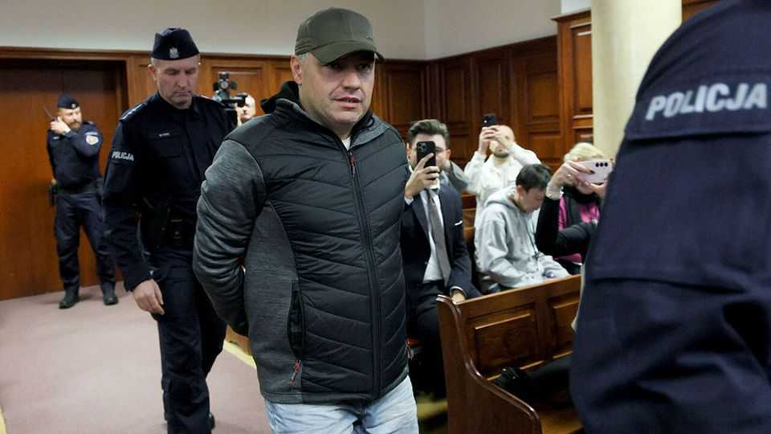

Europe | Treacherous waters
Poland refuses to extradite a Nord Stream suspect
Relations with Germany take a turn for the worse
October 23rd 2025

On September 26th, 2022 someone blew up the Nord Stream 1 and 2 pipelines, built to carry natural gas from Russia to Germany. Whether Volodymyr Zhuravlev was responsible may never be known. Mr Zhuravlev, a Ukrainian diving instructor, was arrested last month at his home in Warsaw on a warrant issued by German prosecutors, who said he was part of a seven-person team that carried out the attack. But on October 17th a Warsaw court refused to extradite Mr Zhuravlev, who denies the charges. Three days later Polish prosecutors said they would not appeal, leaving him a free man.

The decision stemmed partly from patchy spots in international law. The explosions took place outside any country’s territorial waters. Under maritime law, trying crimes on ships in international waters is the responsibility of the country whose flag they carry. But pipelines have no flag, and jurisdiction over them is surprisingly fuzzy. Furthermore, the majority owner of the Nord Stream tubes is not a German entity but Gazprom, a Russian state-owned gas company. The prosecution says the demolition team rented their yacht on Rügen, a German island. But the judge said that connection was insufficient to prove that a German court had jurisdiction.

At another level, the ruling underscored the difficult relationship between Germany and Poland. Polish leaders have long castigated Germany over Nord Stream, which made Europe more dependent on Russian gas. On October 7th Donald Tusk, Poland’s prime minister, wrote on X, a messaging platform, that “The problem with North Stream 2 is not that it was blown up. The problem is that it was built.” Such chest-thumping plays well in domestic politics, where Mr Tusk, a centrist liberal, is battling over legal reforms with the hard-right president, Karol Nawrocki.

Yet it undermines efforts to improve relations with Germany, which had collapsed under Poland’s preceding government, led by the nationalist Law

and Justice party. When Friedrich Merz became Germany’s chancellor in May there were high hopes for a new partnership between the two big powers. But “it was a sort of reset that never took place,” says Kai-Olaf Lang of the German Institute for International and Security Affairs. Germany soon instituted immigration controls, including on its Polish border. Poland responded with checks of its own.

Germany has accepted the Polish decision, but history furnishes endless sources of resentment for nationalists to exploit. Mr Nawrocki has resurrected demands for reparations for the second world war, an issue Germany insists was settled decades ago. Some Poles worry that Germany may return to its habit of Ostpolitik, or placating Russia. To lay such suspicions to rest, says Tomasz Sawczuk of Polityka Insight, a think-tank in Warsaw, Poles expect Germany to recognise that “even if blowing up Nord Stream is not nice, they should not make a lot of fuss about it.” ■

To stay on top of the biggest European stories, sign up to Café Europa, our weekly subscriber-only newsletter.

This article was downloaded by zlibrary from https://www.economist.com//europe/2025/10/23/poland-refuses-to-extradite-a-nord- stream-suspect