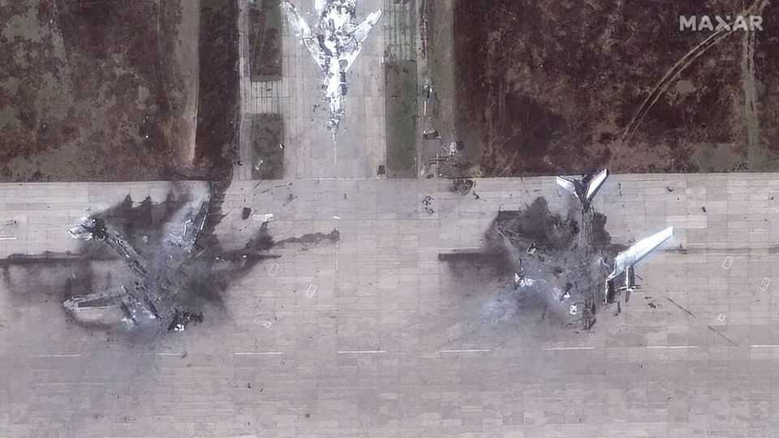

Europe | Battle conditions
Western drones are underwhelming on the Ukrainian battlefield
Most are too expensive, and irrelevant to the kind of war Russia is waging
October 23rd 2025

AMERICAN SWITCHBLADE drones were once cutting-edge. Fast, clever and precise, they were essential kit for special forces in Iraq and Afghanistan. But when a batch of Switchblade-300s reached Ukraine in 2022, high hopes were quickly shattered. The drones were too expensive. They struggled against Russian electronic warfare. They caused minimal damage when they hit their targets. “When we tested them, they glitched under jamming conditions,” says Valery Borovyk, a military-drone developer. “When one hit the rear window of a minibus, the front windows didn’t even shatter.”

Since then various Western companies have sought to showcase their drones on what has become the world’s best testing ground. But they have largely fallen flat. Ukrainian companies that once looked to emulate Western tech heroes like Anduril and Helsing now find themselves plotting a path for those multi-billion euro companies to follow. Mr Borovyk, whose drones have been linked to those used in Operation Spiderweb, a brazen Ukrainian raid that destroyed strategic bombers deep inside Russia, reckons “no more than 20-30%” of the battleground technology is Western. “Ukraine now outpaces almost every country in the world,” he says.

Cost is part of the explanation, but performance is increasingly as important. Ukrainian drone companies are producing products that are more relevant to the fight. They are more agile and have a keener understanding of the front, its big data, and the fast-changing needs. Not every Western defence giant is testing its wares in the Ukrainian crucible. But “If you haven’t seen the sea, how can you make a good boat?” asks Vadym Yunyk, who heads Tech Force in UA, a consortium of Ukraine’s defence companies.

A clash of doctrines is at the heart of the issue. Until recently, Western countries concentrated on exquisite wares that worked well in limited battles against lesser opponents. The Ukrainian-Russian battlefield is different: total, balanced, and highly democratised. The cheap FPV drones that were pioneered by Ukraine in 2023, then copied by Russia, now destroy high- value targets in a way that previously required the most cutting-edge weapons. Russia’s main innovation has meanwhile been to adopt a “spam” strategy, massing drones to overwhelm defences.

All this makes disposability crucial. The average ground drone (UGV) in Ukraine, for example, has a life expectancy of just one week, says Viktor Dolgopiatov, who heads Burevii, a design bureau pioneering this emergent class of weapon. When you multiply such losses along 2,000km of front line, the scale of the challenge is clear. It makes no sense to send a few Western ground systems costing hundreds of thousands of dollars into battle when Ukrainian near-equivalents can be manufactured for $10,000-20,000. Yet that is where Western companies and their governments have often placed their bets. “It’s like choosing between BMWs and Skoda Octavias,” says Eduard Lysenko, an officer with Brave-1, the government’s defence-

tech arm. “A BMW is faster and more comfortable, but it really doesn’t help you if your task is to give everyone cars.”

One drone that embodies Ukraine’s own Skoda-style response to Russia’s spam war is the Blyskavka (“lightning”), a fixed-wing craft reverse- engineered from the Russian Molniya (also “lightning”, but in Russian). The Blyskavka, which recently entered serial production, is built from the cheapest materials available. It’s no looker, but it hits a sweet spot for front- line troops, lifting 8kg of explosives over 40km with a tiny price tag of $800. The drone’s lead engineer is scathing about Western competitors who, he says, are focused on over-designed items with huge margins to justify small volumes and high R&D costs.

The companies that have succeeded in establishing a demand in Ukraine tend to be those that established a significant early local presence: releasing systems for testing, and then iterating rapidly. Examples include companies backed by Google’s former CEO Eric Schmidt and Quantum Systems, a German company producing reconnaissance UAVs. Quantum Systems’ Vector drone is among the more expensive being used by Ukraine, but it has been well reviewed by commanders. Oleksandr Berezhny, who heads the company’s Ukraine office, says embedding locally and early was a deliberate choice to keep up with the speed of change.

Ukraine’s innovation has not yet impacted where the serious money flows. NATO countries are in the process of ramping up spending to 5 % of GDP, of which 3.5 % is “hard” defence. There are signs priorities are changing, but much of the new investment will probably still fund European companies producing technology ill-suited to the challenges of Russia’s war. Meanwhile, Ukrainian companies with battle-tested achievements are in critical need of money. Perhaps 40% of the country’s overall drone-making capacity lies idle. At a recent Brave-1 event in Lviv, Ukrainian firms raised $100m in a round of new private investment. That was four times more than last year, but trivial when compared to the tens of billions being spent abroad.

For sure, any investment in Ukraine’s drone industry faces obvious hurdles. The country has weak IP protections, a shaky rule of law, and is restricting export of weapons during wartime. Doubts also linger over the long-term

business case too. Ukraine has essentially reversed the normal lucrative route of military-to-civilian technology transfer by refashioning civilian technology for the frontlines. Much of it, unfortunately, is easily replicable. Even so, it is hard not to conclude Western companies, armies, and governments would gain by leaning harder into Ukraine’s drone expertise.

Western companies may well be holding back the best kit from the Ukrainian battlefield, for all the reasons above and more. But the example of the Switchblade-300s shows technology has a limited shelf life, and needs continuous updating. (A newer Switchblade, for example, is being used to reasonable effect in conditions of limited Russian jamming.) Cutting edge weapons should always be in the mix. But war in Ukraine has opened a Pandora’s box of cheap, “spam” technology, and it threatens to overwhelm any military that is unprepared for it. “No one in this world understands what threats will exist tomorrow—not a single analyst, not a single general,” Says Mr Borovyk: “My advice to defence firms is if you are not deeply involved in the war in Ukraine today, you are on the road to bankruptcy tomorrow.” ■

To stay on top of the biggest European stories, sign up to Café Europa, our weekly subscriber-only newsletter.

This article was downloaded by zlibrary from https://www.economist.com//europe/2025/10/23/western-drones-are-underwhelming-on- the-ukrainian-battlefield